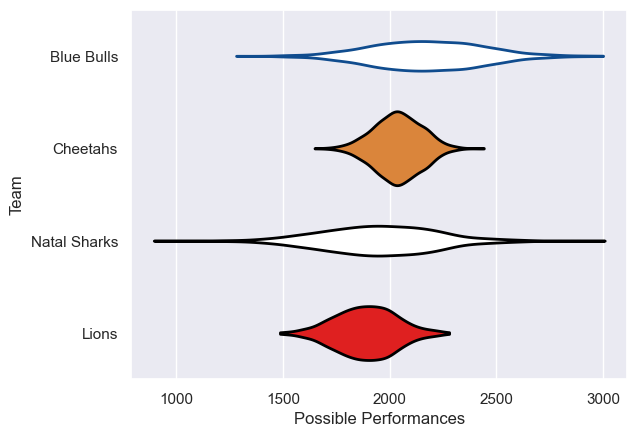

---  
title: "Currie Cup 2007"  
date: 2025-07-29 6:00:00 -0500  
categories: model review projection  
layout: article  
aside:  
    toc: true  
---
# Current Team Rankings

# Standings

## Current Standings

| Club         |   Played |   Wins |   Point Differential |   Losing Bonus Points | Try Bonus Points   |   Competition Points |
|:-------------|---------:|-------:|---------------------:|----------------------:|:-------------------|---------------------:|
| Cheetahs     |        2 |      2 |                    7 |                     0 |                    |                    8 |
| Lions        |        2 |      1 |                    5 |                     1 |                    |                    5 |
| Blue Bulls   |        1 |      0 |                   -5 |                     1 |                    |                    1 |
| Natal Sharks |        1 |      0 |                   -7 |                     1 |                    |                    1 |

# Completed Match Review

| Model | Percent Correct Predictions | Spread Error |
| ------ | ------ | ------ |
| Club Level | 33.3% | 12.0 |
| Player Level: Lineup | nan% | nan |
| Player Level: Minutes | nan% | nan |

