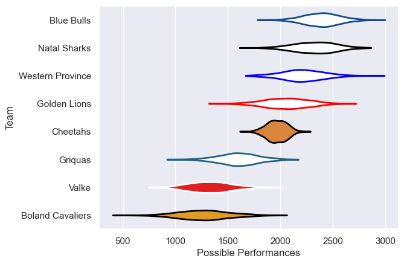

---  
title: "Currie Cup 2008 Status"  
date: 2025-07-28 6:00:00 -0500  
categories: model review projection  
layout: article  
aside:  
    toc: true  
---
# Current Team Rankings

# Standings

## Current Standings

| Club             |   Played |   Wins |   Point Differential |   Losing Bonus Points | Try Bonus Points   |   Competition Points |
|:-----------------|---------:|-------:|---------------------:|----------------------:|:-------------------|---------------------:|
| Natal Sharks     |       11 |     11 |                  224 |                     0 |                    |                   44 |
| Blue Bulls       |       11 |      8 |                  204 |                     2 |                    |                   34 |
| Golden Lions     |       10 |      5 |                   76 |                     1 |                    |                   21 |
| Western Province |        8 |      5 |                   64 |                     0 |                    |                   20 |
| Cheetahs         |        9 |      5 |                   55 |                     0 |                    |                   20 |
| Griquas          |        9 |      2 |                 -134 |                     0 |                    |                    8 |
| Boland Cavaliers |        8 |      1 |                 -160 |                     1 |                    |                    5 |
| Valke            |        8 |      0 |                 -329 |                     2 |                    |                    2 |

# Completed Match Review

| Model | Percent Correct Predictions | Spread Error |
| ------ | ------ | ------ |
| Club Level | 67.6% | 23.7 |
| Player Level: Lineup | nan% | nan |
| Player Level: Minutes | nan% | nan |

