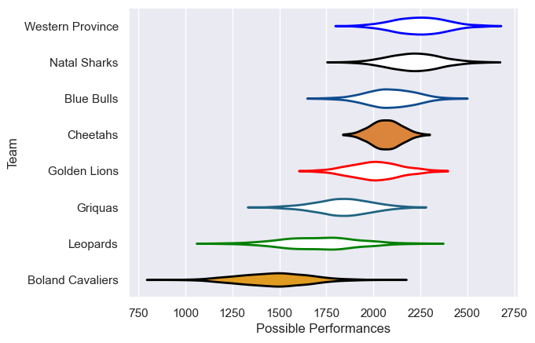

---  
title: "Currie Cup 2009 Status"  
date: 2025-07-28 6:00:00 -0500  
categories: model review projection  
layout: article  
aside:  
    toc: true  
---
# Current Team Rankings

# Standings

## Current Standings

| Club             |   Played |   Wins |   Point Differential |   Losing Bonus Points |   Try Bonus Points |   Competition Points |
|:-----------------|---------:|-------:|---------------------:|----------------------:|-------------------:|---------------------:|
| Natal Sharks     |       15 |     12 |                  191 |                     1 |                  1 |                   50 |
| Blue Bulls       |       16 |     11 |                  179 |                     4 |                    |                   48 |
| Western Province |       15 |     10 |                  217 |                     4 |                    |                   44 |
| Cheetahs         |       16 |      9 |                  193 |                     2 |                    |                   38 |
| Golden Lions     |       14 |      7 |                   99 |                     6 |                    |                   34 |
| Griquas          |       14 |      8 |                  -41 |                     1 |                    |                   33 |
| Leopards         |       14 |      1 |                 -324 |                     1 |                    |                    5 |
| Boland Cavaliers |       14 |      1 |                 -514 |                     1 |                    |                    5 |

# Completed Match Review

| Model | Percent Correct Predictions | Spread Error |
| ------ | ------ | ------ |
| Club Level | 71.2% | 17.4 |
| Player Level: Lineup | nan% | nan |
| Player Level: Minutes | nan% | nan |

