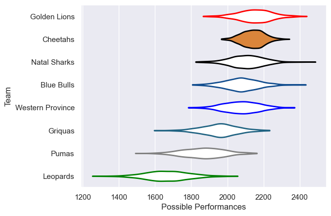

---  
title: "Currie Cup 2011"  
date: 2025-07-29 6:00:00 -0500  
categories: model review projection  
layout: article  
aside:  
    toc: true  
---
# Current Team Rankings

# Standings

## Current Standings

| Club             |   Played |   Wins |   Point Differential |   Losing Bonus Points |   Try Bonus Points |   Competition Points |
|:-----------------|---------:|-------:|---------------------:|----------------------:|-------------------:|---------------------:|
| Golden Lions     |       16 |     12 |                  137 |                     2 |                  1 |                   53 |
| Natal Sharks     |       16 |     11 |                   83 |                     1 |                  1 |                   46 |
| Cheetahs         |       15 |      8 |                  167 |                     4 |                    |                   40 |
| Western Province |       15 |      8 |                   87 |                     2 |                  1 |                   37 |
| Blue Bulls       |       14 |      8 |                   84 |                     1 |                  1 |                   36 |
| Griquas          |       14 |      6 |                  -44 |                     2 |                  1 |                   29 |
| Pumas            |       14 |      2 |                 -180 |                     5 |                  1 |                   14 |
| Leopards         |       14 |      1 |                 -334 |                     0 |                    |                    4 |

# Completed Match Review

| Model | Percent Correct Predictions | Spread Error |
| ------ | ------ | ------ |
| Club Level | 72.9% | 11.9 |
| Player Level: Lineup | nan% | nan |
| Player Level: Minutes | nan% | nan |

