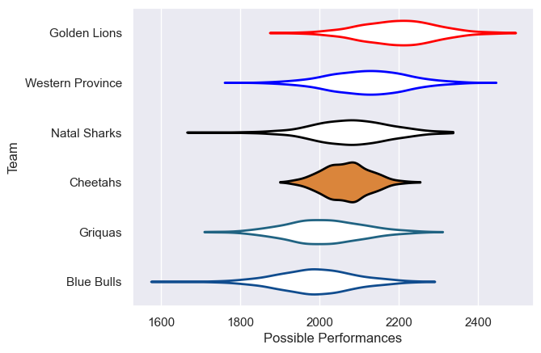

---  
title: "Currie Cup 2012"  
date: 2025-07-29 6:00:00 -0500  
categories: model review projection  
layout: article  
aside:  
    toc: true  
---
# Current Team Rankings

# Standings

## Current Standings

| Club             |   Played |   Wins |   Point Differential |   Losing Bonus Points | Try Bonus Points   |   Competition Points |
|:-----------------|---------:|-------:|---------------------:|----------------------:|:-------------------|---------------------:|
| Natal Sharks     |       12 |      8 |                   69 |                     3 |                    |                   35 |
| Western Province |       12 |      7 |                   58 |                     2 |                    |                   30 |
| Golden Lions     |       11 |      6 |                    1 |                     1 |                    |                   25 |
| Blue Bulls       |       11 |      5 |                  -28 |                     1 |                    |                   21 |
| Griquas          |       10 |      4 |                  -63 |                     1 |                    |                   17 |
| Cheetahs         |       10 |      3 |                  -37 |                     4 |                    |                   16 |

# Completed Match Review

| Model | Percent Correct Predictions | Spread Error |
| ------ | ------ | ------ |
| Club Level | 57.6% | 12.9 |
| Player Level: Lineup | nan% | nan |
| Player Level: Minutes | nan% | nan |

