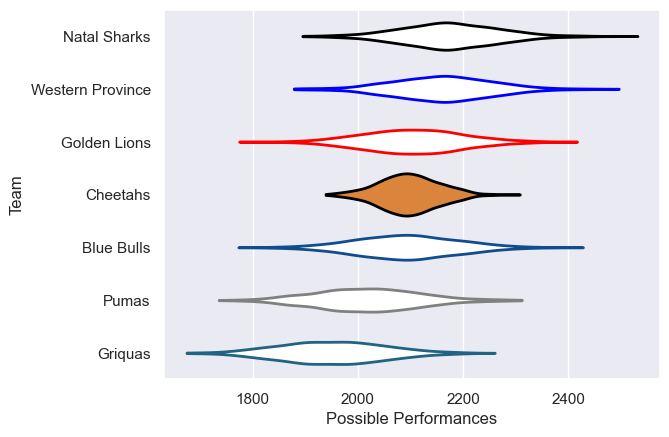

---  
title: "Currie Cup 2013"  
date: 2025-07-29 6:00:00 -0500  
categories: model review projection  
layout: article  
aside:  
    toc: true  
---
# Current Team Rankings

# Standings

## Current Standings

| Club             |   Played |   Wins |   Point Differential |   Losing Bonus Points |   Try Bonus Points |   Competition Points |
|:-----------------|---------:|-------:|---------------------:|----------------------:|-------------------:|---------------------:|
| Western Province |       12 |      9 |                   47 |                     0 |                    |                   40 |
| Natal Sharks     |       12 |      9 |                   73 |                     3 |                    |                   39 |
| Cheetahs         |       11 |      5 |                   13 |                     3 |                  1 |                   24 |
| Golden Lions     |       11 |      4 |                    9 |                     3 |                  1 |                   22 |
| Blue Bulls       |       10 |      3 |                  -24 |                     2 |                    |                   16 |
| Griquas          |       11 |      2 |                 -116 |                     6 |                  1 |                   15 |
| Pumas            |        1 |      0 |                   -2 |                     1 |                    |                    1 |

# Completed Match Review

| Model | Percent Correct Predictions | Spread Error |
| ------ | ------ | ------ |
| Club Level | 55.9% | 9.9 |
| Player Level: Lineup | nan% | nan |
| Player Level: Minutes | nan% | nan |

