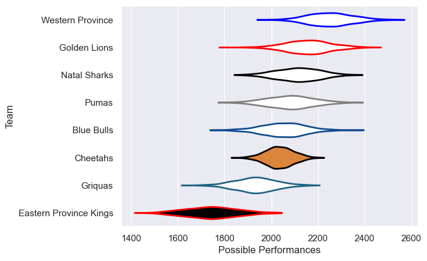

---  
title: "Currie Cup 2014 Status"  
date: 2025-07-28 6:00:00 -0500  
categories: model review projection  
layout: article  
aside:  
    toc: true  
---
# Current Team Rankings

# Standings

## Current Standings

| Club                   |   Played |   Wins |   Point Differential |   Losing Bonus Points |   Try Bonus Points |   Competition Points |
|:-----------------------|---------:|-------:|---------------------:|----------------------:|-------------------:|---------------------:|
| Golden Lions           |       13 |      8 |                  186 |                     1 |                  6 |                   43 |
| Western Province       |       11 |      9 |                  137 |                     1 |                  5 |                   42 |
| Natal Sharks           |       11 |      7 |                   35 |                     1 |                    |                   31 |
| Blue Bulls             |       11 |      6 |                   28 |                     1 |                  2 |                   27 |
| Pumas                  |       10 |      4 |                  -32 |                     2 |                  2 |                   20 |
| Cheetahs               |       10 |      3 |                  -45 |                     3 |                  3 |                   20 |
| Griquas                |       10 |      3 |                 -112 |                     2 |                  1 |                   15 |
| Eastern Province Kings |       10 |      1 |                 -197 |                     1 |                  1 |                    6 |

# Completed Match Review

| Model | Percent Correct Predictions | Spread Error |
| ------ | ------ | ------ |
| Club Level | 72.1% | 11.5 |
| Player Level: Lineup | nan% | nan |
| Player Level: Minutes | nan% | nan |

