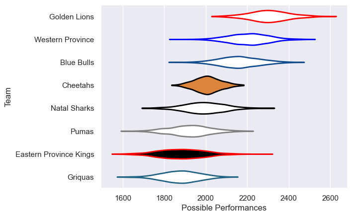

---  
title: "Currie Cup 2015"  
date: 2025-07-29 6:00:00 -0500  
categories: model review projection  
layout: article  
aside:  
    toc: true  
---
# Current Team Rankings

# Standings

## Current Standings

| Club                   |   Played |   Wins |   Point Differential |   Losing Bonus Points |   Try Bonus Points |   Competition Points |
|:-----------------------|---------:|-------:|---------------------:|----------------------:|-------------------:|---------------------:|
| Golden Lions           |       12 |     12 |                  231 |                     0 |                  5 |                   53 |
| Western Province       |       12 |      8 |                   77 |                     1 |                  4 |                   37 |
| Blue Bulls             |       11 |      8 |                   99 |                     1 |                  1 |                   34 |
| Cheetahs               |       11 |      3 |                  -62 |                     2 |                  5 |                   23 |
| Natal Sharks           |       10 |      4 |                   -8 |                     1 |                  1 |                   20 |
| Pumas                  |       10 |      3 |                  -75 |                     2 |                  1 |                   17 |
| Eastern Province Kings |       10 |      2 |                 -119 |                     2 |                  1 |                   11 |
| Griquas                |       10 |      1 |                 -143 |                     1 |                  1 |                    6 |

# Completed Match Review

| Model | Percent Correct Predictions | Spread Error |
| ------ | ------ | ------ |
| Club Level | 74.4% | 12.0 |
| Player Level: Lineup | nan% | nan |
| Player Level: Minutes | nan% | nan |

