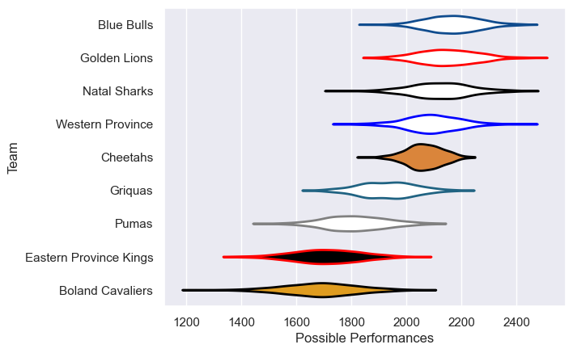

---  
title: "Currie Cup 2016 Status"  
date: 2025-07-28 6:00:00 -0500  
categories: model review projection  
layout: article  
aside:  
    toc: true  
---
# Current Team Rankings

# Standings

## Current Standings

| Club                   |   Played |   Wins |   Point Differential |   Losing Bonus Points | Try Bonus Points   |   Competition Points |
|:-----------------------|---------:|-------:|---------------------:|----------------------:|:-------------------|---------------------:|
| Cheetahs               |       10 |     10 |                  243 |                     0 |                    |                   40 |
| Blue Bulls             |       10 |      7 |                   89 |                     1 |                    |                   29 |
| Western Province       |        9 |      5 |                   10 |                     2 |                    |                   22 |
| Golden Lions           |       10 |      4 |                  114 |                     1 |                    |                   21 |
| Natal Sharks           |        7 |      5 |                  111 |                     1 |                    |                   21 |
| Griquas                |        8 |      4 |                  -58 |                     0 |                    |                   16 |
| Boland Cavaliers       |        8 |      2 |                 -124 |                     1 |                    |                    9 |
| Pumas                  |        8 |      1 |                 -143 |                     2 |                    |                    6 |
| Eastern Province Kings |        8 |      0 |                 -242 |                     0 |                    |                    0 |

# Completed Match Review

| Model | Percent Correct Predictions | Spread Error |
| ------ | ------ | ------ |
| Club Level | 69.2% | 17.2 |
| Player Level: Lineup | nan% | nan |
| Player Level: Minutes | nan% | nan |

