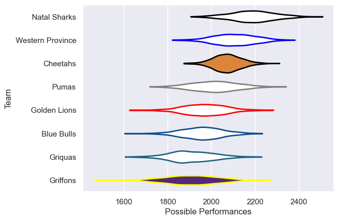

---  
title: "Currie Cup 2017 Status"  
date: 2025-07-28 6:00:00 -0500  
categories: model review projection  
layout: article  
aside:  
    toc: true  
---
# Current Team Rankings

# Standings

## Current Standings

| Club             |   Played |   Wins |   Point Differential |   Losing Bonus Points |   Try Bonus Points |   Competition Points |
|:-----------------|---------:|-------:|---------------------:|----------------------:|-------------------:|---------------------:|
| Natal Sharks     |       15 |     11 |                  133 |                     0 |                  1 |                   49 |
| Western Province |       13 |      8 |                  116 |                     1 |                    |                   33 |
| Golden Lions     |       13 |      6 |                  -63 |                     2 |                    |                   26 |
| Griquas          |       13 |      5 |                  -34 |                     4 |                  1 |                   25 |
| Cheetahs         |       12 |      6 |                 -101 |                     1 |                    |                   25 |
| Blue Bulls       |       13 |      5 |                    5 |                     3 |                    |                   23 |
| Pumas            |       12 |      4 |                  -23 |                     4 |                    |                   20 |
| Griffons         |        1 |      0 |                  -33 |                     0 |                  1 |                    1 |

# Completed Match Review

| Model | Percent Correct Predictions | Spread Error |
| ------ | ------ | ------ |
| Club Level | 60.9% | 14.7 |
| Player Level: Lineup | nan% | nan |
| Player Level: Minutes | nan% | nan |

