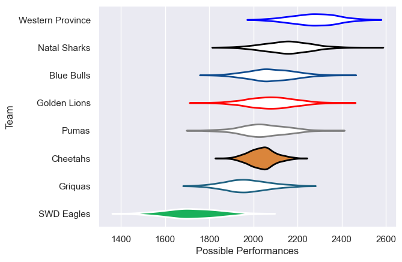

---  
title: "Currie Cup 2018 Status"  
date: 2025-07-28 6:00:00 -0500  
categories: model review projection  
layout: article  
aside:  
    toc: true  
---
# Current Team Rankings

# Standings

## Current Standings

| Club             |   Played |   Wins |   Point Differential |   Losing Bonus Points |   Try Bonus Points |   Competition Points |
|:-----------------|---------:|-------:|---------------------:|----------------------:|-------------------:|---------------------:|
| Western Province |        8 |      7 |                  161 |                     1 |                    |                   29 |
| Natal Sharks     |        8 |      7 |                   74 |                     0 |                    |                   28 |
| Golden Lions     |        7 |      4 |                   17 |                     0 |                    |                   16 |
| Blue Bulls       |        7 |      3 |                  -12 |                     2 |                    |                   14 |
| Pumas            |        6 |      2 |                  -16 |                     0 |                    |                    8 |
| Cheetahs         |        7 |      1 |                 -116 |                     1 |                  1 |                    6 |
| Griquas          |        6 |      1 |                  -77 |                     1 |                    |                    5 |
| SWD Eagles       |        1 |      0 |                  -31 |                     0 |                    |                    0 |

# Completed Match Review

| Model | Percent Correct Predictions | Spread Error |
| ------ | ------ | ------ |
| Club Level | 72.0% | 16.5 |
| Player Level: Lineup | nan% | nan |
| Player Level: Minutes | nan% | nan |

