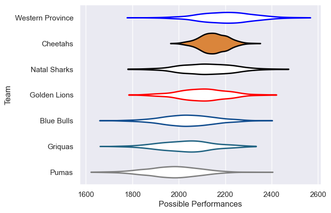

---  
title: "Currie Cup 2019"  
date: 2025-07-29 6:00:00 -0500  
categories: model review projection  
layout: article  
aside:  
    toc: true  
---
# Current Team Rankings

# Standings

## Current Standings

| Club             |   Played |   Wins |   Point Differential |   Losing Bonus Points |   Try Bonus Points |   Competition Points |
|:-----------------|---------:|-------:|---------------------:|----------------------:|-------------------:|---------------------:|
| Cheetahs         |        8 |      6 |                   96 |                     2 |                  1 |                   27 |
| Golden Lions     |        8 |      5 |                   11 |                     3 |                  1 |                   24 |
| Griquas          |        7 |      4 |                  -12 |                     1 |                    |                   17 |
| Natal Sharks     |        7 |      4 |                  -30 |                     1 |                    |                   17 |
| Western Province |        6 |      2 |                   30 |                     4 |                    |                   12 |
| Blue Bulls       |        6 |      2 |                  -48 |                     0 |                    |                    8 |
| Pumas            |        6 |      1 |                  -47 |                     2 |                    |                    6 |

# Completed Match Review

| Model | Percent Correct Predictions | Spread Error |
| ------ | ------ | ------ |
| Club Level | 50.0% | 11.5 |
| Player Level: Lineup | nan% | nan |
| Player Level: Minutes | nan% | nan |

