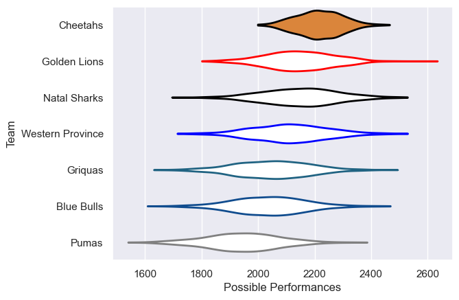

---  
title: "Currie Cup 2020"  
date: 2025-07-29 6:00:00 -0500  
categories: model review projection  
layout: article  
aside:  
    toc: true  
---
# Current Team Rankings

# Standings

## Current Standings

| Club             |   Played |   Wins |   Point Differential |   Losing Bonus Points | Try Bonus Points   |   Competition Points |
|:-----------------|---------:|-------:|---------------------:|----------------------:|:-------------------|---------------------:|
| Golden Lions     |        5 |      5 |                   52 |                     0 |                    |                   20 |
| Blue Bulls       |        4 |      2 |                   26 |                     1 |                    |                   11 |
| Western Province |        4 |      2 |                   26 |                     2 |                    |                   10 |
| Natal Sharks     |        4 |      2 |                   -4 |                     0 |                    |                    8 |
| Cheetahs         |        4 |      2 |                  -12 |                     0 |                    |                    8 |
| Pumas            |        4 |      1 |                  -48 |                     1 |                    |                    5 |
| Griquas          |        5 |      0 |                  -40 |                     2 |                    |                    4 |

# Completed Match Review

| Model | Percent Correct Predictions | Spread Error |
| ------ | ------ | ------ |
| Club Level | 60.0% | 11.6 |
| Player Level: Lineup | nan% | nan |
| Player Level: Minutes | nan% | nan |

