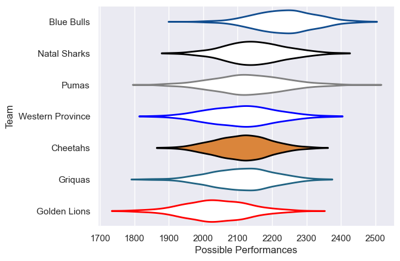

---  
title: "Currie Cup 2021 Status"  
date: 2025-07-28 6:00:00 -0500  
categories: model review projection  
layout: article  
aside:  
    toc: true  
---
# Current Team Rankings

# Standings

## Current Standings

| Club             |   Played |   Wins |   Point Differential |   Losing Bonus Points |   Try Bonus Points |   Competition Points |
|:-----------------|---------:|-------:|---------------------:|----------------------:|-------------------:|---------------------:|
| Blue Bulls       |       18 |     12 |                  114 |                     1 |                  1 |                   56 |
| Natal Sharks     |       18 |      8 |                   66 |                     2 |                    |                   44 |
| Western Province |       16 |      7 |                  -19 |                     2 |                    |                   34 |
| Pumas            |       14 |      5 |                   40 |                     3 |                    |                   31 |
| Griquas          |       15 |      5 |                  -17 |                     5 |                    |                   29 |
| Cheetahs         |       14 |      4 |                  -37 |                     4 |                    |                   26 |
| Golden Lions     |       15 |      3 |                 -147 |                     3 |                    |                   21 |

# Completed Match Review

| Model | Percent Correct Predictions | Spread Error |
| ------ | ------ | ------ |
| Club Level | 47.3% | 11.9 |
| Player Level: Lineup | nan% | nan |
| Player Level: Minutes | nan% | nan |

