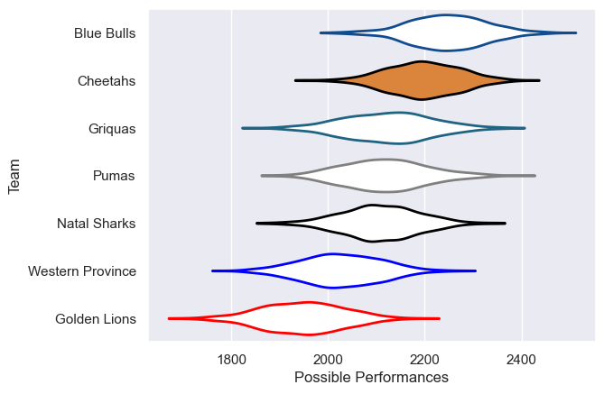

---  
title: "Currie Cup 2022 Status"  
date: 2025-07-28 6:00:00 -0500  
categories: model review projection  
layout: article  
aside:  
    toc: true  
---
# Current Team Rankings

# Standings

## Current Standings

| Club             |   Played |   Wins |   Point Differential |   Losing Bonus Points |   Try Bonus Points |   Competition Points |
|:-----------------|---------:|-------:|---------------------:|----------------------:|-------------------:|---------------------:|
| Cheetahs         |       13 |     10 |                  150 |                     2 |                  7 |                   49 |
| Blue Bulls       |       13 |      9 |                   81 |                     0 |                  9 |                   47 |
| Griquas          |       14 |      8 |                   42 |                     3 |                  6 |                   41 |
| Pumas            |       14 |      7 |                   51 |                     3 |                  7 |                   38 |
| Natal Sharks     |       12 |      5 |                  -31 |                     2 |                  3 |                   27 |
| Western Province |       12 |      3 |                  -87 |                     4 |                  3 |                   19 |
| Golden Lions     |       12 |      2 |                 -206 |                     2 |                  5 |                   15 |

# Completed Match Review

| Model | Percent Correct Predictions | Spread Error |
| ------ | ------ | ------ |
| Club Level | 60.0% | 14.1 |
| Player Level: Lineup | nan% | nan |
| Player Level: Minutes | nan% | nan |

