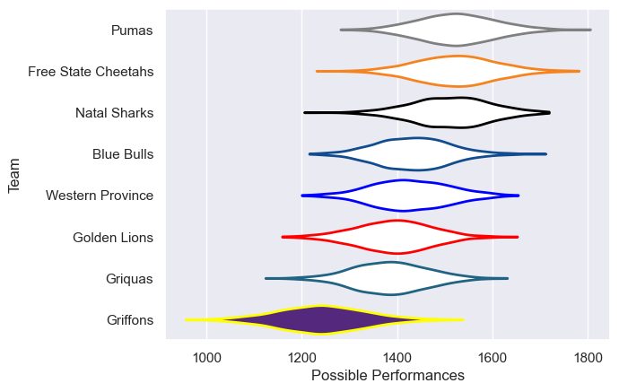
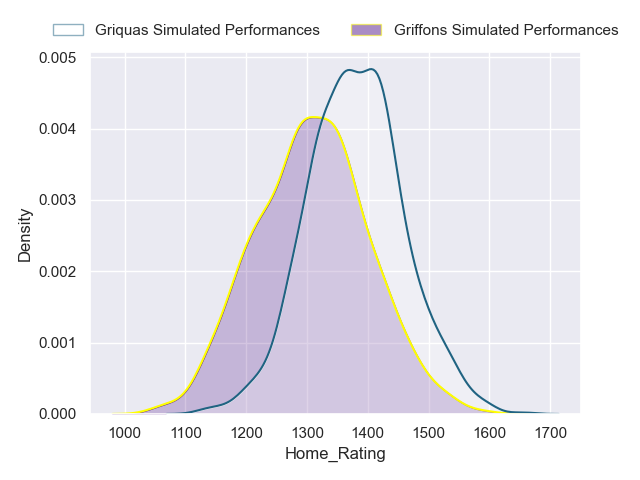
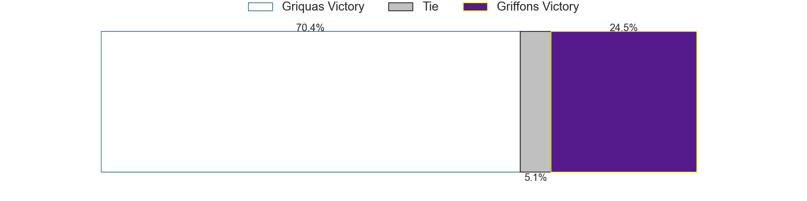
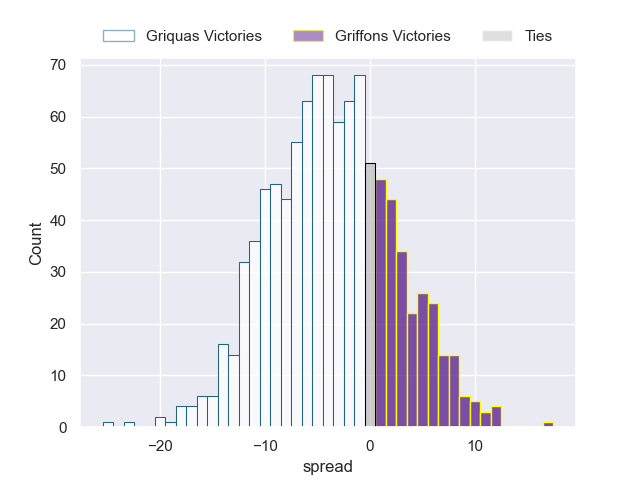
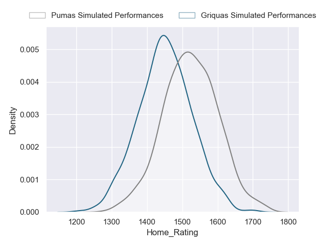
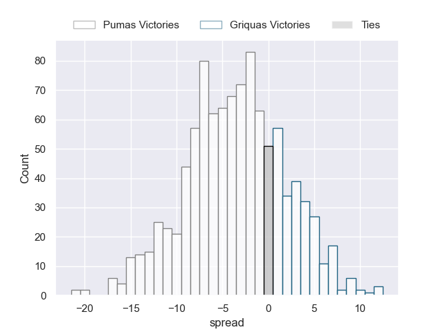

---  
title: "Currie Cup 2023 Status"  
date: 2023-05-19 6:00:00 -0500  
categories: model review projection  
layout: article  
aside:  
    toc: true  
---
# Current Team Rankings

# Standings

## Current Standings

| Club                |   Played |   Wins |   Point Differential |   Losing Bonus Points |   Try Bonus Points |   Competition Points |
|:--------------------|---------:|-------:|---------------------:|----------------------:|-------------------:|---------------------:|
| Pumas               |       10 |      7 |                  164 |                     2 |                nan |                   34 |
| Natal Sharks        |       10 |      7 |                   48 |                     1 |                nan |                   32 |
| Free State Cheetahs |        9 |      6 |                   85 |                     2 |                nan |                   31 |
| Western Province    |       10 |      5 |                   24 |                     2 |                nan |                   27 |
| Golden Lions        |       10 |      4 |                  -32 |                     3 |                nan |                   24 |
| Griquas             |       10 |      5 |                  -60 |                     0 |                nan |                   23 |
| Blue Bulls          |       10 |      4 |                  -46 |                     1 |                nan |                   21 |
| Griffons            |        9 |      1 |                 -183 |                     1 |                nan |                    8 |

## Projected Remaining Table

| Club                |   Matches Remaining |   Wins |   Point Differential |   Losing Bonus Points |   Try Bonus Points |   Competition Points |
|:--------------------|--------------------:|-------:|---------------------:|----------------------:|-------------------:|---------------------:|
| Pumas               |                   4 |    3   |                 15.8 |                   0.9 |                2.9 |                 15.7 |
| Natal Sharks        |                   4 |    2.9 |                 22.8 |                   0.9 |                2.8 |                 15.4 |
| Free State Cheetahs |                   4 |    2.1 |                  4.4 |                   1.4 |                2   |                 11.7 |
| Western Province    |                   4 |    2.1 |                  1.4 |                   1.5 |                1.9 |                 11.6 |
| Golden Lions        |                   4 |    2.1 |                  4.4 |                   1.3 |                2   |                 11.5 |
| Blue Bulls          |                   4 |    1.9 |                  3.2 |                   1.2 |                1.8 |                 10.8 |
| Griquas             |                   4 |    1.6 |                 -8.4 |                   1.3 |                1.5 |                  9.3 |
| Griffons            |                   4 |    0.3 |                -44.2 |                   0.9 |                0.4 |                  2.5 |

## Projected Total Table

| Club                |   Total Matches |   Wins |   Point Differential |   Losing Bonus Points |   Try Bonus Points |   Competition Points |
|:--------------------|----------------:|-------:|---------------------:|----------------------:|-------------------:|---------------------:|
| Pumas               |              14 |   10   |                179.8 |                   2.9 |                2.9 |                 49.7 |
| Natal Sharks        |              14 |    9.9 |                 70.8 |                   1.9 |                2.8 |                 47.4 |
| Free State Cheetahs |              13 |    8.1 |                 89.4 |                   3.4 |                2   |                 42.7 |
| Western Province    |              14 |    7.1 |                 25.4 |                   3.5 |                1.9 |                 38.6 |
| Golden Lions        |              14 |    6.1 |                -27.6 |                   4.3 |                2   |                 35.5 |
| Griquas             |              14 |    6.6 |                -68.4 |                   1.3 |                1.5 |                 32.3 |
| Blue Bulls          |              14 |    5.9 |                -42.8 |                   2.2 |                1.8 |                 31.8 |
| Griffons            |              13 |    1.3 |               -227.2 |                   1.9 |                0.4 |                 10.5 |

# Completed Match Review

| Model | Percent Correct Predictions | Spread Error |
| ------ | ------ | ------ |
| Club Level | 56.4% | 16.5 |
| Player Level: Lineup | 66.7% | 16.7 |
| Player Level: Minutes | 69.4% | 16.4 |

# Future Predictions

## Week 11

### Western Province V Pumas on 2023/05/19

Average Margin: Pumas by 1.4

### Natal Sharks V Free State Cheetahs on 2023/05/19

Average Margin: Natal Sharks by 2.9

### Griffons V Griquas on 2023/05/20

Average Margin: Griquas by 3.6

### Golden Lions V Blue Bulls on 2023/05/20

Average Margin: Golden Lions by 1.1

## Week 12

### Western Province V Golden Lions on 2023/05/26

Average Margin: Western Province by 5.0

### Natal Sharks V Griffons on 2023/05/26

Average Margin: Natal Sharks by 17.3

### Free State Cheetahs V Griquas on 2023/05/27

Average Margin: Free State Cheetahs by 10.1

### Pumas V Blue Bulls on 2023/05/27

Average Margin: Pumas by 7.8

## Week 13

### Griquas V Western Province on 2023/06/02

Average Margin: Griquas by 1.4

### Blue Bulls V Griffons on 2023/06/02

Average Margin: Blue Bulls by 13.0

### Pumas V Free State Cheetahs on 2023/06/03

Average Margin: Pumas by 3.4

### Golden Lions V Natal Sharks on 2023/06/03

Average Margin: Natal Sharks by 2.4

## Week 14

### Griquas V Pumas on 2023/06/09

Average Margin: Pumas by 3.6

### Golden Lions V Griffons on 2023/06/09

Average Margin: Golden Lions by 10.8

### Western Province V Natal Sharks on 2023/06/10

Average Margin: Natal Sharks by 0.7

### Blue Bulls V Free State Cheetahs on 2023/06/10

Average Margin: Free State Cheetahs by 0.7

