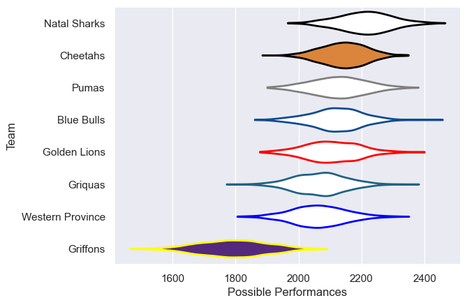

---  
title: "Currie Cup 2023"  
date: 2025-07-29 6:00:00 -0500  
categories: model review projection  
layout: article  
aside:  
    toc: true  
---
# Current Team Rankings

# Standings

## Current Standings

| Club             |   Played |   Wins |   Point Differential |   Losing Bonus Points |   Try Bonus Points |   Competition Points |
|:-----------------|---------:|-------:|---------------------:|----------------------:|-------------------:|---------------------:|
| Cheetahs         |       16 |     11 |                  145 |                     2 |                 11 |                   59 |
| Natal Sharks     |       15 |     10 |                   54 |                     2 |                  7 |                   49 |
| Pumas            |       16 |      9 |                  142 |                     3 |                  6 |                   45 |
| Blue Bulls       |       15 |      7 |                  -38 |                     2 |                  8 |                   38 |
| Western Province |       14 |      7 |                   42 |                     2 |                  7 |                   37 |
| Golden Lions     |       14 |      6 |                   -4 |                     4 |                  7 |                   35 |
| Griquas          |       14 |      7 |                  -35 |                     0 |                  5 |                   35 |
| Griffons         |       14 |      1 |                 -306 |                     1 |                  5 |                   10 |

# Completed Match Review

| Model | Percent Correct Predictions | Spread Error |
| ------ | ------ | ------ |
| Club Level | 54.2% | 15.3 |
| Player Level: Lineup | nan% | nan |
| Player Level: Minutes | nan% | nan |

