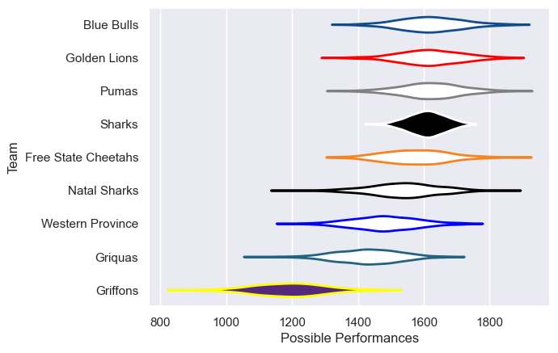
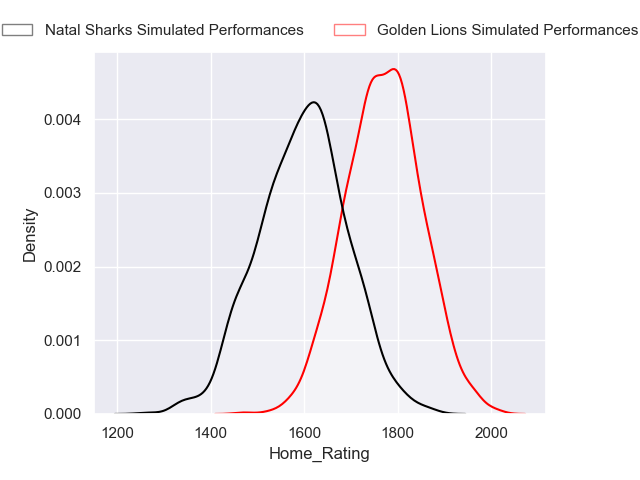
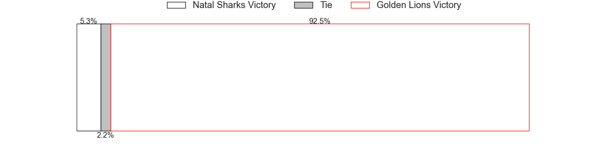
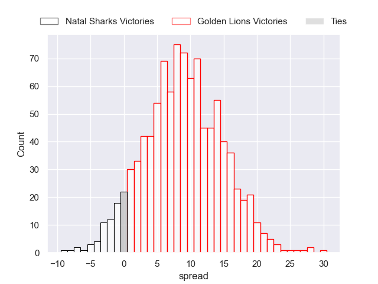
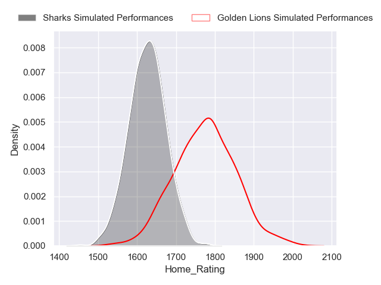
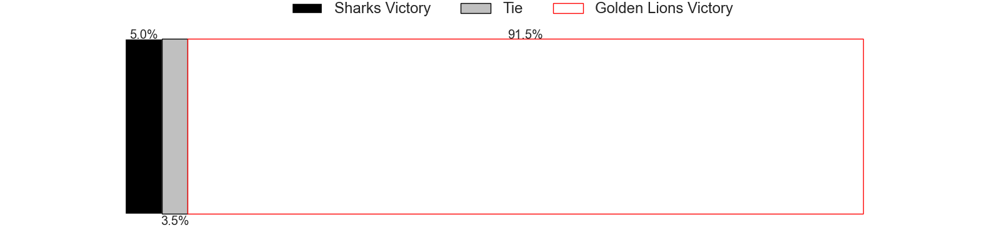
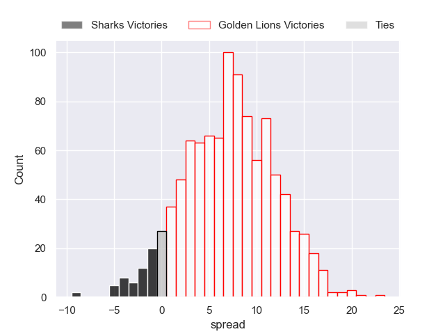

---  
title: "Currie Cup 2024 Status"  
date: 2024-09-20 6:00:00 -0500  
categories: model review projection  
layout: article  
aside:  
    toc: true  
---
# Current Team Rankings

# Standings

## Current Standings

| Club                |   Played |   Wins |   Point Differential |   Losing Bonus Points |   Try Bonus Points |   Competition Points |
|:--------------------|---------:|-------:|---------------------:|----------------------:|-------------------:|---------------------:|
| Golden Lions        |       13 |     11 |                  219 |                     0 |                nan |                   47 |
| Blue Bulls          |       12 |      8 |                  118 |                     1 |                nan |                   40 |
| Sharks              |       11 |      7 |                   93 |                     2 |                nan |                   30 |
| Pumas               |       12 |      6 |                  -50 |                     0 |                nan |                   29 |
| Free State Cheetahs |       11 |      5 |                   62 |                     1 |                nan |                   28 |
| Griquas             |       12 |      5 |                  -62 |                     0 |                nan |                   24 |
| Natal Sharks        |        7 |      3 |                   18 |                     2 |                nan |                   19 |
| Western Province    |       10 |      3 |                   -3 |                     2 |                nan |                   18 |
| Griffons            |       10 |      0 |                 -395 |                     1 |                nan |                    2 |

## Projected Remaining Table

| Club         |   Matches Remaining |   Wins |   Point Differential |   Losing Bonus Points |   Try Bonus Points |   Competition Points |
|:-------------|--------------------:|-------:|---------------------:|----------------------:|-------------------:|---------------------:|
| Golden Lions |                   2 |    1.9 |             16.3225  |                   0.1 |                0.8 |                  8.4 |
| Sharks       |                   1 |    0.1 |             -7.40584 |                   0.4 |                0.1 |                  0.8 |
| Natal Sharks |                   1 |    0.1 |             -8.91665 |                   0.3 |                0.1 |                  0.7 |

## Projected Total Table

| Club                |   Total Matches |   Wins |   Point Differential |   Losing Bonus Points |   Try Bonus Points |   Competition Points |
|:--------------------|----------------:|-------:|---------------------:|----------------------:|-------------------:|---------------------:|
| Golden Lions        |              15 |   12.9 |            235.322   |                   0.1 |                0.8 |                 55.4 |
| Blue Bulls          |              12 |    8   |            118       |                   1   |                0   |                 40   |
| Sharks              |              12 |    7.1 |             85.5942  |                   2.4 |                0.1 |                 30.8 |
| Pumas               |              12 |    6   |            -50       |                   0   |                0   |                 29   |
| Free State Cheetahs |              11 |    5   |             62       |                   1   |                0   |                 28   |
| Griquas             |              12 |    5   |            -62       |                   0   |                0   |                 24   |
| Natal Sharks        |               8 |    3.1 |              9.08335 |                   2.3 |                0.1 |                 19.7 |
| Western Province    |              10 |    3   |             -3       |                   2   |                0   |                 18   |
| Griffons            |              10 |    0   |           -395       |                   1   |                0   |                  2   |

# Completed Match Review

| Model | Percent Correct Predictions | Spread Error |
| ------ | ------ | ------ |
| Club Level | 53.1% | 15.5 |
| Player Level: Lineup | 57.7% | 20.2 |
| Player Level: Minutes | 57.7% | 20.2 |

# Future Predictions

## Week 14

### Golden Lions V Natal Sharks on 2024/09/21

Average Margin: Golden Lions by 8.9

Average Scoreline: 34-25

### Golden Lions V Sharks on 2024/09/21

Average Margin: Golden Lions by 7.4

Average Scoreline: 35-27

