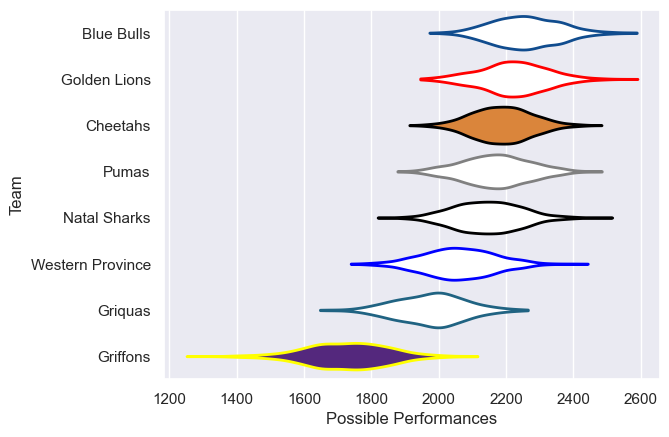

---  
title: "Currie Cup 2024 Status"  
date: 2025-07-28 6:00:00 -0500  
categories: model review projection  
layout: article  
aside:  
    toc: true  
---
# Current Team Rankings

# Standings

## Current Standings

| Club             |   Played |   Wins |   Point Differential |   Losing Bonus Points |   Try Bonus Points |   Competition Points |
|:-----------------|---------:|-------:|---------------------:|----------------------:|-------------------:|---------------------:|
| Blue Bulls       |        8 |      6 |                  125 |                     0 |                  5 |                   33 |
| Golden Lions     |        7 |      6 |                  114 |                     0 |                  3 |                   27 |
| Cheetahs         |        7 |      4 |                   70 |                     0 |                  5 |                   23 |
| Natal Sharks     |        7 |      2 |                   18 |                     2 |                  5 |                   19 |
| Pumas            |        7 |      3 |                  -43 |                     0 |                  5 |                   19 |
| Western Province |        6 |      2 |                   23 |                     2 |                  4 |                   14 |
| Griquas          |        7 |      2 |                  -44 |                     0 |                  4 |                   12 |
| Griffons         |        7 |      0 |                 -263 |                     1 |                  1 |                    2 |

## Projected Remaining Table

| Club         |   To Play |   Projected Wins |   Projected Differential |   Projected Losing Bonus Points | Projected Try Bonus Points   |   Projected Competition Points |
|:-------------|----------:|-----------------:|-------------------------:|--------------------------------:|:-----------------------------|-------------------------------:|
| Golden Lions |         1 |             0.64 |                     3.19 |                            0.16 |                              |                           2.8  |
| Natal Sharks |         1 |             0.32 |                    -3.19 |                            0.27 |                              |                           1.63 |

## Projected Total Table

| Club             |   Played |   Wins |   Point Differential |   Losing Bonus Points |   Try Bonus Points |   Competition Points |
|:-----------------|---------:|-------:|---------------------:|----------------------:|-------------------:|---------------------:|
| Blue Bulls       |        8 |   6    |               125    |                  0    |                  5 |                33    |
| Golden Lions     |        8 |   6.64 |               117.19 |                  0.16 |                  3 |                29.8  |
| Cheetahs         |        7 |   4    |                70    |                  0    |                  5 |                23    |
| Natal Sharks     |        8 |   2.32 |                14.81 |                  2.27 |                  5 |                20.63 |
| Pumas            |        7 |   3    |               -43    |                  0    |                  5 |                19    |
| Western Province |        6 |   2    |                23    |                  2    |                  4 |                14    |
| Griquas          |        7 |   2    |               -44    |                  0    |                  4 |                12    |
| Griffons         |        7 |   0    |              -263    |                  1    |                  1 |                 2    |

# Completed Match Review

| Model | Percent Correct Predictions | Spread Error |
| ------ | ------ | ------ |
| Club Level | 62.1% | 16.5 |
| Player Level: Lineup | nan% | nan |
| Player Level: Minutes | nan% | nan |

# Future Predictions

## Week 9

### Golden Lions V Natal Sharks on 2024/09/21

Average Margin: Golden Lions by 3.2

