---  
title: "Currie Cup 2024 Status"  
date: 2024-07-12 6:00:00 -0500  
categories: model review projection  
layout: article  
aside:  
    toc: true  
---
# Current Team Rankings

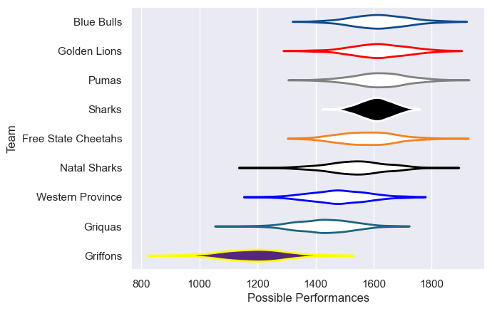
# Standings

## Current Standings

| Club                |   Played |   Wins |   Point Differential |   Losing Bonus Points |   Try Bonus Points |   Competition Points |
|:--------------------|---------:|-------:|---------------------:|----------------------:|-------------------:|---------------------:|
| Golden Lions        |        2 |      2 |                    2 |                     0 |                nan |                    8 |
| Free State Cheetahs |        1 |      1 |                   62 |                     0 |                  1 |                    5 |
| Pumas               |        1 |      1 |                   20 |                     0 |                  1 |                    5 |
| Blue Bulls          |        1 |      1 |                    5 |                     0 |                  0 |                    4 |
| Natal Sharks        |        1 |      0 |                   -1 |                     1 |                  1 |                    2 |
| Western Province    |        1 |      0 |                   -5 |                     1 |                  1 |                    2 |
| Sharks              |        1 |      0 |                   -1 |                     1 |                nan |                    1 |
| Griquas             |        1 |      0 |                  -20 |                     0 |                  1 |                    1 |
| Griffons            |        1 |      0 |                  -62 |                     0 |                  0 |                    0 |

## Projected Remaining Table

| Club                |   Matches Remaining |   Wins |   Point Differential |   Losing Bonus Points |   Try Bonus Points |   Competition Points |
|:--------------------|--------------------:|-------:|---------------------:|----------------------:|-------------------:|---------------------:|
| Blue Bulls          |                   1 |    1   |             13.0891  |                   0   |                0.9 |                  4.8 |
| Free State Cheetahs |                   1 |    0.9 |              8.34175 |                   0.1 |                0.5 |                  4.1 |
| Sharks              |                   1 |    0.8 |              5.5352  |                   0.2 |                0.5 |                  3.9 |
| Pumas               |                   1 |    0.8 |              5.32124 |                   0.2 |                0.3 |                  3.6 |
| Griquas             |                   2 |    0.6 |             -7.50832 |                   0.8 |                0.3 |                  3.5 |
| Natal Sharks        |                   1 |    0.6 |              1.97311 |                   0.3 |                0.7 |                  3.4 |
| Golden Lions        |                   1 |    0.2 |             -5.32124 |                   0.3 |                0.3 |                  1.7 |
| Western Province    |                   1 |    0.1 |             -8.34175 |                   0.3 |                0.2 |                  1   |
| Griffons            |                   1 |    0   |            -13.0891  |                   0.2 |                0.4 |                  0.8 |

## Projected Total Table

| Club                |   Total Matches |   Wins |   Point Differential |   Losing Bonus Points |   Try Bonus Points |   Competition Points |
|:--------------------|----------------:|-------:|---------------------:|----------------------:|-------------------:|---------------------:|
| Golden Lions        |               3 |    2.2 |            -3.32124  |                   0.3 |                0.3 |                  9.7 |
| Free State Cheetahs |               2 |    1.9 |            70.3417   |                   0.1 |                1.5 |                  9.1 |
| Blue Bulls          |               2 |    2   |            18.0891   |                   0   |                0.9 |                  8.8 |
| Pumas               |               2 |    1.8 |            25.3212   |                   0.2 |                1.3 |                  8.6 |
| Natal Sharks        |               2 |    0.6 |             0.973112 |                   1.3 |                1.7 |                  5.4 |
| Sharks              |               2 |    0.8 |             4.5352   |                   1.2 |                0.5 |                  4.9 |
| Griquas             |               3 |    0.6 |           -27.5083   |                   0.8 |                1.3 |                  4.5 |
| Western Province    |               2 |    0.1 |           -13.3417   |                   1.3 |                1.2 |                  3   |
| Griffons            |               2 |    0   |           -75.0891   |                   0.2 |                0.4 |                  0.8 |

# Completed Match Review

| Model | Percent Correct Predictions | Spread Error |
| ------ | ------ | ------ |
| Club Level | 20.0% | 17.4 |
| Player Level: Lineup | 25.0% | 23.6 |
| Player Level: Minutes | 25.0% | 23.6 |

# Future Predictions

## Week 3

### Griquas V Natal Sharks on 2024/07/12

Average Margin: Natal Sharks by 2.0

Average Scoreline: 35-33

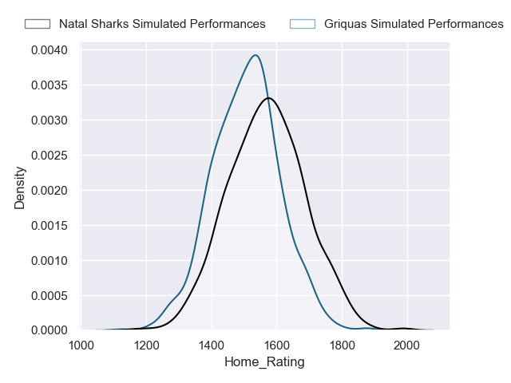
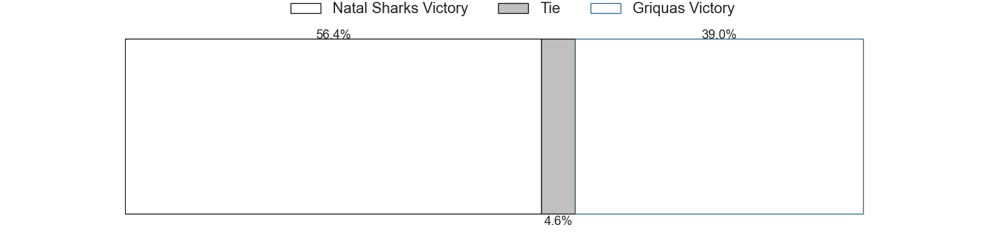
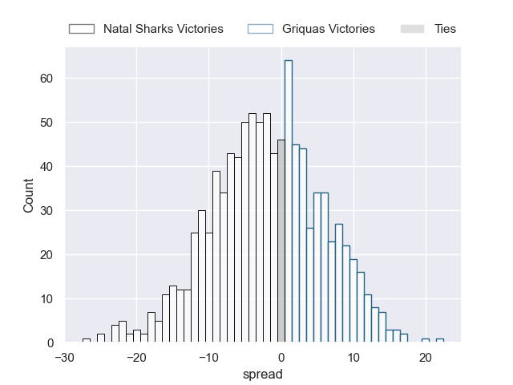

### Pumas V Golden Lions on 2024/07/12

Average Margin: Pumas by 5.3

Average Scoreline: 27-22

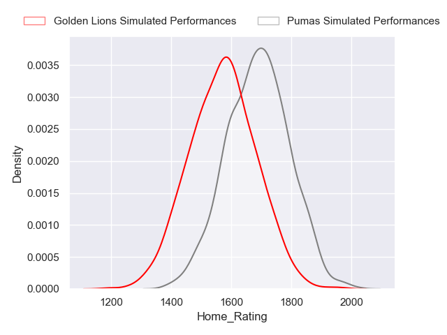
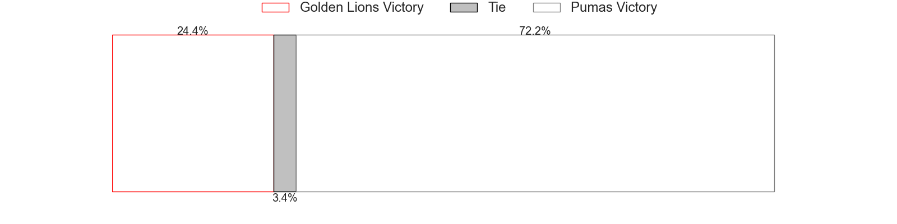
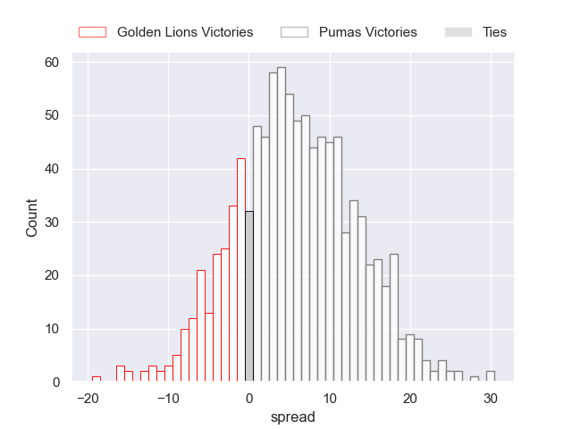

### Griquas V Sharks on 2024/07/12

Average Margin: Sharks by 5.5

Average Scoreline: 28-23

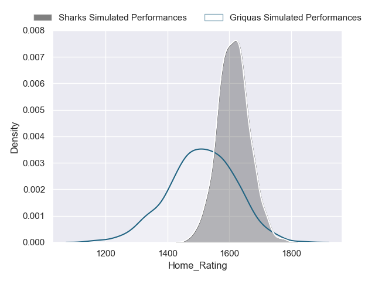
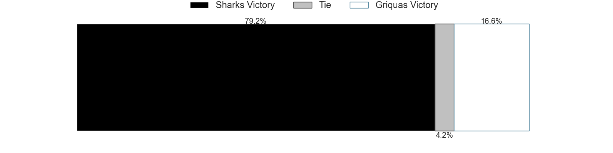
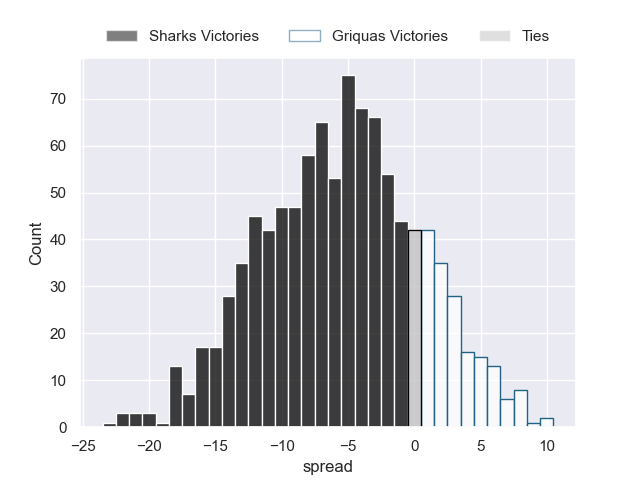

### Free State Cheetahs V Western Province on 2024/07/13

Average Margin: Free State Cheetahs by 8.3

Average Scoreline: 30-21

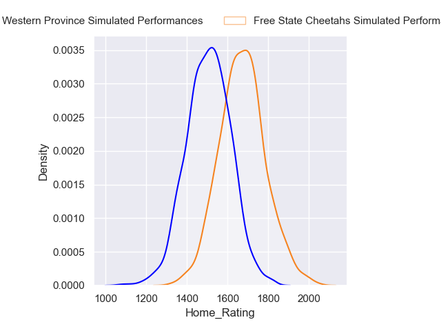
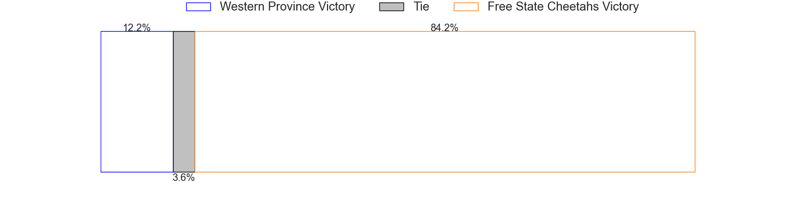
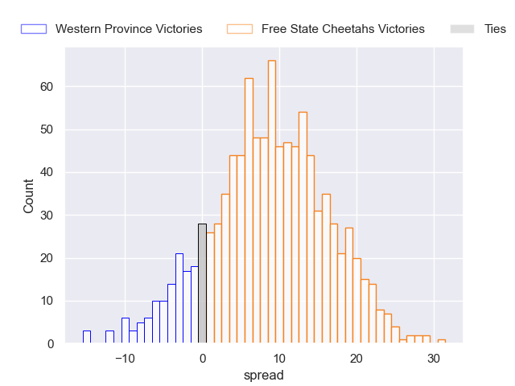

### Griffons V Blue Bulls on 2024/07/14

Average Margin: Blue Bulls by 13.1

Average Scoreline: 36-23

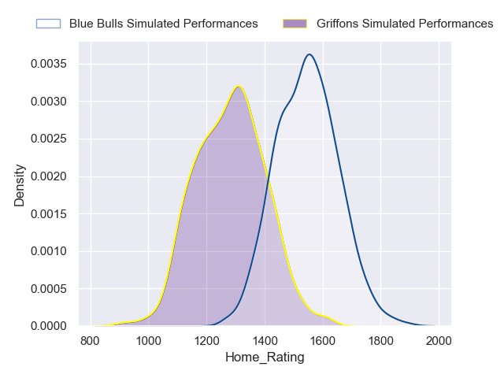
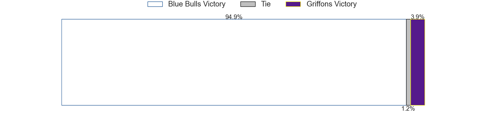
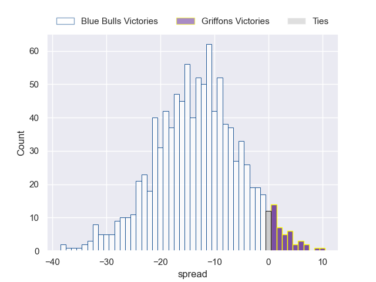

