---  
title: "Currie Cup 2024 Status"  
date: 2024-07-03 6:00:00 -0500  
categories: model review projection  
layout: article  
aside:  
    toc: true  
---
# Current Team Rankings

# Standings

## Projected Total Table

| Club                |   Total Matches |   Wins |   Point Differential |   Losing Bonus Points |   Try Bonus Points |   Competition Points |
|:--------------------|----------------:|-------:|---------------------:|----------------------:|-------------------:|---------------------:|
| Free State Cheetahs |               1 |    1   |            22.0134   |                   0   |                0.9 |                  4.9 |
| Sharks              |               1 |    0.9 |             7.93393  |                   0.1 |                0.3 |                  4   |
| Western Province    |               1 |    0.7 |             4.62369  |                   0.2 |                0.2 |                  3.3 |
| Pumas               |               1 |    0.5 |             0.669572 |                   0.3 |                0.5 |                  2.9 |
| Griquas             |               1 |    0.5 |            -0.669572 |                   0.3 |                0.2 |                  2.4 |
| Blue Bulls          |               1 |    0.3 |            -4.62369  |                   0.4 |                0.2 |                  1.7 |
| Golden Lions        |               1 |    0.1 |            -7.93393  |                   0.4 |                0.2 |                  0.9 |
| Griffons            |               1 |    0   |           -22.0134   |                   0   |                0.3 |                  0.4 |

# Future Predictions

## Week 1

### Griquas V Pumas on 2024/07/05

Average Margin: Pumas by 0.7

Average Scoreline: 23-23

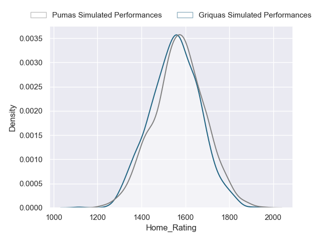

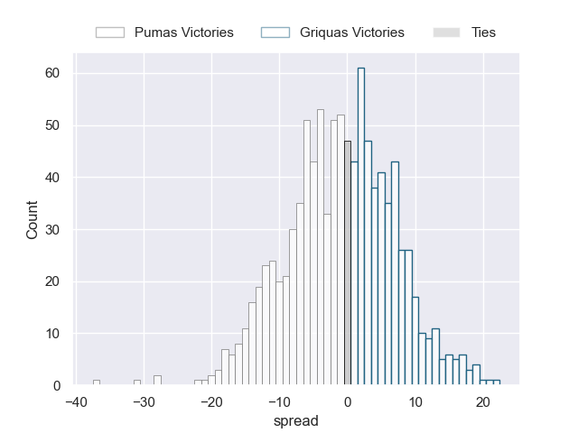

### Sharks V Golden Lions on 2024/07/05

Average Margin: Sharks by 7.9

Average Scoreline: 28-20

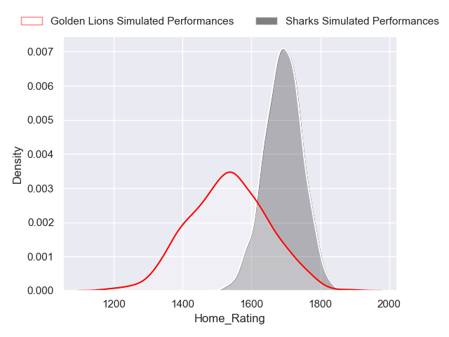
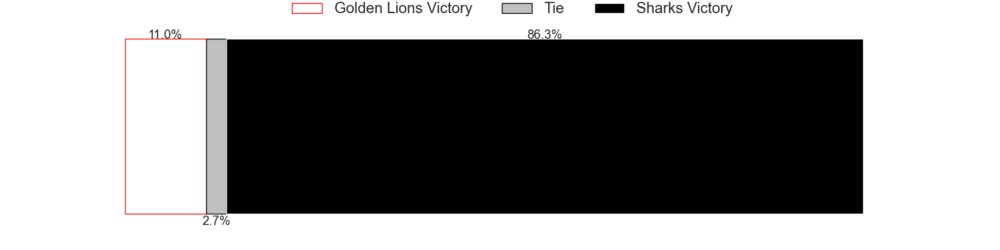
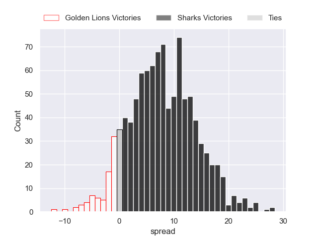

### Free State Cheetahs V Griffons on 2024/07/06

Average Margin: Free State Cheetahs by 22.0

Average Scoreline: 50-28

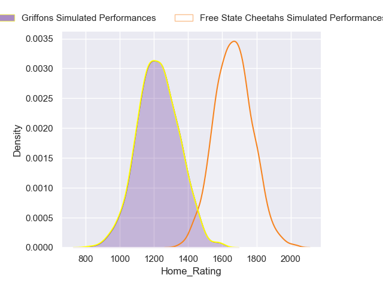
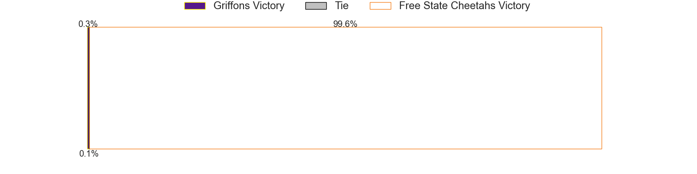
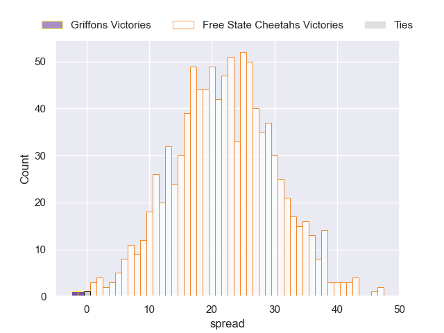

### Western Province V Blue Bulls on 2024/07/07

Average Margin: Western Province by 4.6

Average Scoreline: 25-20

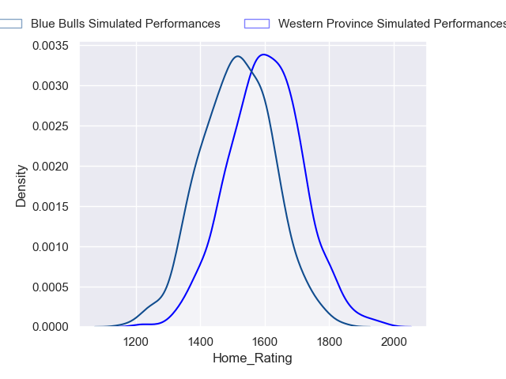
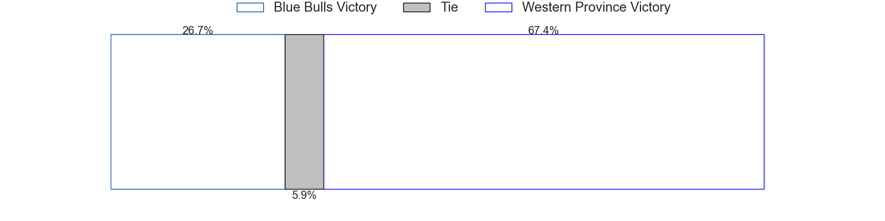
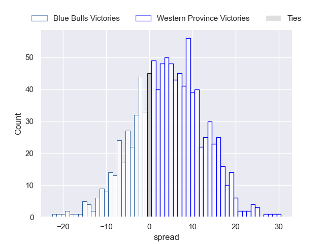

