---  
title: "Currie Cup 2024 Status"  
date: 2024-07-19 6:00:00 -0500  
categories: model review projection  
layout: article  
aside:  
    toc: true  
---
# Current Team Rankings

# Standings

## Current Standings

| Club                |   Played |   Wins |   Point Differential |   Losing Bonus Points |   Try Bonus Points |   Competition Points |
|:--------------------|---------:|-------:|---------------------:|----------------------:|-------------------:|---------------------:|
| Golden Lions        |        3 |      3 |                   56 |                     0 |                nan |                   13 |
| Free State Cheetahs |        2 |      2 |                   82 |                     0 |                  2 |                   10 |
| Griquas             |        3 |      2 |                  -14 |                     0 |                nan |                   10 |
| Blue Bulls          |        2 |      2 |                   47 |                     0 |                  1 |                    9 |
| Pumas               |        2 |      1 |                  -34 |                     0 |                  1 |                    5 |
| Natal Sharks        |        2 |      0 |                   -4 |                     2 |                  2 |                    4 |
| Sharks              |        2 |      0 |                   -4 |                     2 |                nan |                    2 |
| Western Province    |        2 |      0 |                  -25 |                     1 |                  1 |                    2 |
| Griffons            |        2 |      0 |                 -104 |                     0 |                  0 |                    0 |

## Projected Remaining Table

| Club                |   Matches Remaining |   Wins |   Point Differential |   Losing Bonus Points |   Try Bonus Points |   Competition Points |
|:--------------------|--------------------:|-------:|---------------------:|----------------------:|-------------------:|---------------------:|
| Western Province    |                   1 |    0.9 |            11.5267   |                   0   |                0.9 |                  4.7 |
| Golden Lions        |                   1 |    1   |            12.8489   |                   0   |                0.6 |                  4.5 |
| Sharks              |                   1 |    0.5 |             0.218966 |                   0.4 |                0.3 |                  2.8 |
| Blue Bulls          |                   1 |    0.5 |             0.75239  |                   0.3 |                0.2 |                  2.6 |
| Free State Cheetahs |                   1 |    0.5 |            -0.75239  |                   0.3 |                0.4 |                  2.6 |
| Pumas               |                   1 |    0.5 |            -0.218966 |                   0.4 |                0.2 |                  2.5 |
| Griffons            |                   1 |    0.1 |           -11.5267   |                   0.2 |                0.2 |                  0.7 |
| Griquas             |                   1 |    0   |           -12.8489   |                   0.2 |                0.2 |                  0.5 |

## Projected Total Table

| Club                |   Total Matches |   Wins |   Point Differential |   Losing Bonus Points |   Try Bonus Points |   Competition Points |
|:--------------------|----------------:|-------:|---------------------:|----------------------:|-------------------:|---------------------:|
| Golden Lions        |               4 |    4   |             68.8489  |                   0   |                0.6 |                 17.5 |
| Free State Cheetahs |               3 |    2.5 |             81.2476  |                   0.3 |                2.4 |                 12.6 |
| Blue Bulls          |               3 |    2.5 |             47.7524  |                   0.3 |                1.2 |                 11.6 |
| Griquas             |               4 |    2   |            -26.8489  |                   0.2 |                0.2 |                 10.5 |
| Pumas               |               3 |    1.5 |            -34.219   |                   0.4 |                1.2 |                  7.5 |
| Western Province    |               3 |    0.9 |            -13.4733  |                   1   |                1.9 |                  6.7 |
| Sharks              |               3 |    0.5 |             -3.78103 |                   2.4 |                0.3 |                  4.8 |
| Natal Sharks        |               2 |    0   |             -4       |                   2   |                2   |                  4   |
| Griffons            |               3 |    0.1 |           -115.527   |                   0.2 |                0.2 |                  0.7 |

# Completed Match Review

| Model | Percent Correct Predictions | Spread Error |
| ------ | ------ | ------ |
| Club Level | 40.0% | 19.9 |
| Player Level: Lineup | 50.0% | 27.0 |
| Player Level: Minutes | 50.0% | 26.9 |

# Future Predictions

## Week 4

### Pumas V Sharks on 2024/07/19

Average Margin: Sharks by 0.2

Average Scoreline: 24-24

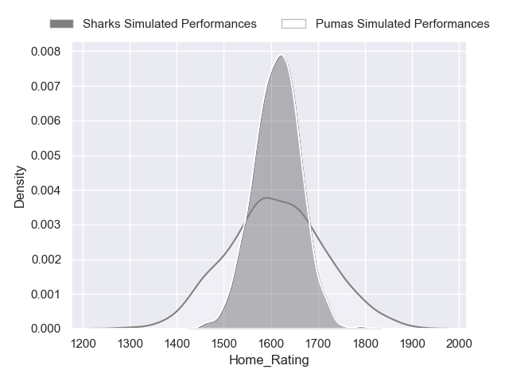

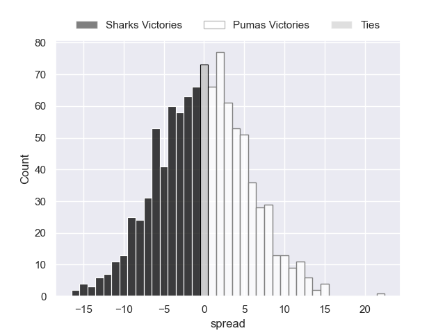

### Blue Bulls V Free State Cheetahs on 2024/07/19

Average Margin: Blue Bulls by 0.8

Average Scoreline: 33-33

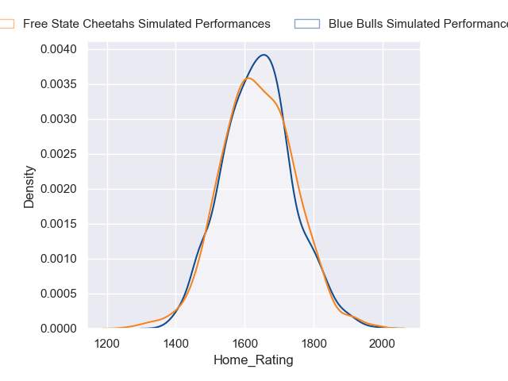
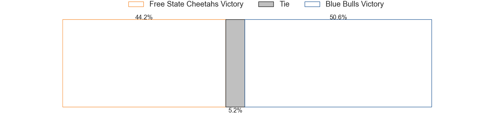
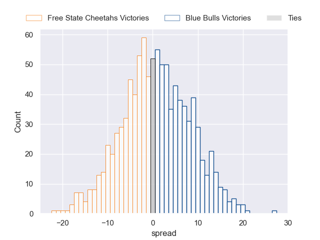

### Golden Lions V Griquas on 2024/07/19

Average Margin: Golden Lions by 12.8

Average Scoreline: 40-27

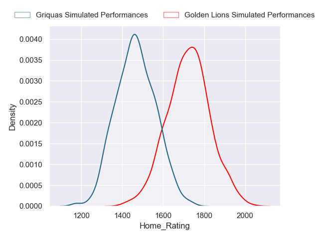
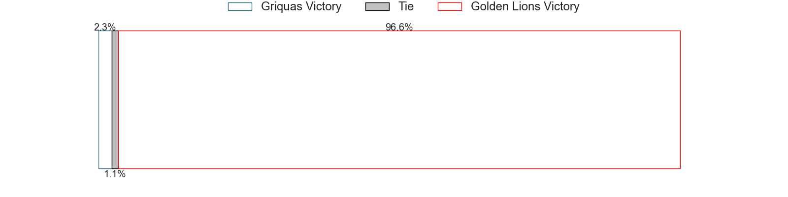
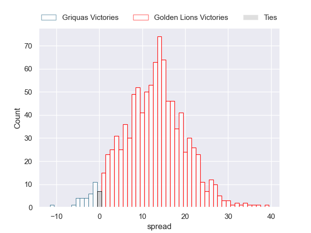

### Griffons V Western Province on 2024/07/21

Average Margin: Western Province by 11.5

Average Scoreline: 44-32

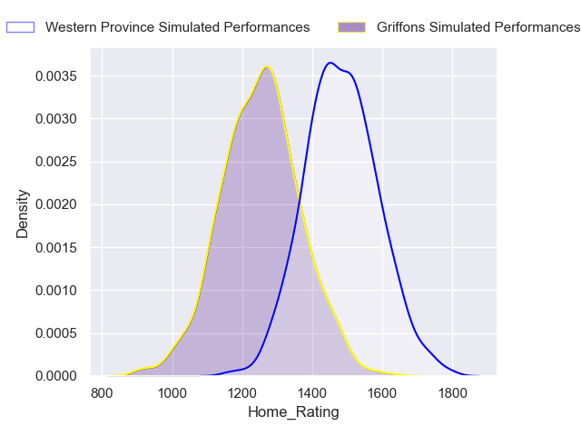
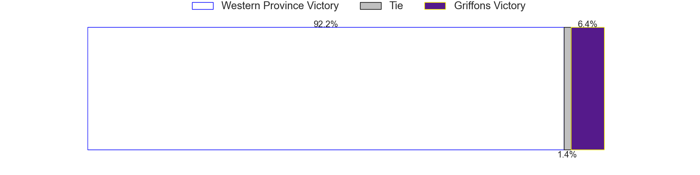
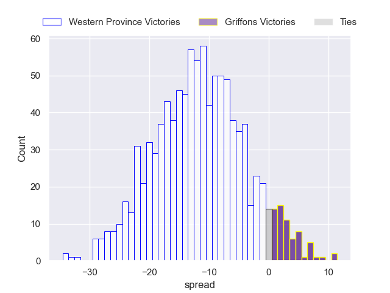

