---  
title: "Currie Cup 2024 Status"  
date: 2024-08-12 6:00:00 -0500  
categories: model review projection  
layout: article  
aside:  
    toc: true  
---
# Current Team Rankings

# Standings

## Current Standings

| Club                |   Played |   Wins |   Point Differential |   Losing Bonus Points |   Try Bonus Points |   Competition Points |
|:--------------------|---------:|-------:|---------------------:|----------------------:|-------------------:|---------------------:|
| Golden Lions        |        7 |      6 |                  106 |                     0 |                nan |                   25 |
| Blue Bulls          |        6 |      5 |                  109 |                     0 |                nan |                   23 |
| Free State Cheetahs |        6 |      4 |                   79 |                     0 |                nan |                   20 |
| Pumas               |        6 |      3 |                  -27 |                     0 |                nan |                   15 |
| Sharks              |        6 |      2 |                   18 |                     2 |                nan |                   12 |
| Western Province    |        6 |      2 |                   23 |                     2 |                nan |                   11 |
| Griquas             |        7 |      2 |                  -93 |                     0 |                nan |                   10 |
| Natal Sharks        |        2 |      0 |                   -4 |                     2 |                  2 |                    4 |
| Griffons            |        6 |      0 |                 -211 |                     1 |                nan |                    1 |

## Projected Remaining Table

| Club                |   Matches Remaining |   Wins |   Point Differential |   Losing Bonus Points |   Try Bonus Points |   Competition Points |
|:--------------------|--------------------:|-------:|---------------------:|----------------------:|-------------------:|---------------------:|
| Golden Lions        |                   1 |    1   |             12.7522  |                   0   |                0.7 |                  4.7 |
| Griquas             |                   1 |    0.9 |              8.85591 |                   0.1 |                0.9 |                  4.6 |
| Free State Cheetahs |                   1 |    0.6 |              1.95681 |                   0.3 |                0.3 |                  3.2 |
| Pumas               |                   1 |    0.6 |              0.65352 |                   0.3 |                0.3 |                  2.9 |
| Blue Bulls          |                   1 |    0.4 |             -0.65352 |                   0.4 |                0.3 |                  2.5 |
| Sharks              |                   1 |    0.4 |             -1.95681 |                   0.5 |                0.3 |                  2.2 |
| Griffons            |                   1 |    0.1 |             -8.85591 |                   0.3 |                0.4 |                  1   |
| Western Province    |                   1 |    0   |            -12.7522  |                   0.2 |                0.2 |                  0.4 |

## Projected Total Table

| Club                |   Total Matches |   Wins |   Point Differential |   Losing Bonus Points |   Try Bonus Points |   Competition Points |
|:--------------------|----------------:|-------:|---------------------:|----------------------:|-------------------:|---------------------:|
| Golden Lions        |               8 |    7   |             118.752  |                   0   |                0.7 |                 29.7 |
| Blue Bulls          |               7 |    5.4 |             108.346  |                   0.4 |                0.3 |                 25.5 |
| Free State Cheetahs |               7 |    4.6 |              80.9568 |                   0.3 |                0.3 |                 23.2 |
| Pumas               |               7 |    3.6 |             -26.3465 |                   0.3 |                0.3 |                 17.9 |
| Griquas             |               8 |    2.9 |             -84.1441 |                   0.1 |                0.9 |                 14.6 |
| Sharks              |               7 |    2.4 |              16.0432 |                   2.5 |                0.3 |                 14.2 |
| Western Province    |               7 |    2   |              10.2478 |                   2.2 |                0.2 |                 11.4 |
| Natal Sharks        |               2 |    0   |              -4      |                   2   |                2   |                  4   |
| Griffons            |               7 |    0.1 |            -219.856  |                   1.3 |                0.4 |                  2   |

# Completed Match Review

| Model | Percent Correct Predictions | Spread Error |
| ------ | ------ | ------ |
| Club Level | 57.7% | 15.9 |
| Player Level: Lineup | 50.0% | 26.6 |
| Player Level: Minutes | 50.0% | 26.6 |

# Future Predictions

## Week 8

### Pumas V Blue Bulls on 2024/08/16

Average Margin: Pumas by 0.7

Average Scoreline: 22-22

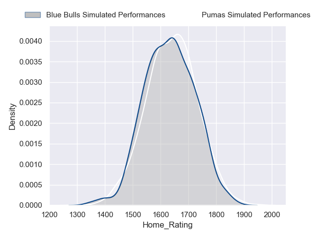
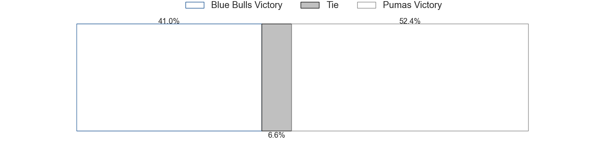
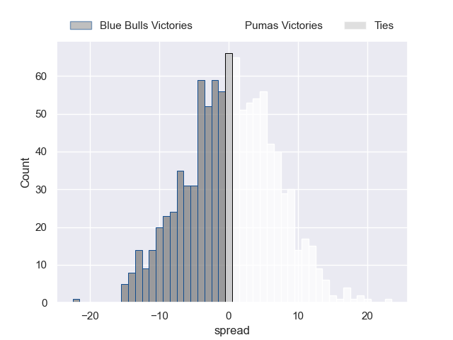

### Golden Lions V Western Province on 2024/08/17

Average Margin: Golden Lions by 12.8

Average Scoreline: 46-33

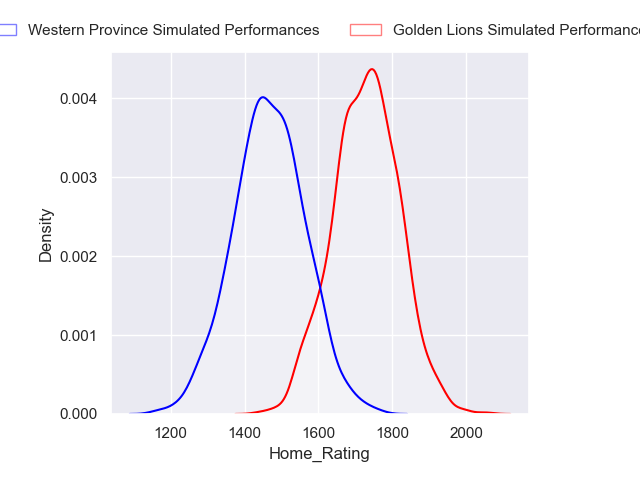
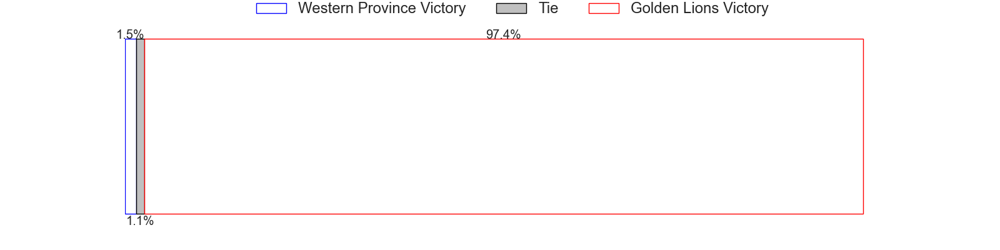
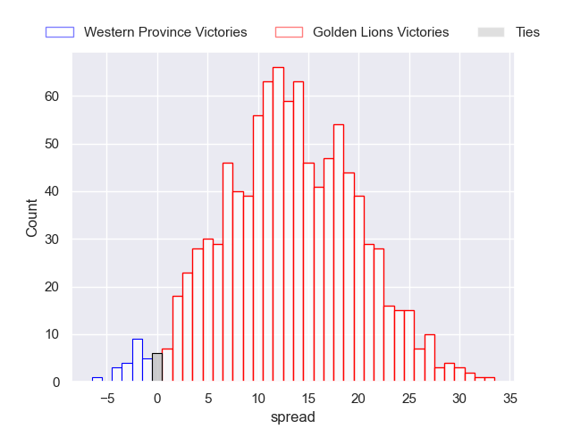

### Free State Cheetahs V Sharks on 2024/08/17

Average Margin: Free State Cheetahs by 2.0

Average Scoreline: 26-24

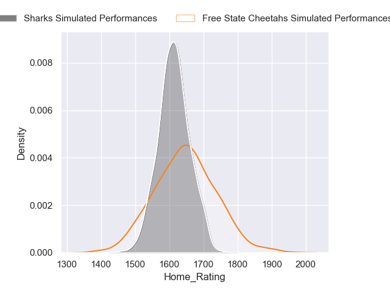
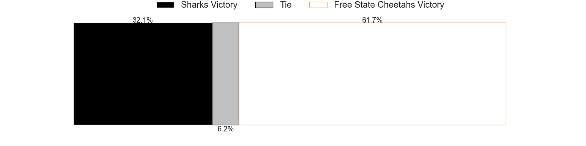
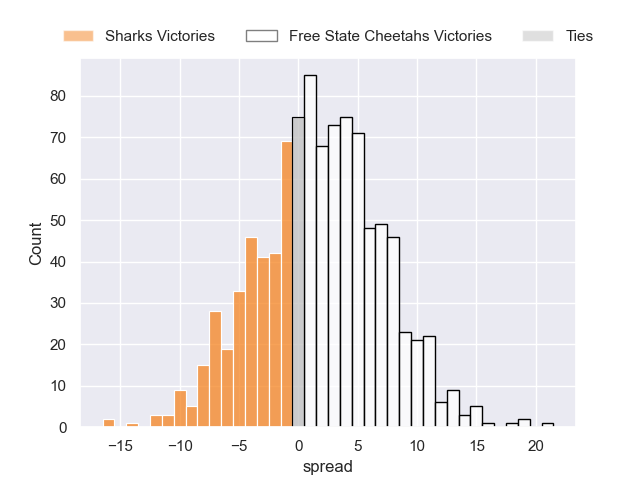

### Griffons V Griquas on 2024/08/18

Average Margin: Griquas by 8.9

Average Scoreline: 25-16

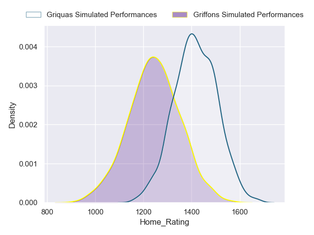
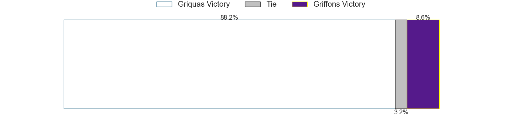
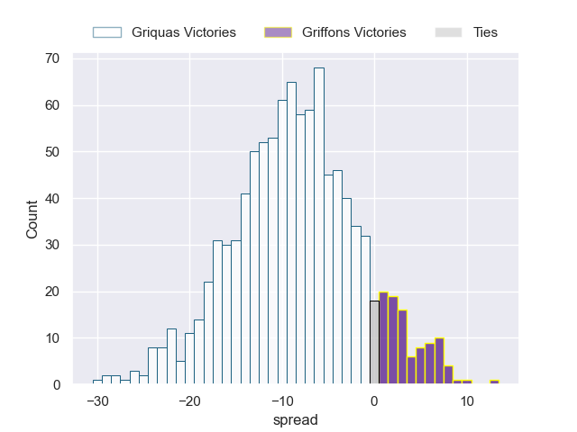

