---  
title: "Currie Cup 2024 Status"  
date: 2024-07-22 6:00:00 -0500  
categories: model review projection  
layout: article  
aside:  
    toc: true  
---
# Current Team Rankings

# Standings

## Current Standings

| Club                |   Played |   Wins |   Point Differential |   Losing Bonus Points |   Try Bonus Points |   Competition Points |
|:--------------------|---------:|-------:|---------------------:|----------------------:|-------------------:|---------------------:|
| Golden Lions        |        4 |      4 |                   68 |                     0 |                nan |                   17 |
| Blue Bulls          |        3 |      3 |                   59 |                     0 |                nan |                   13 |
| Free State Cheetahs |        3 |      2 |                   70 |                     0 |                nan |                   10 |
| Griquas             |        4 |      2 |                  -26 |                     0 |                nan |                   10 |
| Pumas               |        3 |      2 |                  -24 |                     0 |                nan |                    9 |
| Western Province    |        3 |      1 |                   24 |                     1 |                nan |                    6 |
| Natal Sharks        |        2 |      0 |                   -4 |                     2 |                  2 |                    4 |
| Sharks              |        3 |      0 |                  -14 |                     2 |                nan |                    2 |
| Griffons            |        3 |      0 |                 -153 |                     0 |                nan |                    0 |

## Projected Remaining Table

| Club                |   Matches Remaining |   Wins |   Point Differential |   Losing Bonus Points |   Try Bonus Points |   Competition Points |
|:--------------------|--------------------:|-------:|---------------------:|----------------------:|-------------------:|---------------------:|
| Free State Cheetahs |                   1 |    1   |             18.971   |                   0   |                1   |                  5   |
| Pumas               |                   1 |    0.9 |             10.6545  |                   0.1 |                0.6 |                  4.4 |
| Golden Lions        |                   1 |    0.9 |              6.27669 |                   0.1 |                0.4 |                  4   |
| Blue Bulls          |                   1 |    0.9 |              7.7106  |                   0.1 |                0.4 |                  3.9 |
| Sharks              |                   1 |    0.1 |             -6.27669 |                   0.4 |                0.2 |                  1.1 |
| Western Province    |                   1 |    0.1 |             -7.7106  |                   0.3 |                0.2 |                  1.1 |
| Griquas             |                   1 |    0.1 |            -10.6545  |                   0.2 |                0.2 |                  0.7 |
| Griffons            |                   1 |    0   |            -18.971   |                   0.1 |                0.2 |                  0.2 |

## Projected Total Table

| Club                |   Total Matches |   Wins |   Point Differential |   Losing Bonus Points |   Try Bonus Points |   Competition Points |
|:--------------------|----------------:|-------:|---------------------:|----------------------:|-------------------:|---------------------:|
| Golden Lions        |               5 |    4.9 |              74.2767 |                   0.1 |                0.4 |                 21   |
| Blue Bulls          |               4 |    3.9 |              66.7106 |                   0.1 |                0.4 |                 16.9 |
| Free State Cheetahs |               4 |    3   |              88.971  |                   0   |                1   |                 15   |
| Pumas               |               4 |    2.9 |             -13.3455 |                   0.1 |                0.6 |                 13.4 |
| Griquas             |               5 |    2.1 |             -36.6545 |                   0.2 |                0.2 |                 10.7 |
| Western Province    |               4 |    1.1 |              16.2894 |                   1.3 |                0.2 |                  7.1 |
| Natal Sharks        |               2 |    0   |              -4      |                   2   |                2   |                  4   |
| Sharks              |               4 |    0.1 |             -20.2767 |                   2.4 |                0.2 |                  3.1 |
| Griffons            |               4 |    0   |            -171.971  |                   0.1 |                0.2 |                  0.2 |

# Completed Match Review

| Model | Percent Correct Predictions | Spread Error |
| ------ | ------ | ------ |
| Club Level | 50.0% | 19.4 |
| Player Level: Lineup | 50.0% | 27.0 |
| Player Level: Minutes | 50.0% | 26.9 |

# Future Predictions

## Week 5

### Griffons V Free State Cheetahs on 2024/07/26

Average Margin: Free State Cheetahs by 19.0

Average Scoreline: 47-28

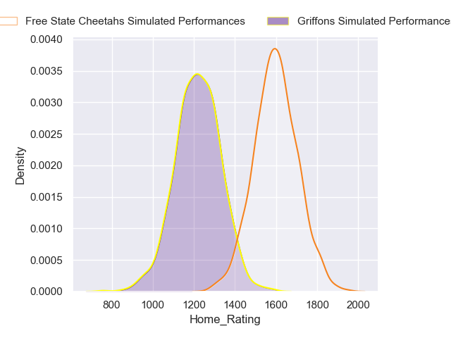
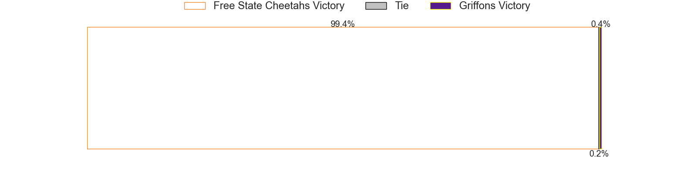
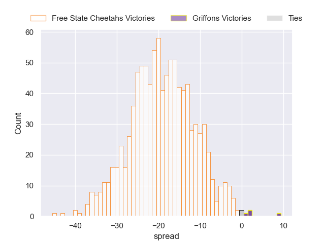

### Blue Bulls V Western Province on 2024/07/27

Average Margin: Blue Bulls by 7.7

Average Scoreline: 30-23

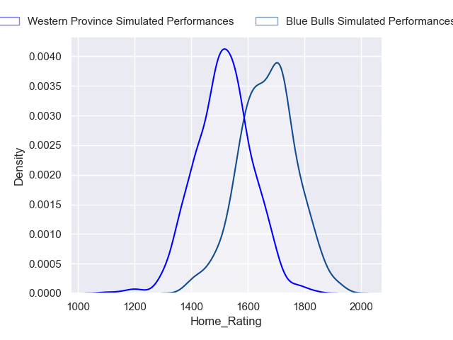
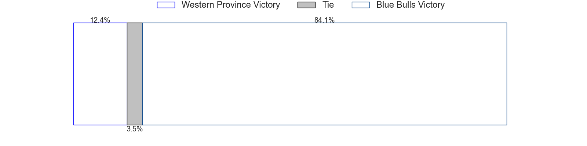
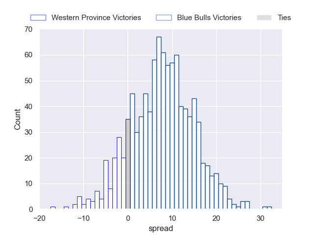

### Golden Lions V Sharks on 2024/07/27

Average Margin: Golden Lions by 6.3

Average Scoreline: 30-23

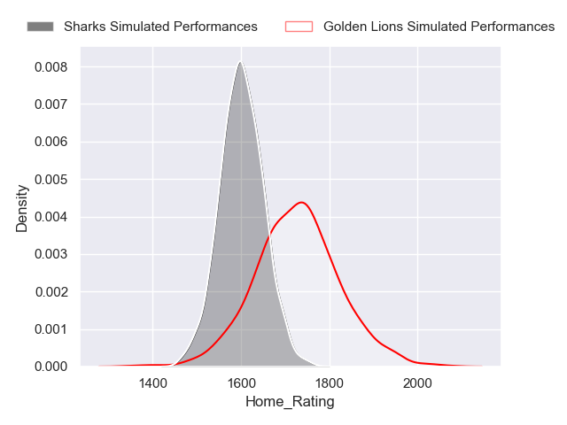
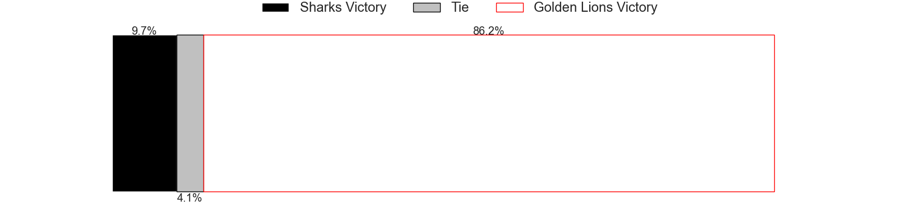
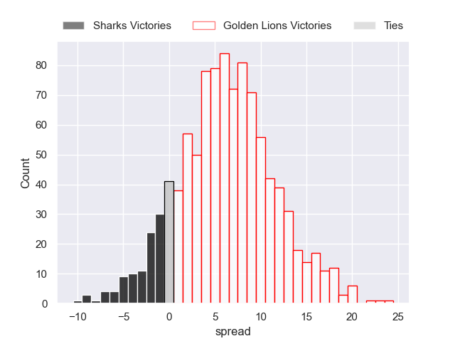

### Pumas V Griquas on 2024/07/28

Average Margin: Pumas by 10.7

Average Scoreline: 33-23

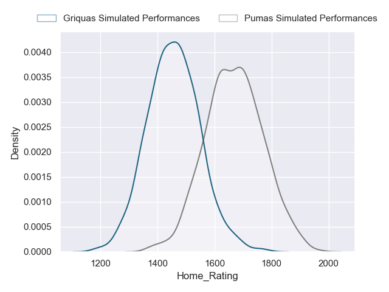
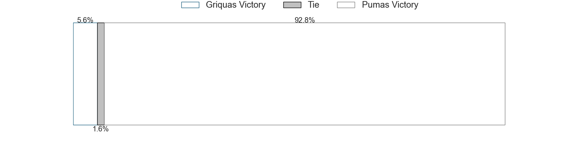
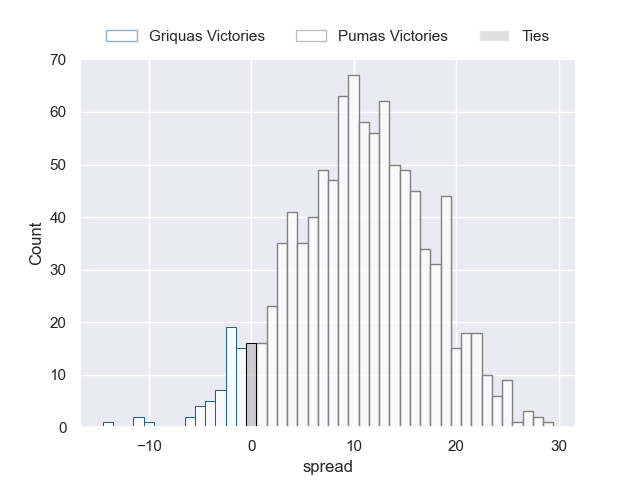

