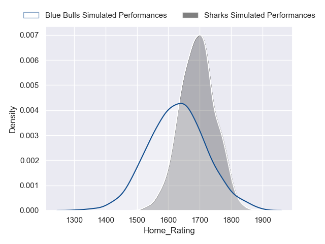
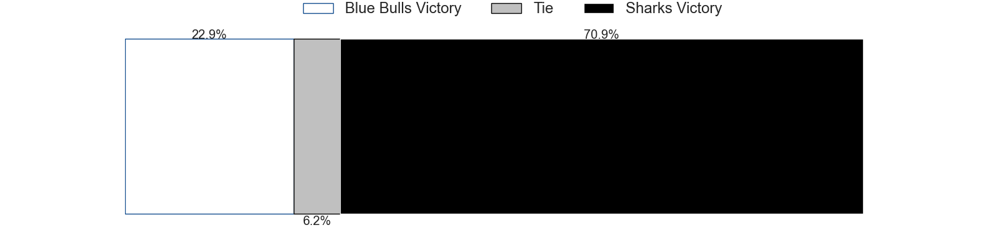
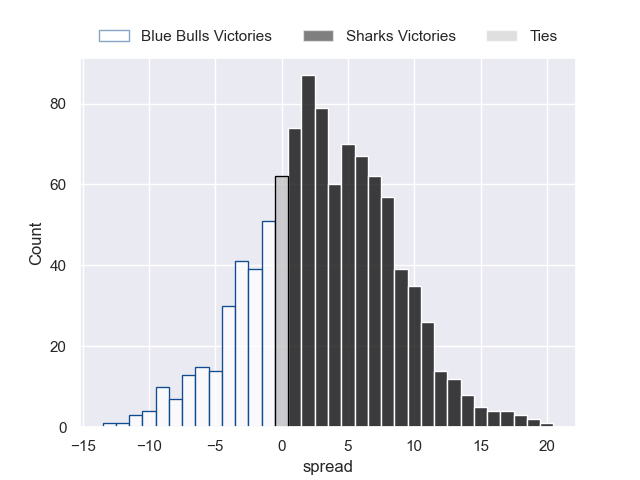

---  
title: "Currie Cup 2024 Status"  
date: 2024-09-05 6:00:00 -0500  
categories: model review projection  
layout: article  
aside:  
    toc: true  
---
# Current Team Rankings

# Standings

## Current Standings

| Club                |   Played |   Wins |   Point Differential |   Losing Bonus Points |   Try Bonus Points |   Competition Points |
|:--------------------|---------:|-------:|---------------------:|----------------------:|-------------------:|---------------------:|
| Golden Lions        |       11 |      9 |                  153 |                     0 |                nan |                   39 |
| Blue Bulls          |        9 |      7 |                  124 |                     0 |                nan |                   35 |
| Natal Sharks        |        9 |      5 |                   87 |                     2 |                nan |                   29 |
| Pumas               |       11 |      6 |                  -23 |                     0 |                nan |                   29 |
| Free State Cheetahs |       10 |      4 |                   39 |                     2 |                nan |                   25 |
| Sharks              |        9 |      5 |                   87 |                     2 |                nan |                   24 |
| Griquas             |       11 |      4 |                  -70 |                     0 |                nan |                   20 |
| Western Province    |       10 |      3 |                   -3 |                     2 |                nan |                   18 |
| Griffons            |       10 |      0 |                 -394 |                     1 |                nan |                    2 |

## Projected Remaining Table

| Club                |   Matches Remaining |   Wins |   Point Differential |   Losing Bonus Points |   Try Bonus Points |   Competition Points |
|:--------------------|--------------------:|-------:|---------------------:|----------------------:|-------------------:|---------------------:|
| Golden Lions        |                   1 |    1   |             32.3027  |                   0   |                1   |                  5   |
| Blue Bulls          |                   2 |    0.6 |             -6.41529 |                   0.9 |                0.5 |                  3.8 |
| Pumas               |                   1 |    0.8 |              5.85055 |                   0.1 |                0.2 |                  3.7 |
| Griquas             |                   1 |    0.7 |              3.41958 |                   0.3 |                0.3 |                  3.4 |
| Sharks              |                   1 |    0.7 |              3.13474 |                   0.2 |                0.3 |                  3.4 |
| Natal Sharks        |                   1 |    0.7 |              3.28055 |                   0.2 |                0.3 |                  3.3 |
| Western Province    |                   1 |    0.3 |             -3.41958 |                   0.4 |                0.4 |                  2.1 |
| Free State Cheetahs |                   1 |    0.2 |             -5.85055 |                   0.4 |                0.3 |                  1.3 |
| Griffons            |                   1 |    0   |            -32.3027  |                   0   |                0.1 |                  0.1 |

## Projected Total Table

| Club                |   Total Matches |   Wins |   Point Differential |   Losing Bonus Points |   Try Bonus Points |   Competition Points |
|:--------------------|----------------:|-------:|---------------------:|----------------------:|-------------------:|---------------------:|
| Golden Lions        |              12 |   10   |            185.303   |                   0   |                1   |                 44   |
| Blue Bulls          |              11 |    7.6 |            117.585   |                   0.9 |                0.5 |                 38.8 |
| Pumas               |              12 |    6.8 |            -17.1495  |                   0.1 |                0.2 |                 32.7 |
| Natal Sharks        |              10 |    5.7 |             90.2806  |                   2.2 |                0.3 |                 32.3 |
| Sharks              |              10 |    5.7 |             90.1347  |                   2.2 |                0.3 |                 27.4 |
| Free State Cheetahs |              11 |    4.2 |             33.1495  |                   2.4 |                0.3 |                 26.3 |
| Griquas             |              12 |    4.7 |            -66.5804  |                   0.3 |                0.3 |                 23.4 |
| Western Province    |              11 |    3.3 |             -6.41958 |                   2.4 |                0.4 |                 20.1 |
| Griffons            |              11 |    0   |           -426.303   |                   1   |                0.1 |                  2.1 |

# Completed Match Review

| Model | Percent Correct Predictions | Spread Error |
| ------ | ------ | ------ |
| Club Level | 51.1% | 16.3 |
| Player Level: Lineup | 57.7% | 20.1 |
| Player Level: Minutes | 57.7% | 20.2 |

# Future Predictions

## Week 12

### Golden Lions V Griffons on 2024/09/06

Average Margin: Golden Lions by 32.3

Average Scoreline: 48-15

### Griquas V Western Province on 2024/09/06

Average Margin: Griquas by 3.4

Average Scoreline: 30-27

### Pumas V Free State Cheetahs on 2024/09/07

Average Margin: Pumas by 5.9

Average Scoreline: 28-22

### Sharks V Blue Bulls on 2024/09/08

Average Margin: Sharks by 3.1

Average Scoreline: 28-24

### Natal Sharks V Blue Bulls on 2024/09/08

Average Margin: Natal Sharks by 3.3

Average Scoreline: 28-25

