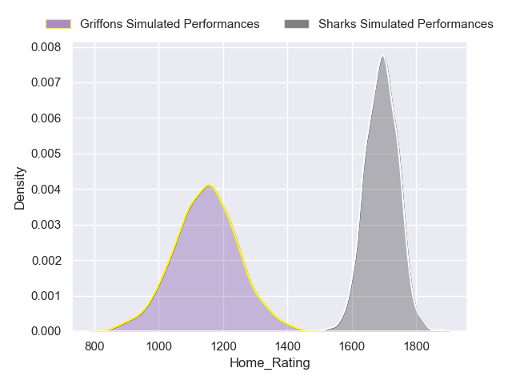
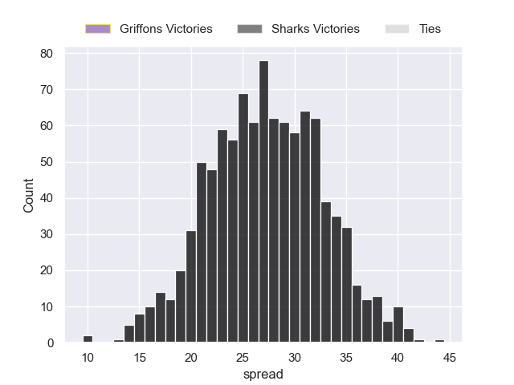

---  
title: "Currie Cup 2024 Status"  
date: 2024-08-30 6:00:00 -0500  
categories: model review projection  
layout: article  
aside:  
    toc: true  
---
# Current Team Rankings

# Standings

## Current Standings

| Club                |   Played |   Wins |   Point Differential |   Losing Bonus Points |   Try Bonus Points |   Competition Points |
|:--------------------|---------:|-------:|---------------------:|----------------------:|-------------------:|---------------------:|
| Blue Bulls          |        8 |      7 |                  148 |                     0 |                nan |                   35 |
| Golden Lions        |       10 |      8 |                  129 |                     0 |                nan |                   35 |
| Pumas               |       10 |      6 |                  -14 |                     0 |                nan |                   29 |
| Free State Cheetahs |        9 |      4 |                   52 |                     2 |                nan |                   25 |
| Natal Sharks        |        8 |      4 |                   31 |                     2 |                nan |                   25 |
| Sharks              |        8 |      4 |                   31 |                     2 |                nan |                   20 |
| Griquas             |       10 |      3 |                  -83 |                     0 |                nan |                   16 |
| Western Province    |        9 |      2 |                  -12 |                     2 |                nan |                   14 |
| Griffons            |        8 |      0 |                 -282 |                     1 |                nan |                    2 |

## Projected Remaining Table

| Club                |   Matches Remaining |   Wins |   Point Differential |   Losing Bonus Points |   Try Bonus Points |   Competition Points |
|:--------------------|--------------------:|-------:|---------------------:|----------------------:|-------------------:|---------------------:|
| Natal Sharks        |                   2 |    1.5 |             26.6372  |                   0.4 |                1.1 |                  7.5 |
| Pumas               |                   2 |    1.5 |              7.9326  |                   0.4 |                0.7 |                  7.1 |
| Golden Lions        |                   2 |    1.3 |             25.665   |                   0.4 |                1.3 |                  6.8 |
| Blue Bulls          |                   2 |    1.2 |              3.82835 |                   0.6 |                0.6 |                  6.1 |
| Griquas             |                   2 |    1.2 |              2.24119 |                   0.7 |                0.6 |                  5.8 |
| Sharks              |                   1 |    1   |             27.2596  |                   0   |                0.9 |                  4.9 |
| Free State Cheetahs |                   2 |    0.7 |             -4.63964 |                   0.8 |                0.9 |                  4.6 |
| Western Province    |                   2 |    0.6 |             -5.53415 |                   0.9 |                0.6 |                  4   |
| Griffons            |                   3 |    0   |            -83.3902  |                   0   |                0.6 |                  0.6 |

## Projected Total Table

| Club                |   Total Matches |   Wins |   Point Differential |   Losing Bonus Points |   Try Bonus Points |   Competition Points |
|:--------------------|----------------:|-------:|---------------------:|----------------------:|-------------------:|---------------------:|
| Golden Lions        |              12 |    9.3 |             154.665  |                   0.4 |                1.3 |                 41.8 |
| Blue Bulls          |              10 |    8.2 |             151.828  |                   0.6 |                0.6 |                 41.1 |
| Pumas               |              12 |    7.5 |              -6.0674 |                   0.4 |                0.7 |                 36.1 |
| Natal Sharks        |              10 |    5.5 |              57.6372 |                   2.4 |                1.1 |                 32.5 |
| Free State Cheetahs |              11 |    4.7 |              47.3604 |                   2.8 |                0.9 |                 29.6 |
| Sharks              |               9 |    5   |              58.2596 |                   2   |                0.9 |                 24.9 |
| Griquas             |              12 |    4.2 |             -80.7588 |                   0.7 |                0.6 |                 21.8 |
| Western Province    |              11 |    2.6 |             -17.5341 |                   2.9 |                0.6 |                 18   |
| Griffons            |              11 |    0   |            -365.39   |                   1   |                0.6 |                  2.6 |

# Completed Match Review

| Model | Percent Correct Predictions | Spread Error |
| ------ | ------ | ------ |
| Club Level | 52.5% | 15.2 |
| Player Level: Lineup | 57.7% | 20.1 |
| Player Level: Minutes | 57.7% | 20.2 |

# Future Predictions

## Week 11

### Griquas V Free State Cheetahs on 2024/08/30

Average Margin: Free State Cheetahs by 0.6

Average Scoreline: 34-34

### Blue Bulls V Golden Lions on 2024/08/30

Average Margin: Blue Bulls by 3.9

Average Scoreline: 33-29

### Sharks V Griffons on 2024/08/31

Average Margin: Sharks by 27.3

Average Scoreline: 40-12

### Natal Sharks V Griffons on 2024/08/31

Average Margin: Natal Sharks by 26.6

Average Scoreline: 45-18

### Western Province V Pumas on 2024/09/01

Average Margin: Pumas by 2.6

Average Scoreline: 28-25

## Week 12

### Griquas V Western Province on 2024/09/06

Average Margin: Griquas by 2.9

Average Scoreline: 34-31

### Golden Lions V Griffons on 2024/09/06

Average Margin: Golden Lions by 29.5

Average Scoreline: 46-17

### Pumas V Free State Cheetahs on 2024/09/07

Average Margin: Pumas by 5.3

Average Scoreline: 28-23

### Natal Sharks V Blue Bulls on 2024/09/08

Average Margin: Blue Bulls by 0.0

Average Scoreline: 23-23

