---  
title: "Currie Cup 2024 Status"  
date: 2024-07-29 6:00:00 -0500  
categories: model review projection  
layout: article  
aside:  
    toc: true  
---
# Current Team Rankings

# Standings

## Current Standings

| Club                |   Played |   Wins |   Point Differential |   Losing Bonus Points |   Try Bonus Points |   Competition Points |
|:--------------------|---------:|-------:|---------------------:|----------------------:|-------------------:|---------------------:|
| Blue Bulls          |        4 |      4 |                   75 |                     0 |                nan |                   17 |
| Golden Lions        |        5 |      4 |                   55 |                     0 |                nan |                   17 |
| Free State Cheetahs |        4 |      3 |                   72 |                     0 |                nan |                   14 |
| Pumas               |        4 |      3 |                   16 |                     0 |                nan |                   13 |
| Griquas             |        5 |      2 |                  -66 |                     0 |                nan |                   10 |
| Western Province    |        4 |      1 |                    8 |                     1 |                nan |                    6 |
| Sharks              |        4 |      1 |                   -1 |                     2 |                nan |                    6 |
| Natal Sharks        |        2 |      0 |                   -4 |                     2 |                  2 |                    4 |
| Griffons            |        4 |      0 |                 -155 |                     1 |                nan |                    1 |

## Projected Remaining Table

| Club                |   Matches Remaining |   Wins |   Point Differential |   Losing Bonus Points |   Try Bonus Points |   Competition Points |
|:--------------------|--------------------:|-------:|---------------------:|----------------------:|-------------------:|---------------------:|
| Western Province    |                   1 |    1   |             18.0143  |                   0   |                0.9 |                  4.9 |
| Golden Lions        |                   1 |    0.8 |              5.8951  |                   0.2 |                0.6 |                  4   |
| Pumas               |                   1 |    0.8 |              3.9172  |                   0.2 |                0.2 |                  3.5 |
| Free State Cheetahs |                   1 |    0.6 |              0.88853 |                   0.3 |                0.3 |                  2.9 |
| Blue Bulls          |                   1 |    0.4 |             -0.88853 |                   0.4 |                0.4 |                  2.6 |
| Sharks              |                   1 |    0.2 |             -3.9172  |                   0.5 |                0.4 |                  1.8 |
| Griquas             |                   1 |    0.2 |             -5.8951  |                   0.4 |                0.2 |                  1.4 |
| Griffons            |                   1 |    0   |            -18.0143  |                   0.1 |                0.2 |                  0.3 |

## Projected Total Table

| Club                |   Total Matches |   Wins |   Point Differential |   Losing Bonus Points |   Try Bonus Points |   Competition Points |
|:--------------------|----------------:|-------:|---------------------:|----------------------:|-------------------:|---------------------:|
| Golden Lions        |               6 |    4.8 |              60.8951 |                   0.2 |                0.6 |                 21   |
| Blue Bulls          |               5 |    4.4 |              74.1115 |                   0.4 |                0.4 |                 19.6 |
| Free State Cheetahs |               5 |    3.6 |              72.8885 |                   0.3 |                0.3 |                 16.9 |
| Pumas               |               5 |    3.8 |              19.9172 |                   0.2 |                0.2 |                 16.5 |
| Griquas             |               6 |    2.2 |             -71.8951 |                   0.4 |                0.2 |                 11.4 |
| Western Province    |               5 |    2   |              26.0143 |                   1   |                0.9 |                 10.9 |
| Sharks              |               5 |    1.2 |              -4.9172 |                   2.5 |                0.4 |                  7.8 |
| Natal Sharks        |               2 |    0   |              -4      |                   2   |                2   |                  4   |
| Griffons            |               5 |    0   |            -173.014  |                   1.1 |                0.2 |                  1.3 |

# Completed Match Review

| Model | Percent Correct Predictions | Spread Error |
| ------ | ------ | ------ |
| Club Level | 55.6% | 18.9 |
| Player Level: Lineup | 50.0% | 26.6 |
| Player Level: Minutes | 50.0% | 26.6 |

# Future Predictions

## Week 6

### Free State Cheetahs V Blue Bulls on 2024/08/02

Average Margin: Free State Cheetahs by 0.9

Average Scoreline: 30-29

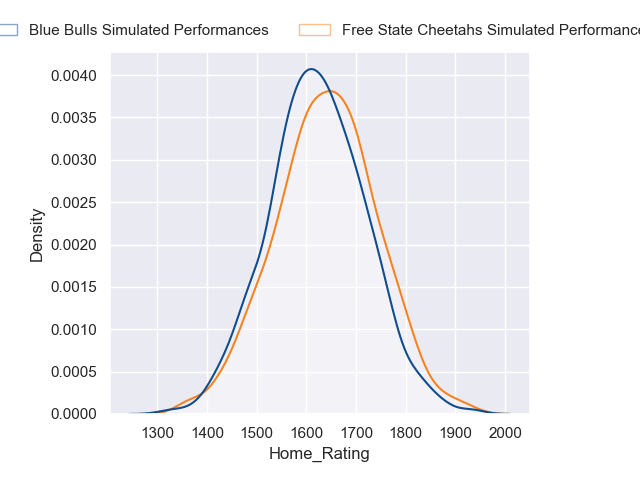
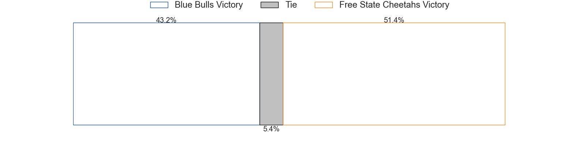
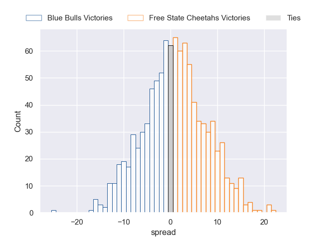

### Pumas V Sharks on 2024/08/03

Average Margin: Pumas by 3.9

Average Scoreline: 26-22

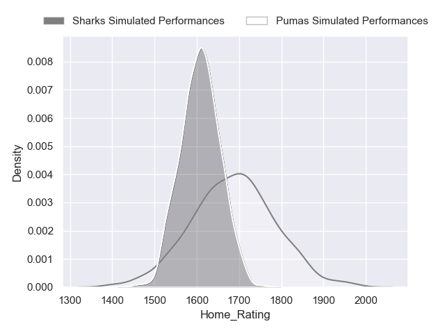
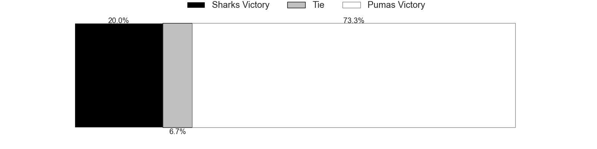
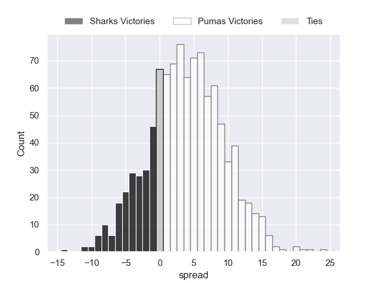

### Western Province V Griffons on 2024/08/03

Average Margin: Western Province by 18.0

Average Scoreline: 55-37

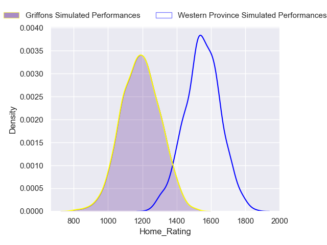
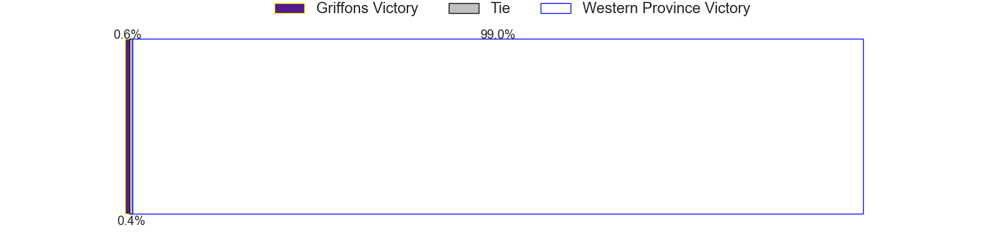
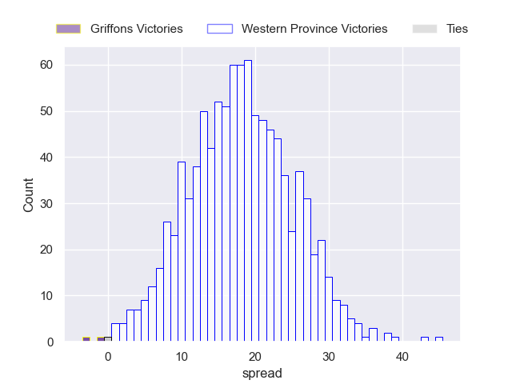

### Griquas V Golden Lions on 2024/08/04

Average Margin: Golden Lions by 5.9

Average Scoreline: 39-33

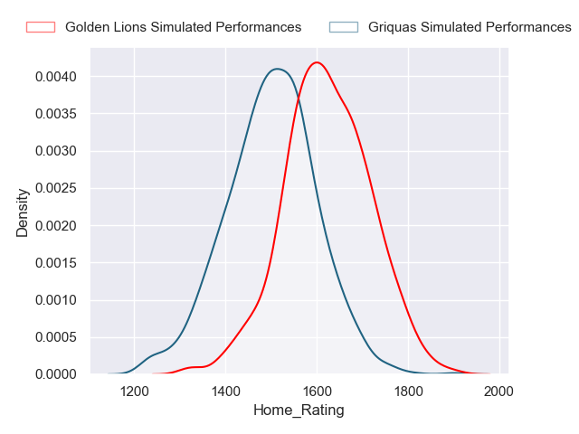
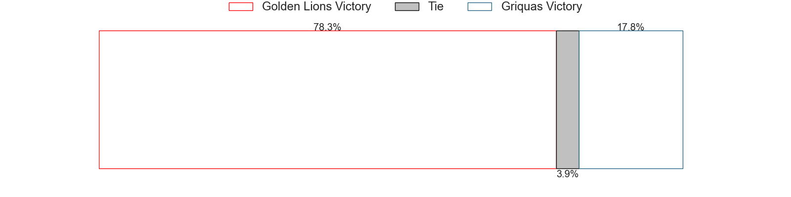
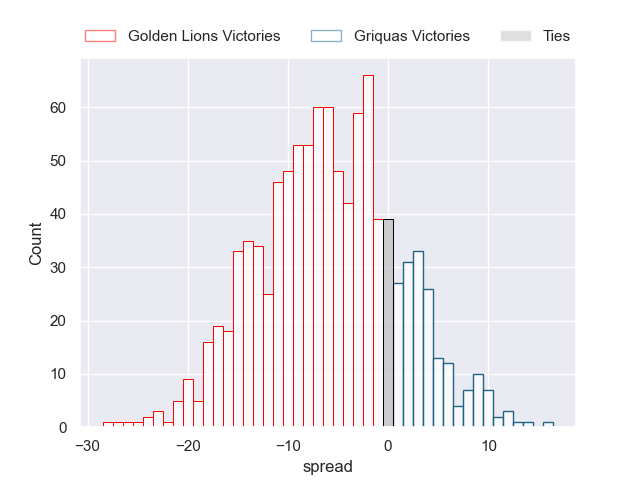

