---  
title: "Currie Cup 2024 Status"  
date: 2024-08-08 6:00:00 -0500  
categories: model review projection  
layout: article  
aside:  
    toc: true  
---
# Current Team Rankings

# Standings

## Current Standings

| Club                |   Played |   Wins |   Point Differential |   Losing Bonus Points |   Try Bonus Points |   Competition Points |
|:--------------------|---------:|-------:|---------------------:|----------------------:|-------------------:|---------------------:|
| Golden Lions        |        6 |      5 |                   63 |                     0 |                nan |                   21 |
| Blue Bulls          |        5 |      4 |                   75 |                     0 |                nan |                   19 |
| Free State Cheetahs |        5 |      3 |                   72 |                     0 |                nan |                   16 |
| Pumas               |        5 |      3 |                   16 |                     0 |                nan |                   15 |
| Western Province    |        5 |      2 |                   30 |                     1 |                nan |                   10 |
| Griquas             |        6 |      2 |                  -74 |                     0 |                nan |                   10 |
| Sharks              |        5 |      1 |                   -1 |                     2 |                nan |                    8 |
| Natal Sharks        |        2 |      0 |                   -4 |                     2 |                  2 |                    4 |
| Griffons            |        5 |      0 |                 -177 |                     1 |                nan |                    1 |

## Projected Remaining Table

| Club                |   Matches Remaining |   Wins |   Point Differential |   Losing Bonus Points |   Try Bonus Points |   Competition Points |
|:--------------------|--------------------:|-------:|---------------------:|----------------------:|-------------------:|---------------------:|
| Blue Bulls          |                   1 |    1   |             25.247   |                   0   |                1   |                  5   |
| Sharks              |                   1 |    1   |             13.0298  |                   0   |                0.5 |                  4.4 |
| Golden Lions        |                   1 |    0.8 |              4.35162 |                   0.2 |                0.4 |                  3.6 |
| Free State Cheetahs |                   1 |    0.6 |              1.0813  |                   0.3 |                0.4 |                  3   |
| Western Province    |                   1 |    0.4 |             -1.0813  |                   0.4 |                0.2 |                  2.3 |
| Pumas               |                   1 |    0.2 |             -4.35162 |                   0.4 |                0.3 |                  1.7 |
| Griffons            |                   1 |    0   |            -25.247   |                   0   |                0.4 |                  0.4 |
| Griquas             |                   1 |    0   |            -13.0298  |                   0.1 |                0.2 |                  0.3 |

## Projected Total Table

| Club                |   Total Matches |   Wins |   Point Differential |   Losing Bonus Points |   Try Bonus Points |   Competition Points |
|:--------------------|----------------:|-------:|---------------------:|----------------------:|-------------------:|---------------------:|
| Golden Lions        |               7 |    5.8 |              67.3516 |                   0.2 |                0.4 |                 24.6 |
| Blue Bulls          |               6 |    5   |             100.247  |                   0   |                1   |                 24   |
| Free State Cheetahs |               6 |    3.6 |              73.0813 |                   0.3 |                0.4 |                 19   |
| Pumas               |               6 |    3.2 |              11.6484 |                   0.4 |                0.3 |                 16.7 |
| Sharks              |               6 |    2   |              12.0298 |                   2   |                0.5 |                 12.4 |
| Western Province    |               6 |    2.4 |              28.9187 |                   1.4 |                0.2 |                 12.3 |
| Griquas             |               7 |    2   |             -87.0298 |                   0.1 |                0.2 |                 10.3 |
| Natal Sharks        |               2 |    0   |              -4      |                   2   |                2   |                  4   |
| Griffons            |               6 |    0   |            -202.247  |                   1   |                0.4 |                  1.4 |

# Completed Match Review

| Model | Percent Correct Predictions | Spread Error |
| ------ | ------ | ------ |
| Club Level | 54.5% | 16.1 |
| Player Level: Lineup | 50.0% | 26.6 |
| Player Level: Minutes | 50.0% | 26.6 |

# Future Predictions

## Week 7

### Western Province V Free State Cheetahs on 2024/08/10

Average Margin: Free State Cheetahs by 1.1

Average Scoreline: 27-26

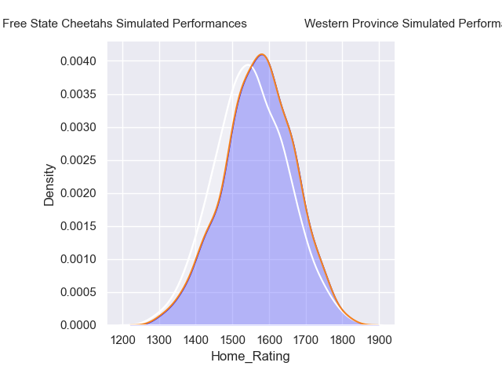
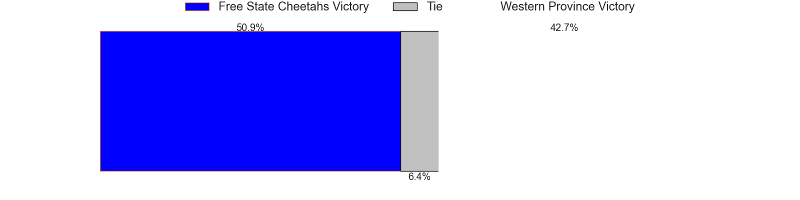
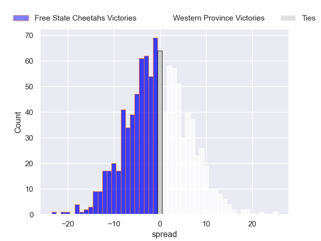

### Blue Bulls V Griffons on 2024/08/10

Average Margin: Blue Bulls by 25.2

Average Scoreline: 55-29

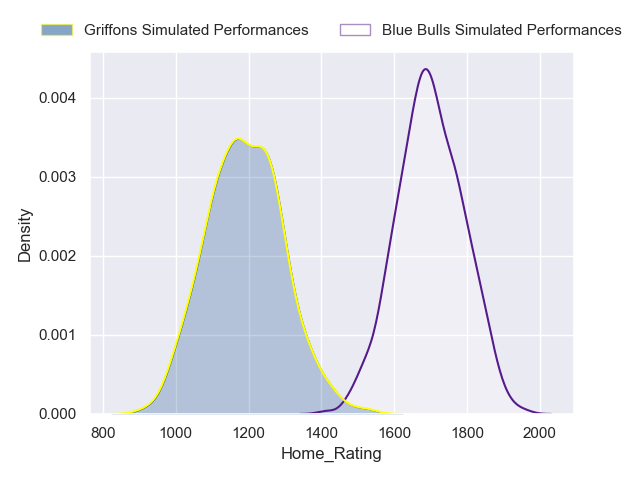
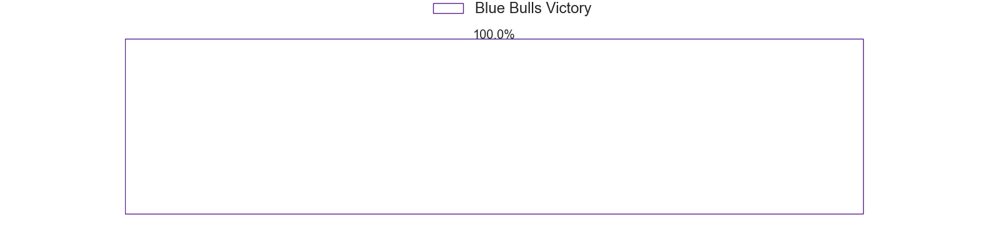
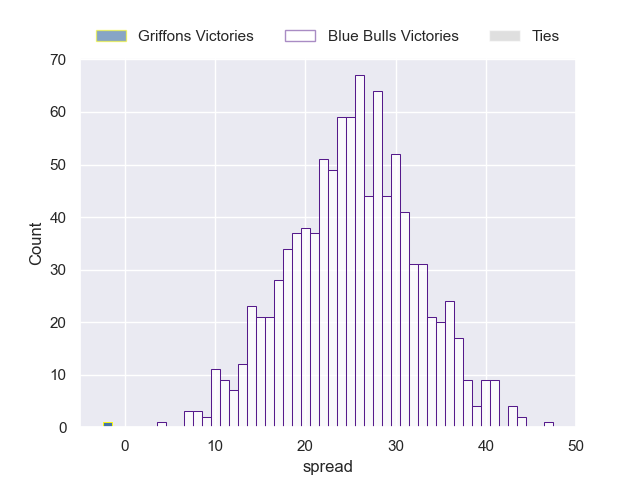

### Golden Lions V Pumas on 2024/08/10

Average Margin: Golden Lions by 4.4

Average Scoreline: 29-25

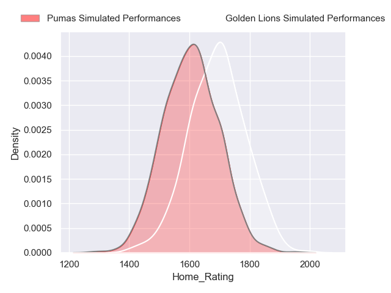
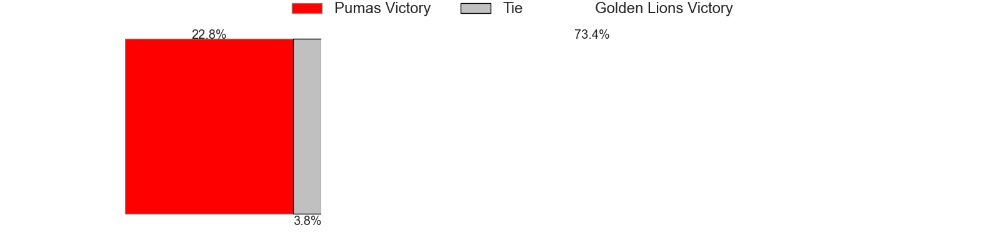
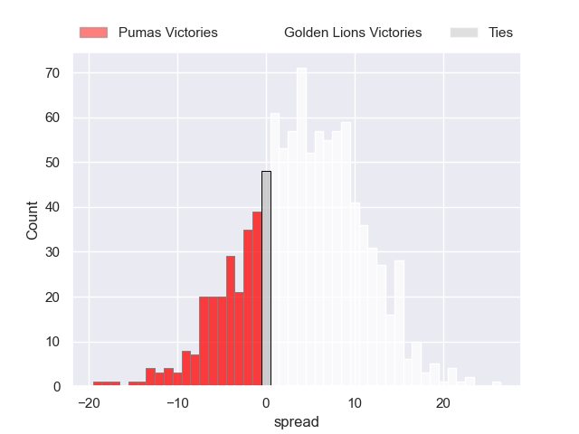

### Sharks V Griquas on 2024/08/11

Average Margin: Sharks by 13.0

Average Scoreline: 33-20

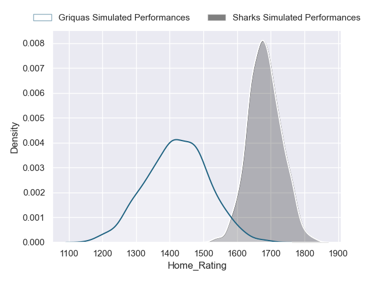

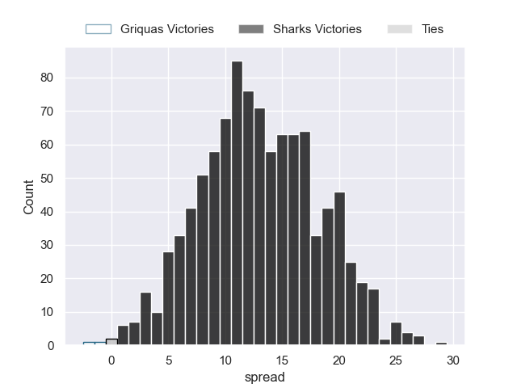

