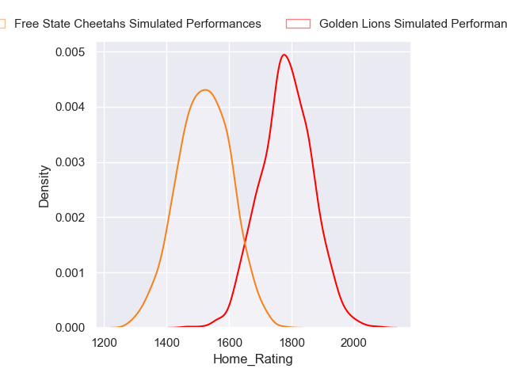
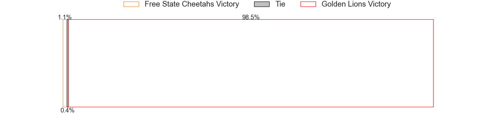
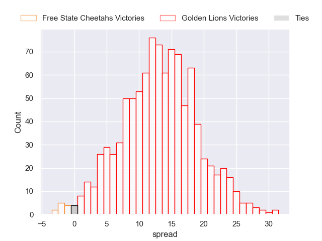
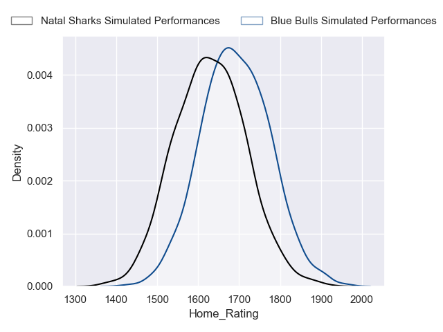
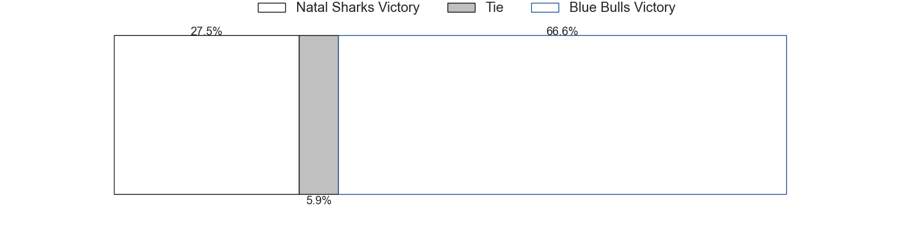
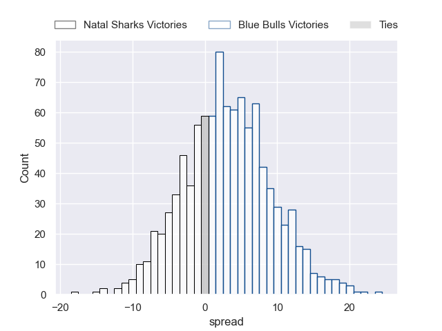
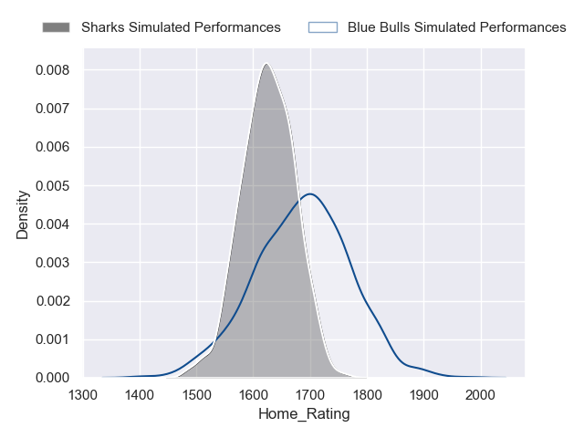
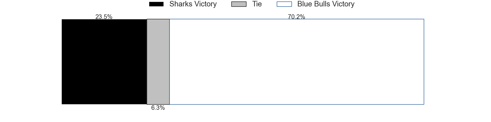
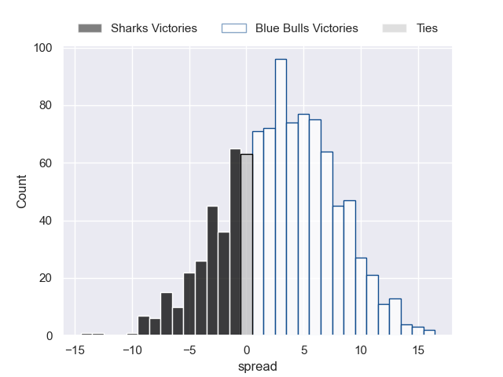

---  
title: "Currie Cup 2024 Status"  
date: 2024-09-09 6:00:00 -0500  
categories: model review projection  
layout: article  
aside:  
    toc: true  
---
# Current Team Rankings

# Standings

## Current Standings

| Club                |   Played |   Wins |   Point Differential |   Losing Bonus Points |   Try Bonus Points |   Competition Points |
|:--------------------|---------:|-------:|---------------------:|----------------------:|-------------------:|---------------------:|
| Golden Lions        |       12 |     10 |                  210 |                     0 |                nan |                   43 |
| Blue Bulls          |       11 |      7 |                  112 |                     2 |                nan |                   37 |
| Natal Sharks        |       10 |      6 |                   93 |                     2 |                nan |                   33 |
| Free State Cheetahs |       11 |      5 |                   66 |                     2 |                nan |                   29 |
| Pumas               |       12 |      6 |                  -50 |                     0 |                nan |                   29 |
| Sharks              |       10 |      6 |                   93 |                     2 |                nan |                   28 |
| Griquas             |       12 |      5 |                  -62 |                     0 |                nan |                   24 |
| Western Province    |       11 |      3 |                  -11 |                     2 |                nan |                   18 |
| Griffons            |       11 |      0 |                 -451 |                     1 |                nan |                    2 |

## Projected Remaining Table

| Club                |   Matches Remaining |   Wins |   Point Differential |   Losing Bonus Points |   Try Bonus Points |   Competition Points |
|:--------------------|--------------------:|-------:|---------------------:|----------------------:|-------------------:|---------------------:|
| Blue Bulls          |                   2 |    1.4 |              6.11498 |                   0.5 |                0.4 |                  6.6 |
| Golden Lions        |                   1 |    1   |             13.1487  |                   0   |                0.6 |                  4.5 |
| Natal Sharks        |                   1 |    0.3 |             -3.109   |                   0.4 |                0.2 |                  1.9 |
| Sharks              |                   1 |    0.3 |             -3.00598 |                   0.5 |                0.2 |                  1.8 |
| Free State Cheetahs |                   1 |    0   |            -13.1487  |                   0.1 |                0.2 |                  0.4 |

## Projected Total Table

| Club                |   Total Matches |   Wins |   Point Differential |   Losing Bonus Points |   Try Bonus Points |   Competition Points |
|:--------------------|----------------:|-------:|---------------------:|----------------------:|-------------------:|---------------------:|
| Golden Lions        |              13 |   11   |             223.149  |                   0   |                0.6 |                 47.5 |
| Blue Bulls          |              13 |    8.4 |             118.115  |                   2.5 |                0.4 |                 43.6 |
| Natal Sharks        |              11 |    6.3 |              89.891  |                   2.4 |                0.2 |                 34.9 |
| Sharks              |              11 |    6.3 |              89.994  |                   2.5 |                0.2 |                 29.8 |
| Free State Cheetahs |              12 |    5   |              52.8513 |                   2.1 |                0.2 |                 29.4 |
| Pumas               |              12 |    6   |             -50      |                   0   |                0   |                 29   |
| Griquas             |              12 |    5   |             -62      |                   0   |                0   |                 24   |
| Western Province    |              11 |    3   |             -11      |                   2   |                0   |                 18   |
| Griffons            |              11 |    0   |            -451      |                   1   |                0   |                  2   |

# Completed Match Review

| Model | Percent Correct Predictions | Spread Error |
| ------ | ------ | ------ |
| Club Level | 54.0% | 15.9 |
| Player Level: Lineup | 57.7% | 20.2 |
| Player Level: Minutes | 57.7% | 20.2 |

# Future Predictions

## Week 13

### Golden Lions V Free State Cheetahs on 2024/09/14

Average Margin: Golden Lions by 13.1

Average Scoreline: 34-21

### Blue Bulls V Natal Sharks on 2024/09/14

Average Margin: Blue Bulls by 3.1

Average Scoreline: 24-21

### Blue Bulls V Sharks on 2024/09/14

Average Margin: Blue Bulls by 3.0

Average Scoreline: 27-24

