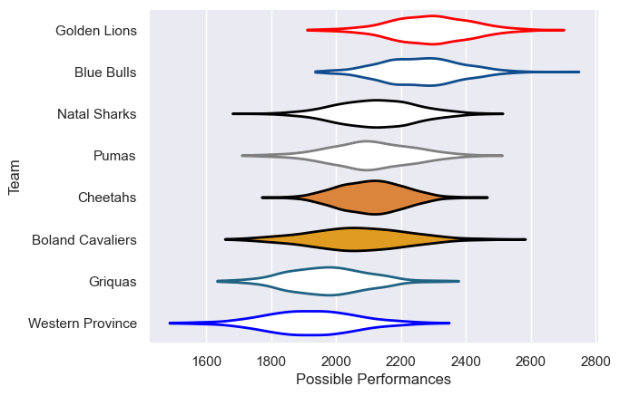

---  
title: "Currie Cup 2025"  
date: 2025-08-04 6:00:00 -0500  
categories: model review projection  
layout: article  
aside:  
    toc: true  
---
# Team Rankings

# Standings

## Current Standings

| Club             |   Played |   Wins |   Point Differential |   Losing Bonus Points |   Try Bonus Points |   Competition Points |
|:-----------------|---------:|-------:|---------------------:|----------------------:|-------------------:|---------------------:|
| Blue Bulls       |        2 |      2 |                   89 |                     0 |                  2 |                   10 |
| Golden Lions     |        2 |      2 |                   62 |                     0 |                  2 |                   10 |
| Cheetahs         |        2 |      1 |                   15 |                     1 |                  2 |                    7 |
| Pumas            |        2 |      1 |                    4 |                     0 |                  2 |                    6 |
| Boland Cavaliers |        2 |      1 |                   -7 |                     0 |                  2 |                    6 |
| Griquas          |        2 |      1 |                  -12 |                     0 |                  1 |                    5 |
| Western Province |        2 |      0 |                  -46 |                     0 |                    |                    0 |
| Natal Sharks     |        2 |      0 |                 -105 |                     0 |                    |                    0 |

## Projected Remaining Table

| Club             |   To Play |   Projected Wins |   Projected Differential |   Projected Losing Bonus Points | Projected Try Bonus Points   |   Projected Competition Points |
|:-----------------|----------:|-----------------:|-------------------------:|--------------------------------:|:-----------------------------|-------------------------------:|
| Blue Bulls       |         5 |            3.232 |                   31.395 |                           0.839 |                              |                         14.165 |
| Golden Lions     |         5 |            3.059 |                   21.926 |                           0.923 |                              |                         13.575 |
| Natal Sharks     |         5 |            2.915 |                   14.853 |                           0.945 |                              |                         13.021 |
| Cheetahs         |         5 |            2.528 |                    5.215 |                           1.064 |                              |                         11.606 |
| Pumas            |         5 |            2.133 |                   -8.068 |                           1.103 |                              |                         10.091 |
| Western Province |         5 |            1.994 |                  -13.157 |                           1.17  |                              |                          9.544 |
| Griquas          |         5 |            1.708 |                  -25.071 |                           1.07  |                              |                          8.274 |
| Boland Cavaliers |         5 |            1.612 |                  -27.093 |                           1.084 |                              |                          7.922 |

## Projected Total Table

| Club             |   Played |   Wins |   Point Differential |   Losing Bonus Points |   Try Bonus Points |   Competition Points |
|:-----------------|---------:|-------:|---------------------:|----------------------:|-------------------:|---------------------:|
| Blue Bulls       |        7 |  5.232 |              120.395 |                 0.839 |                  2 |               24.165 |
| Golden Lions     |        7 |  5.059 |               83.926 |                 0.923 |                  2 |               23.575 |
| Cheetahs         |        7 |  3.528 |               20.215 |                 2.064 |                  2 |               18.606 |
| Pumas            |        7 |  3.133 |               -4.068 |                 1.103 |                  2 |               16.091 |
| Boland Cavaliers |        7 |  2.612 |              -34.093 |                 1.084 |                  2 |               13.922 |
| Griquas          |        7 |  2.708 |              -37.071 |                 1.07  |                  1 |               13.274 |
| Natal Sharks     |        7 |  2.915 |              -90.147 |                 0.945 |                    |               13.021 |
| Western Province |        7 |  1.994 |              -59.157 |                 1.17  |                    |                9.544 |

# Completed Match Review

| Model | Percent Correct Predictions | Spread Error |
| ------ | ------ | ------ |
| Club Level | 64.3% | 15.6 |
| Player Level: Lineup | nan% | nan |
| Player Level: Minutes | nan% | nan |

# Future Predictions

## Week 3

### Griquas V Western Province on 2025/08/08

Average Margin: Griquas by 2.3

### Natal Sharks V Cheetahs on 2025/08/09

Average Margin: Natal Sharks by 0.9

### Blue Bulls V Pumas on 2025/08/09

Average Margin: Blue Bulls by 8.4

### Boland Cavaliers V Golden Lions on 2025/08/10

Average Margin: Golden Lions by 6.3

## Week 4

### Pumas V Golden Lions on 2025/08/15

Average Margin: Golden Lions by 3.4

### Griquas V Natal Sharks on 2025/08/15

Average Margin: Natal Sharks by 0.2

### Cheetahs V Western Province on 2025/08/16

Average Margin: Cheetahs by 6.4

### Boland Cavaliers V Blue Bulls on 2025/08/17

Average Margin: Blue Bulls by 7.7

## Week 5

### Pumas V Boland Cavaliers on 2025/08/22

Average Margin: Pumas by 5.2

### Natal Sharks V Western Province on 2025/08/22

Average Margin: Natal Sharks by 5.8

### Cheetahs V Golden Lions on 2025/08/23

Average Margin: Golden Lions by 1.5

### Blue Bulls V Griquas on 2025/08/24

Average Margin: Blue Bulls by 10.9

## Week 6

### Cheetahs V Griquas on 2025/08/29

Average Margin: Cheetahs by 7.5

### Western Province V Pumas on 2025/08/30

Average Margin: Pumas by 0.4

### Natal Sharks V Boland Cavaliers on 2025/08/30

Average Margin: Natal Sharks by 6.1

### Golden Lions V Blue Bulls on 2025/08/30

Average Margin: Golden Lions by 2.0

## Week 7

### Natal Sharks V Pumas on 2025/09/05

Average Margin: Natal Sharks by 1.9

### Blue Bulls V Cheetahs on 2025/09/06

Average Margin: Blue Bulls by 6.3

### Western Province V Boland Cavaliers on 2025/09/06

Average Margin: Western Province by 1.8

### Golden Lions V Griquas on 2025/09/06

Average Margin: Golden Lions by 8.8

