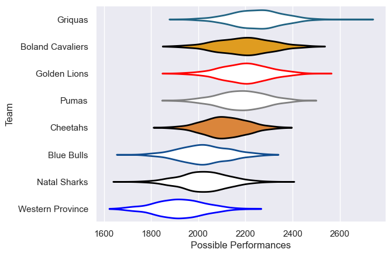

---  
title: "Currie Cup 2025"  
date: 2025-07-29 6:00:00 -0500  
categories: model review projection  
layout: article  
aside:  
    toc: true  
---
# Team Rankings

# Standings

## Current Standings

| Club             |   Played |   Wins |   Point Differential |   Losing Bonus Points |   Try Bonus Points |   Competition Points |
|:-----------------|---------:|-------:|---------------------:|----------------------:|-------------------:|---------------------:|
| Golden Lions     |        1 |      1 |                   41 |                     0 |                  1 |                    5 |
| Blue Bulls       |        1 |      1 |                   25 |                     0 |                  1 |                    5 |
| Pumas            |        1 |      1 |                   21 |                     0 |                  1 |                    5 |
| Boland Cavaliers |        1 |      1 |                    2 |                     0 |                  1 |                    5 |
| Cheetahs         |        1 |      0 |                   -2 |                     1 |                  1 |                    2 |
| Griquas          |        1 |      0 |                  -21 |                     0 |                    |                    0 |
| Western Province |        1 |      0 |                  -25 |                     0 |                    |                    0 |
| Natal Sharks     |        1 |      0 |                  -41 |                     0 |                    |                    0 |

## Projected Remaining Table

| Club             |   To Play |   Projected Wins |   Projected Differential |   Projected Losing Bonus Points | Projected Try Bonus Points   |   Projected Competition Points |
|:-----------------|----------:|-----------------:|-------------------------:|--------------------------------:|:-----------------------------|-------------------------------:|
| Blue Bulls       |         6 |            3.813 |                   33.258 |                           0.983 |                              |                         16.677 |
| Golden Lions     |         6 |            3.776 |                   29.925 |                           1.062 |                              |                         16.61  |
| Natal Sharks     |         6 |            3.338 |                   13.57  |                           1.114 |                              |                         14.954 |
| Cheetahs         |         6 |            2.953 |                    3.175 |                           1.309 |                              |                         13.613 |
| Pumas            |         6 |            2.635 |                   -7.241 |                           1.304 |                              |                         12.364 |
| Western Province |         6 |            2.259 |                  -21.543 |                           1.341 |                              |                         10.809 |
| Griquas          |         6 |            2.251 |                  -23.367 |                           1.265 |                              |                         10.745 |
| Boland Cavaliers |         6 |            2.032 |                  -27.777 |                           1.329 |                              |                          9.935 |

## Projected Total Table

| Club             |   Played |   Wins |   Point Differential |   Losing Bonus Points |   Try Bonus Points |   Competition Points |
|:-----------------|---------:|-------:|---------------------:|----------------------:|-------------------:|---------------------:|
| Blue Bulls       |        7 |  4.813 |               58.258 |                 0.983 |                  1 |               21.677 |
| Golden Lions     |        7 |  4.776 |               70.925 |                 1.062 |                  1 |               21.61  |
| Pumas            |        7 |  3.635 |               13.759 |                 1.304 |                  1 |               17.364 |
| Cheetahs         |        7 |  2.953 |                1.175 |                 2.309 |                  1 |               15.613 |
| Natal Sharks     |        7 |  3.338 |              -27.43  |                 1.114 |                    |               14.954 |
| Boland Cavaliers |        7 |  3.032 |              -25.777 |                 1.329 |                  1 |               14.935 |
| Western Province |        7 |  2.259 |              -46.543 |                 1.341 |                    |               10.809 |
| Griquas          |        7 |  2.251 |              -44.367 |                 1.265 |                    |               10.745 |

# Completed Match Review

| Model | Percent Correct Predictions | Spread Error |
| ------ | ------ | ------ |
| Club Level | 64.3% | 9.4 |
| Player Level: Lineup | nan% | nan |
| Player Level: Minutes | nan% | nan |

# Future Predictions

## Week 2

### Cheetahs V Pumas on 2025/08/01

Average Margin: Cheetahs by 1.8

### Golden Lions V Western Province on 2025/08/02

Average Margin: Golden Lions by 9.2

### Blue Bulls V Natal Sharks on 2025/08/02

Average Margin: Blue Bulls by 5.9

### Griquas V Boland Cavaliers on 2025/08/03

Average Margin: Griquas by 2.4

## Week 3

### Griquas V Western Province on 2025/08/08

Average Margin: Griquas by 1.1

### Natal Sharks V Cheetahs on 2025/08/09

Average Margin: Natal Sharks by 2.9

### Blue Bulls V Pumas on 2025/08/09

Average Margin: Blue Bulls by 7.3

### Boland Cavaliers V Golden Lions on 2025/08/10

Average Margin: Golden Lions by 5.9

## Week 4

### Griquas V Natal Sharks on 2025/08/15

Average Margin: Natal Sharks by 2.1

### Pumas V Golden Lions on 2025/08/15

Average Margin: Golden Lions by 3.2

### Cheetahs V Western Province on 2025/08/16

Average Margin: Cheetahs by 5.1

### Boland Cavaliers V Blue Bulls on 2025/08/17

Average Margin: Blue Bulls by 6.0

## Week 5

### Natal Sharks V Western Province on 2025/08/22

Average Margin: Natal Sharks by 6.7

### Pumas V Boland Cavaliers on 2025/08/22

Average Margin: Pumas by 6.0

### Cheetahs V Golden Lions on 2025/08/23

Average Margin: Golden Lions by 1.9

### Blue Bulls V Griquas on 2025/08/24

Average Margin: Blue Bulls by 10.7

## Week 6

### Cheetahs V Griquas on 2025/08/29

Average Margin: Cheetahs by 6.6

### Western Province V Pumas on 2025/08/30

Average Margin: Pumas by 0.6

### Natal Sharks V Boland Cavaliers on 2025/08/30

Average Margin: Natal Sharks by 6.3

### Golden Lions V Blue Bulls on 2025/08/30

Average Margin: Golden Lions by 2.2

## Week 7

### Natal Sharks V Pumas on 2025/09/05

Average Margin: Natal Sharks by 1.5

### Western Province V Boland Cavaliers on 2025/09/06

Average Margin: Western Province by 1.1

### Blue Bulls V Cheetahs on 2025/09/06

Average Margin: Blue Bulls by 5.6

### Golden Lions V Griquas on 2025/09/06

Average Margin: Golden Lions by 7.5

