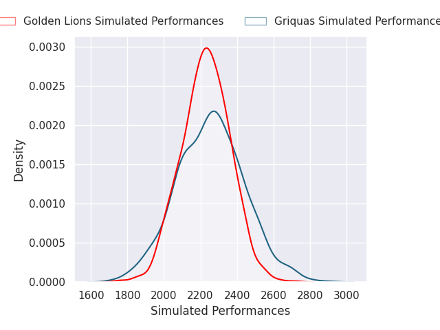
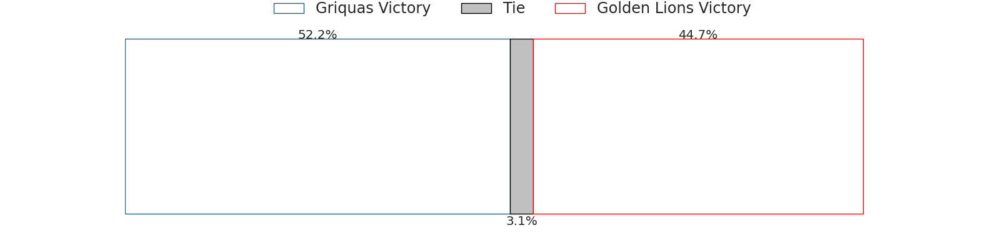
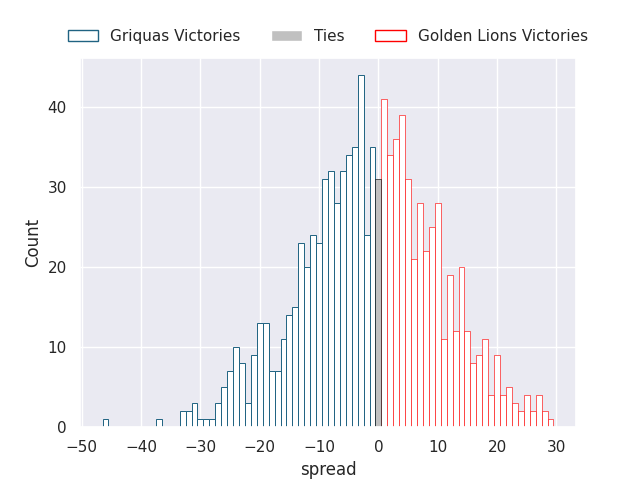
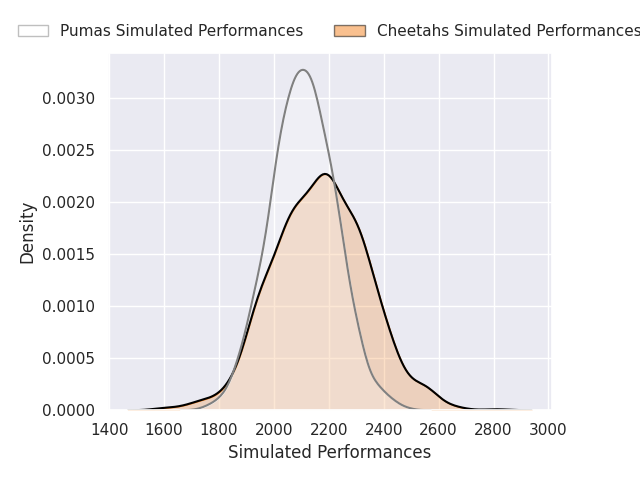
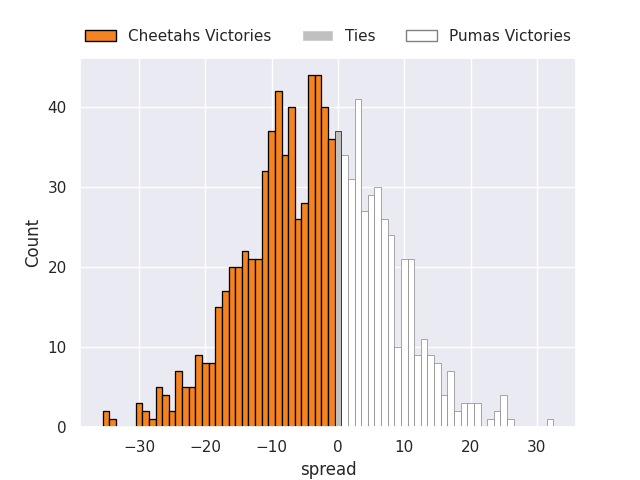

# Team Rankings

# Standings

## Current Standings

| Club             |   Played |   Wins |   Point Differential |   Losing Bonus Points |   Try Bonus Points |   Competition Points |
|:-----------------|---------:|-------:|---------------------:|----------------------:|-------------------:|---------------------:|
| Cheetahs         |        1 |      1 |                    2 |                     0 |                  1 |                    5 |
| Natal Sharks     |        1 |      1 |                    2 |                     0 |                  1 |                    5 |
| Boland Cavaliers |        1 |      1 |                   14 |                     0 |                    |                    4 |
| Western Province |        1 |      1 |                    6 |                     0 |                    |                    4 |
| Golden Lions     |        1 |      0 |                   -2 |                     1 |                  1 |                    2 |
| Pumas            |        1 |      0 |                   -2 |                     1 |                  1 |                    2 |
| Griquas          |        1 |      0 |                   -6 |                     1 |                    |                    1 |
| Blue Bulls       |        1 |      0 |                  -14 |                     0 |                    |                    0 |

## Projected Remaining Table

| Club             |   To Play |   Projected Wins |   Projected Differential |   Projected Losing Bonus Points | Projected Try Bonus Points   |   Projected Competition Points |
|:-----------------|----------:|-----------------:|-------------------------:|--------------------------------:|:-----------------------------|-------------------------------:|
| Griquas          |         4 |            2.54  |                   21.8   |                           0.7   |                              |                         11.08  |
| Golden Lions     |         3 |            2.087 |                   22.18  |                           0.439 |                              |                          8.911 |
| Boland Cavaliers |         3 |            1.742 |                    8.818 |                           0.518 |                              |                          7.67  |
| Pumas            |         4 |            1.393 |                  -16.295 |                           0.94  |                              |                          6.756 |
| Natal Sharks     |         3 |            1.411 |                   -0.727 |                           0.65  |                              |                          6.47  |
| Cheetahs         |         3 |            1.376 |                   -4.199 |                           0.621 |                              |                          6.291 |
| Blue Bulls       |         3 |            0.728 |                  -27.145 |                           0.559 |                              |                          3.595 |
| Western Province |         2 |            0.759 |                   -7.583 |                           0.415 |                              |                          3.555 |
| Lions            |         1 |            0.608 |                    3.151 |                           0.207 |                              |                          2.721 |

## Projected Total Table

| Club             |   Played |   Wins |   Point Differential |   Losing Bonus Points |   Try Bonus Points |   Competition Points |
|:-----------------|---------:|-------:|---------------------:|----------------------:|-------------------:|---------------------:|
| Griquas          |        5 |  2.54  |               15.8   |                 1.7   |                    |               12.08  |
| Boland Cavaliers |        4 |  2.742 |               22.818 |                 0.518 |                    |               11.67  |
| Natal Sharks     |        4 |  2.411 |                1.273 |                 0.65  |                  1 |               11.47  |
| Cheetahs         |        4 |  2.376 |               -2.199 |                 0.621 |                  1 |               11.291 |
| Golden Lions     |        4 |  2.087 |               20.18  |                 1.439 |                  1 |               10.911 |
| Pumas            |        5 |  1.393 |              -18.295 |                 1.94  |                  1 |                8.756 |
| Western Province |        3 |  1.759 |               -1.583 |                 0.415 |                    |                7.555 |
| Blue Bulls       |        4 |  0.728 |              -41.145 |                 0.559 |                    |                3.595 |
| Lions            |        1 |  0.608 |                3.151 |                 0.207 |                    |                2.721 |

# Completed Match Review

| Model | Percent Correct Predictions | Spread Error |
| ------ | ------ | ------ |
| Club Level | 76.5% | 3.5 |
| Player Level: Lineup | nan% | nan |
| Player Level: Minutes | nan% | nan |

# Future Predictions

## Week 2

### Cheetahs V Natal Sharks on 2026/07/24

Average Margin: Cheetahs by 3.8

### Golden Lions V Pumas on 2026/07/25

Average Margin: Golden Lions by 9.6

### Griquas V Blue Bulls on 2026/07/25

Average Margin: Griquas by 12.3

### Boland Cavaliers V Western Province on 2026/07/26

Average Margin: Boland Cavaliers by 8.5

## Week 3

### Griquas V Cheetahs on 2026/07/31

Average Margin: Griquas by 11.2

### Golden Lions V Blue Bulls on 2026/08/01

Average Margin: Golden Lions by 14.0

### Western Province V Natal Sharks on 2026/08/01

Average Margin: Western Province by 0.9

### Boland Cavaliers V Pumas on 2026/08/02

Average Margin: Boland Cavaliers by 4.4

## Week 4

### Griquas V Lions on 2026/08/08

Average Margin: Lions by 3.2

### Blue Bulls V Pumas on 2026/08/08

Average Margin: Pumas by 0.8

### Natal Sharks V Boland Cavaliers on 2026/08/08

Average Margin: Natal Sharks by 4.1

## Week 5

### Griquas V Golden Lions on 2026/09/06

Average Margin: Griquas by 1.4

### Cheetahs V Pumas on 2026/09/06

Average Margin: Cheetahs by 3.2

