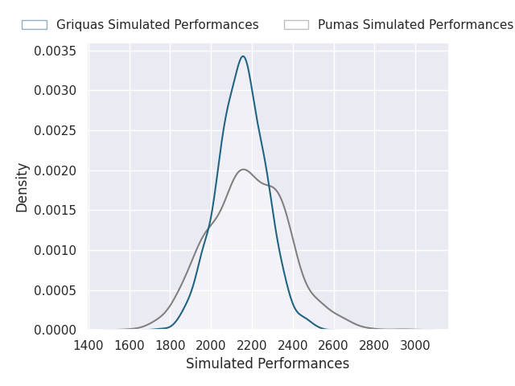
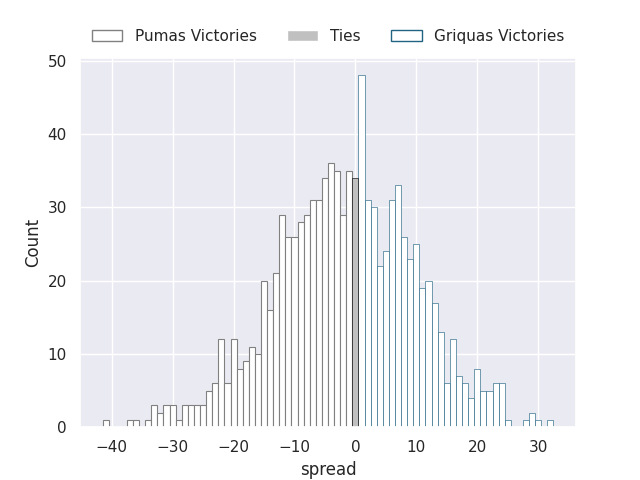
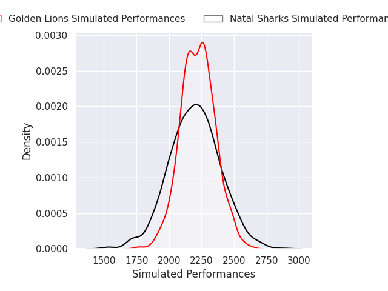
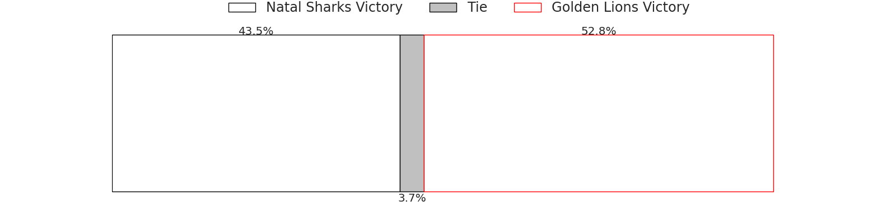
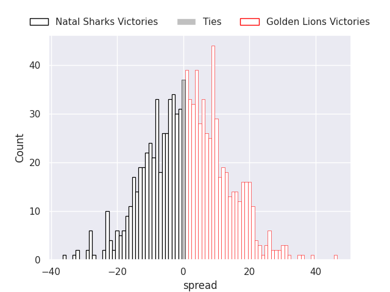
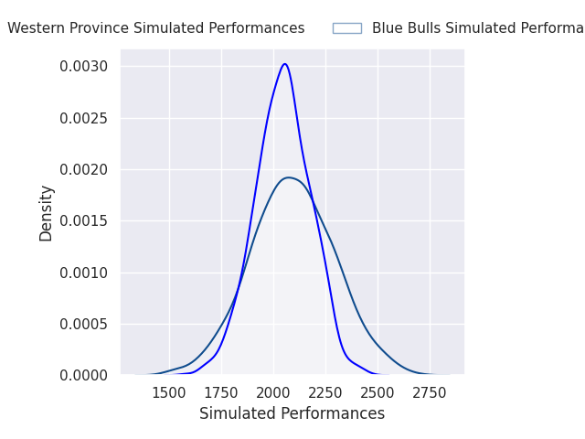
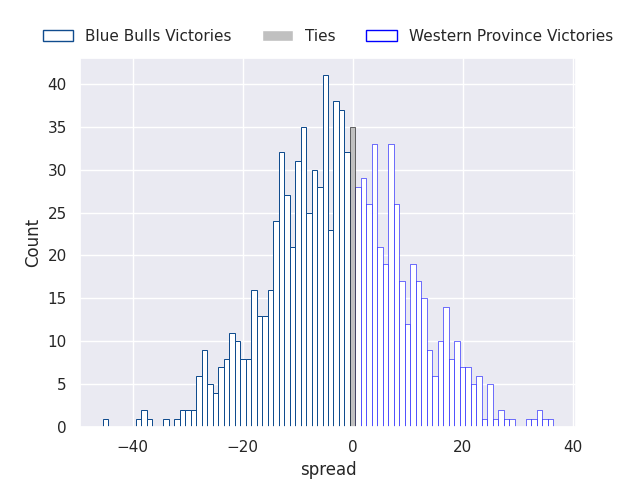
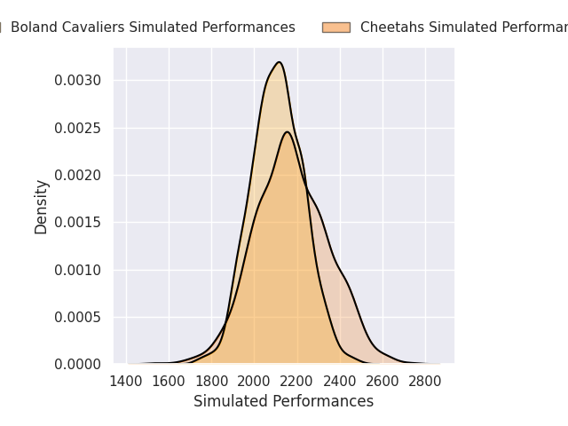
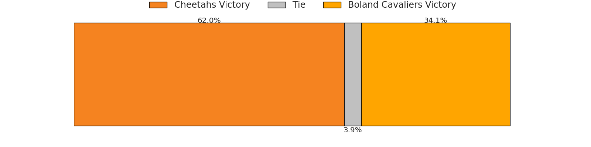
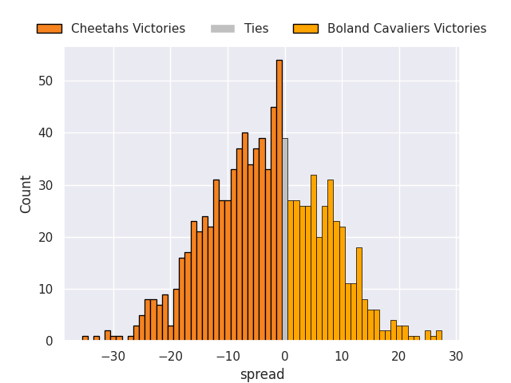

# Team Rankings

# Standings

## Current Standings

| Club             |   Played |   Wins |   Point Differential |   Losing Bonus Points |   Try Bonus Points |   Competition Points |
|:-----------------|---------:|-------:|---------------------:|----------------------:|-------------------:|---------------------:|
| Cheetahs         |        1 |      1 |                    2 |                     0 |                  1 |                    5 |
| Natal Sharks     |        1 |      1 |                    2 |                     0 |                  1 |                    5 |
| Boland Cavaliers |        1 |      1 |                   14 |                     0 |                    |                    4 |
| Western Province |        1 |      1 |                    6 |                     0 |                    |                    4 |
| Golden Lions     |        1 |      0 |                   -2 |                     1 |                  1 |                    2 |
| Pumas            |        1 |      0 |                   -2 |                     1 |                  1 |                    2 |
| Griquas          |        1 |      0 |                   -6 |                     1 |                    |                    1 |
| Blue Bulls       |        1 |      0 |                  -14 |                     0 |                    |                    0 |

## Projected Remaining Table

| Club             |   To Play |   Projected Wins |   Projected Differential |   Projected Losing Bonus Points | Projected Try Bonus Points   |   Projected Competition Points |
|:-----------------|----------:|-----------------:|-------------------------:|--------------------------------:|:-----------------------------|-------------------------------:|
| Griquas          |         4 |            2.476 |                   19.236 |                           0.676 |                              |                         10.79  |
| Boland Cavaliers |         4 |            2.044 |                    5.458 |                           0.835 |                              |                          9.233 |
| Golden Lions     |         3 |            2.135 |                   23.902 |                           0.409 |                              |                          9.107 |
| Natal Sharks     |         4 |            1.963 |                   -0.153 |                           0.84  |                              |                          8.912 |
| Pumas            |         4 |            1.605 |                  -10.798 |                           0.837 |                              |                          7.519 |
| Cheetahs         |         3 |            1.363 |                   -4.922 |                           0.59  |                              |                          6.22  |
| Blue Bulls       |         4 |            1.284 |                  -25.092 |                           0.752 |                              |                          6.09  |
| Western Province |         3 |            1.116 |                  -10.874 |                           0.663 |                              |                          5.293 |
| Lions            |         1 |            0.594 |                    3.243 |                           0.245 |                              |                          2.683 |

## Projected Total Table

| Club             |   Played |   Wins |   Point Differential |   Losing Bonus Points |   Try Bonus Points |   Competition Points |
|:-----------------|---------:|-------:|---------------------:|----------------------:|-------------------:|---------------------:|
| Natal Sharks     |        5 |  2.963 |                1.847 |                 0.84  |                  1 |               13.912 |
| Boland Cavaliers |        5 |  3.044 |               19.458 |                 0.835 |                    |               13.233 |
| Griquas          |        5 |  2.476 |               13.236 |                 1.676 |                    |               11.79  |
| Cheetahs         |        4 |  2.363 |               -2.922 |                 0.59  |                  1 |               11.22  |
| Golden Lions     |        4 |  2.135 |               21.902 |                 1.409 |                  1 |               11.107 |
| Pumas            |        5 |  1.605 |              -12.798 |                 1.837 |                  1 |                9.519 |
| Western Province |        4 |  2.116 |               -4.874 |                 0.663 |                    |                9.293 |
| Blue Bulls       |        5 |  1.284 |              -39.092 |                 0.752 |                    |                6.09  |
| Lions            |        1 |  0.594 |                3.243 |                 0.245 |                    |                2.683 |

# Completed Match Review

| Model | Percent Correct Predictions | Spread Error |
| ------ | ------ | ------ |
| Club Level | 63.2% | 4.5 |
| Player Level: Lineup | nan% | nan |
| Player Level: Minutes | nan% | nan |

# Future Predictions

## Week 2

### Cheetahs V Natal Sharks on 2026/07/24

Average Margin: Cheetahs by 3.2

### Golden Lions V Pumas on 2026/07/25

Average Margin: Golden Lions by 8.8

### Griquas V Blue Bulls on 2026/07/25

Average Margin: Griquas by 12.8

### Boland Cavaliers V Western Province on 2026/07/26

Average Margin: Boland Cavaliers by 8.6

## Week 3

### Griquas V Cheetahs on 2026/07/31

Average Margin: Griquas by 11.4

### Golden Lions V Blue Bulls on 2026/08/01

Average Margin: Golden Lions by 13.8

### Western Province V Natal Sharks on 2026/08/01

Average Margin: Western Province by 0.1

### Boland Cavaliers V Pumas on 2026/08/02

Average Margin: Boland Cavaliers by 4.6

## Week 4

### Natal Sharks V Boland Cavaliers on 2026/08/08

Average Margin: Natal Sharks by 4.5

### Blue Bulls V Pumas on 2026/08/08

Average Margin: Pumas by 0.8

### Griquas V Lions on 2026/08/08

Average Margin: Lions by 3.2

## Week 5

### Pumas V Griquas on 2026/08/21

Average Margin: Pumas by 1.7

### Natal Sharks V Golden Lions on 2026/08/21

Average Margin: Golden Lions by 1.3

### Blue Bulls V Western Province on 2026/08/21

Average Margin: Blue Bulls by 2.4

### Cheetahs V Boland Cavaliers on 2026/08/23

Average Margin: Cheetahs by 3.2

