# Team Rankings

# Standings

## Current Standings

| Club             |   Played |   Wins |   Point Differential |   Losing Bonus Points |   Try Bonus Points |   Competition Points |
|:-----------------|---------:|-------:|---------------------:|----------------------:|-------------------:|---------------------:|
| Cheetahs         |        1 |      1 |                    2 |                     0 |                  1 |                    5 |
| Natal Sharks     |        1 |      1 |                    2 |                     0 |                  1 |                    5 |
| Boland Cavaliers |        1 |      1 |                   14 |                     0 |                    |                    4 |
| Western Province |        1 |      1 |                    6 |                     0 |                    |                    4 |
| Golden Lions     |        1 |      0 |                   -2 |                     1 |                  1 |                    2 |
| Pumas            |        1 |      0 |                   -2 |                     1 |                  1 |                    2 |
| Griquas          |        1 |      0 |                   -6 |                     1 |                    |                    1 |
| Blue Bulls       |        1 |      0 |                  -14 |                     0 |                    |                    0 |

## Projected Remaining Table

| Club             |   To Play |   Projected Wins |   Projected Differential |   Projected Losing Bonus Points | Projected Try Bonus Points   |   Projected Competition Points |
|:-----------------|----------:|-----------------:|-------------------------:|--------------------------------:|:-----------------------------|-------------------------------:|
| Griquas          |         4 |            2.714 |                   26.245 |                           0.595 |                              |                         11.685 |
| Golden Lions     |         3 |            2.397 |                   33.48  |                           0.346 |                              |                         10.058 |
| Boland Cavaliers |         4 |            2.156 |                    7.812 |                           0.702 |                              |                          9.522 |
| Pumas            |         4 |            1.617 |                  -13.247 |                           0.778 |                              |                          7.468 |
| Natal Sharks     |         4 |            1.52  |                  -12.447 |                           0.879 |                              |                          7.211 |
| Blue Bulls       |         4 |            1.263 |                  -25.264 |                           0.765 |                              |                          6.033 |
| Cheetahs         |         3 |            1.285 |                   -5.755 |                           0.607 |                              |                          5.941 |
| Western Province |         3 |            1.011 |                  -14.597 |                           0.629 |                              |                          4.857 |
| Lions            |         1 |            0.612 |                    3.773 |                           0.213 |                              |                          2.739 |

## Projected Total Table

| Club             |   Played |   Wins |   Point Differential |   Losing Bonus Points |   Try Bonus Points |   Competition Points |
|:-----------------|---------:|-------:|---------------------:|----------------------:|-------------------:|---------------------:|
| Boland Cavaliers |        5 |  3.156 |               21.812 |                 0.702 |                    |               13.522 |
| Griquas          |        5 |  2.714 |               20.245 |                 1.595 |                    |               12.685 |
| Natal Sharks     |        5 |  2.52  |              -10.447 |                 0.879 |                  1 |               12.211 |
| Golden Lions     |        4 |  2.397 |               31.48  |                 1.346 |                  1 |               12.058 |
| Cheetahs         |        4 |  2.285 |               -3.755 |                 0.607 |                  1 |               10.941 |
| Pumas            |        5 |  1.617 |              -15.247 |                 1.778 |                  1 |                9.468 |
| Western Province |        4 |  2.011 |               -8.597 |                 0.629 |                    |                8.857 |
| Blue Bulls       |        5 |  1.263 |              -39.264 |                 0.765 |                    |                6.033 |
| Lions            |        1 |  0.612 |                3.773 |                 0.213 |                    |                2.739 |

# Completed Match Review

| Model | Percent Correct Predictions | Spread Error |
| ------ | ------ | ------ |
| Club Level | 78.9% | 3.5 |
| Player Level: Lineup | nan% | nan |
| Player Level: Minutes | nan% | nan |

# Future Predictions

## Week 2

### Cheetahs V Natal Sharks on 2026/07/24

Average Margin: Cheetahs by 4.9

### Golden Lions V Pumas on 2026/07/25

Average Margin: Golden Lions by 10.9

### Griquas V Blue Bulls on 2026/07/25

Average Margin: Griquas by 12.2

### Boland Cavaliers V Western Province on 2026/07/26

Average Margin: Boland Cavaliers by 10.4

## Week 3

### Griquas V Cheetahs on 2026/07/31

Average Margin: Griquas by 10.3

### Golden Lions V Blue Bulls on 2026/08/01

Average Margin: Golden Lions by 14.2

### Western Province V Natal Sharks on 2026/08/01

Average Margin: Western Province by 1.6

### Boland Cavaliers V Pumas on 2026/08/02

Average Margin: Boland Cavaliers by 7.4

## Week 4

### Griquas V Lions on 2026/08/08

Average Margin: Lions by 3.8

### Blue Bulls V Pumas on 2026/08/08

Average Margin: Blue Bulls by 0.8

### Natal Sharks V Boland Cavaliers on 2026/08/08

Average Margin: Natal Sharks by 1.5

## Week 5

### Griquas V Natal Sharks on 2026/08/14

Average Margin: Griquas by 7.5

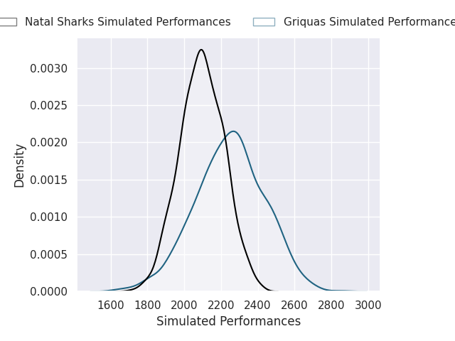
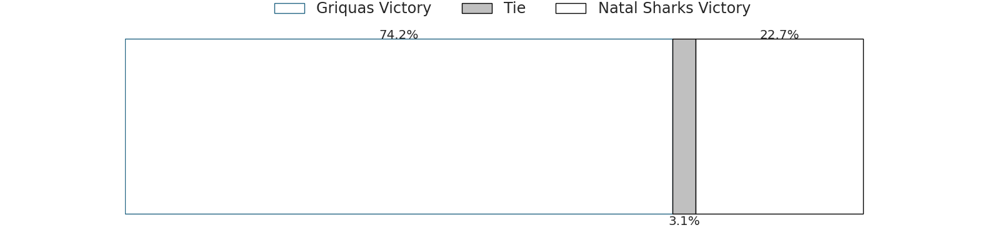
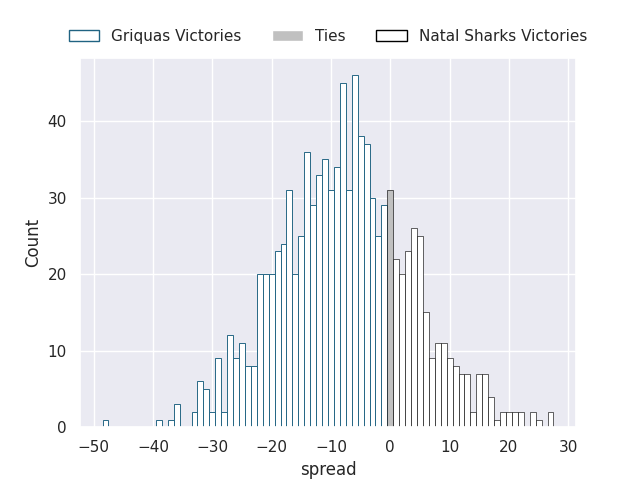

### Golden Lions V Boland Cavaliers on 2026/08/14

Average Margin: Golden Lions by 8.4

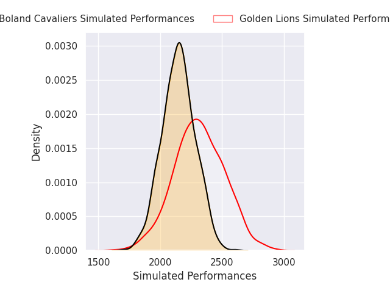
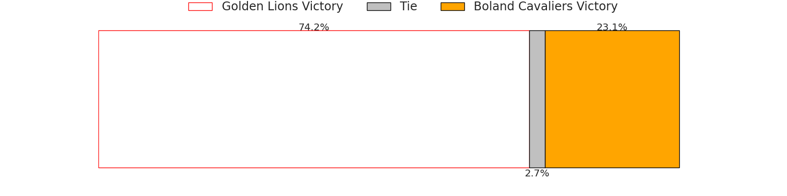
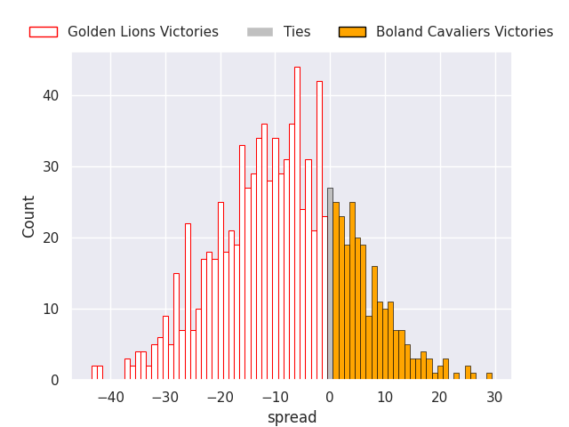

### Pumas V Western Province on 2026/08/15

Average Margin: Pumas by 5.8

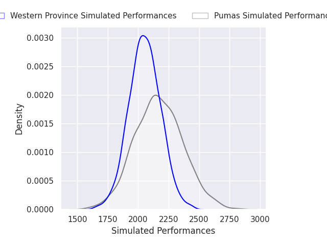
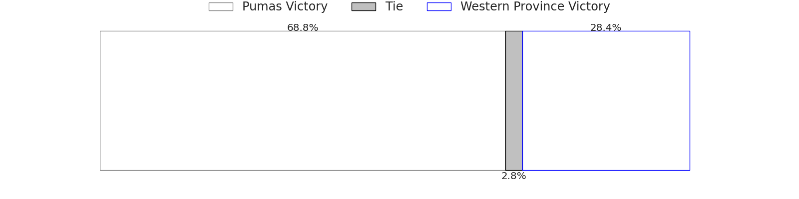
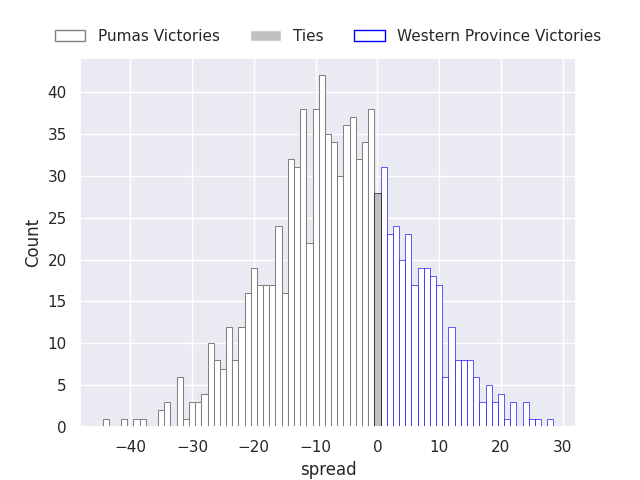

### Blue Bulls V Cheetahs on 2026/08/16

Average Margin: Blue Bulls by 0.3

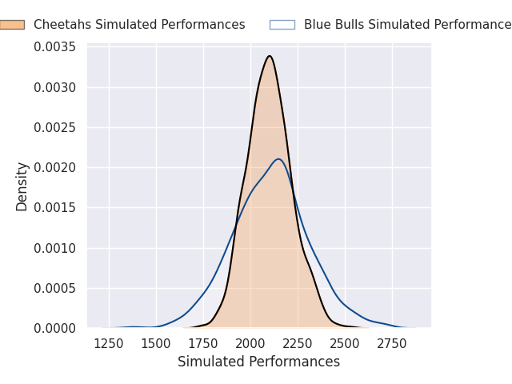

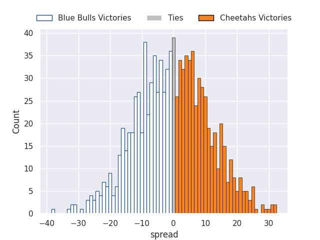

