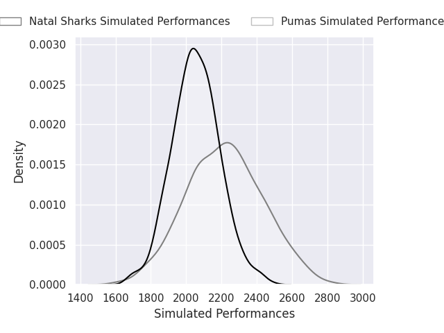
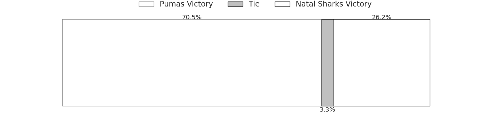
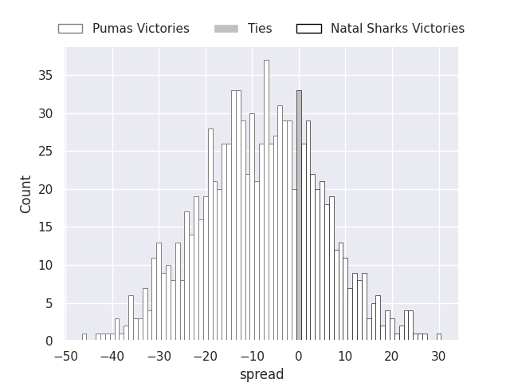
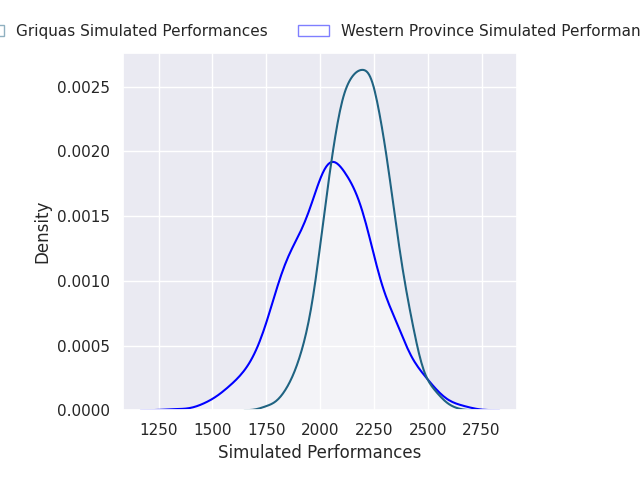
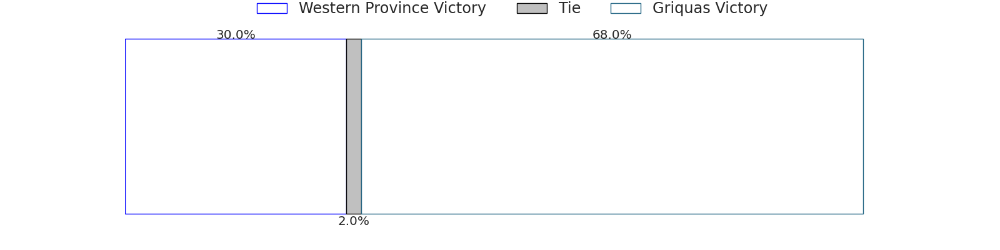
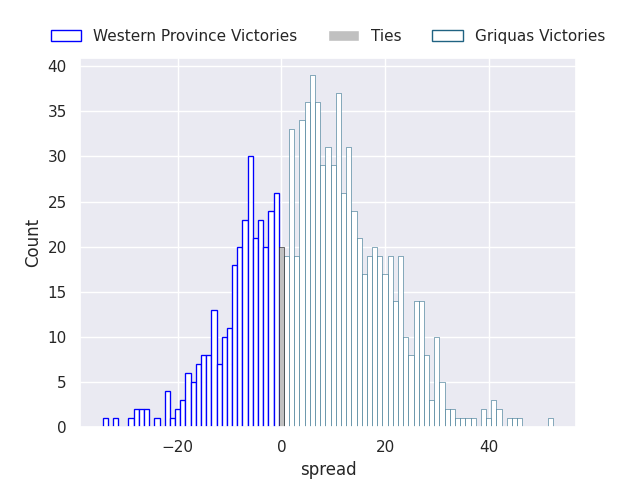

# Team Rankings

# Standings

## Projected Remaining Table

| Club             |   To Play |   Projected Wins |   Projected Differential |   Projected Losing Bonus Points | Projected Try Bonus Points   |   Projected Competition Points |
|:-----------------|----------:|-----------------:|-------------------------:|--------------------------------:|:-----------------------------|-------------------------------:|
| Golden Lions     |         3 |            2.334 |                   31.092 |                           0.349 |                              |                          9.829 |
| Griquas          |         3 |            2.284 |                   29.032 |                           0.386 |                              |                          9.66  |
| Boland Cavaliers |         3 |            2.014 |                   20.722 |                           0.474 |                              |                          8.668 |
| Pumas            |         3 |            1.299 |                   -5.797 |                           0.534 |                              |                          5.91  |
| Cheetahs         |         3 |            1.123 |                  -11.692 |                           0.598 |                              |                          5.27  |
| Natal Sharks     |         3 |            1.051 |                  -13.111 |                           0.642 |                              |                          5.046 |
| Western Province |         3 |            1.005 |                  -16.985 |                           0.6   |                              |                          4.764 |
| Blue Bulls       |         3 |            0.58  |                  -33.261 |                           0.553 |                              |                          2.989 |

## Projected Total Table

| Club             |   Played |   Wins |   Point Differential |   Losing Bonus Points | Try Bonus Points   |   Competition Points |
|:-----------------|---------:|-------:|---------------------:|----------------------:|:-------------------|---------------------:|
| Golden Lions     |        3 |  2.334 |               31.092 |                 0.349 |                    |                9.829 |
| Griquas          |        3 |  2.284 |               29.032 |                 0.386 |                    |                9.66  |
| Boland Cavaliers |        3 |  2.014 |               20.722 |                 0.474 |                    |                8.668 |
| Pumas            |        3 |  1.299 |               -5.797 |                 0.534 |                    |                5.91  |
| Cheetahs         |        3 |  1.123 |              -11.692 |                 0.598 |                    |                5.27  |
| Natal Sharks     |        3 |  1.051 |              -13.111 |                 0.642 |                    |                5.046 |
| Western Province |        3 |  1.005 |              -16.985 |                 0.6   |                    |                4.764 |
| Blue Bulls       |        3 |  0.58  |              -33.261 |                 0.553 |                    |                2.989 |

# Future Predictions

## Week 1

### Pumas V Natal Sharks on 2026/07/17

Average Margin: Pumas by 8.1

### Western Province V Griquas on 2026/07/17

Average Margin: Griquas by 6.6

### Boland Cavaliers V Blue Bulls on 2026/07/19

Average Margin: Boland Cavaliers by 7.9

### Cheetahs V Golden Lions on 2026/07/19

Average Margin: Golden Lions by 5.7

## Week 2

### Cheetahs V Natal Sharks on 2026/07/24

Average Margin: Cheetahs by 4.7

### Golden Lions V Pumas on 2026/07/25

Average Margin: Golden Lions by 11.8

### Griquas V Blue Bulls on 2026/07/25

Average Margin: Griquas by 11.8

### Boland Cavaliers V Western Province on 2026/07/26

Average Margin: Boland Cavaliers by 10.7

## Week 3

### Griquas V Cheetahs on 2026/07/31

Average Margin: Griquas by 10.7

### Golden Lions V Blue Bulls on 2026/08/01

Average Margin: Golden Lions by 13.5

### Western Province V Natal Sharks on 2026/08/01

Average Margin: Western Province by 0.3

### Boland Cavaliers V Pumas on 2026/08/02

Average Margin: Boland Cavaliers by 2.1

