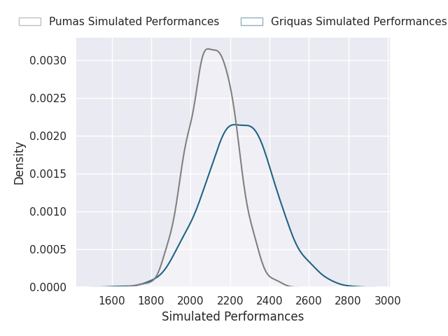
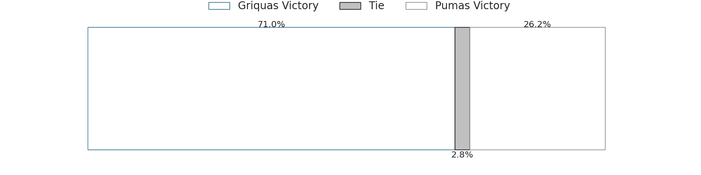
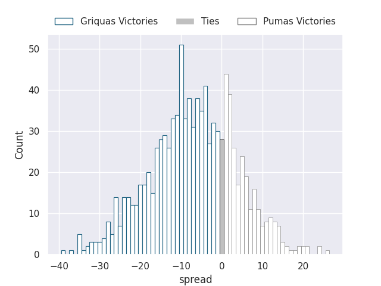

# Team Rankings

# Standings

## Current Standings

| Club             |   Played |   Wins |   Point Differential |   Losing Bonus Points |   Try Bonus Points |   Competition Points |
|:-----------------|---------:|-------:|---------------------:|----------------------:|-------------------:|---------------------:|
| Cheetahs         |        1 |      1 |                    2 |                     0 |                  1 |                    5 |
| Natal Sharks     |        1 |      1 |                    2 |                     0 |                  1 |                    5 |
| Boland Cavaliers |        1 |      1 |                   14 |                     0 |                    |                    4 |
| Western Province |        1 |      1 |                    6 |                     0 |                    |                    4 |
| Golden Lions     |        1 |      0 |                   -2 |                     1 |                  1 |                    2 |
| Pumas            |        1 |      0 |                   -2 |                     1 |                  1 |                    2 |
| Griquas          |        1 |      0 |                   -6 |                     1 |                    |                    1 |
| Blue Bulls       |        1 |      0 |                  -14 |                     0 |                    |                    0 |

## Projected Remaining Table

| Club             |   To Play |   Projected Wins |   Projected Differential |   Projected Losing Bonus Points | Projected Try Bonus Points   |   Projected Competition Points |
|:-----------------|----------:|-----------------:|-------------------------:|--------------------------------:|:-----------------------------|-------------------------------:|
| Griquas          |         4 |            2.697 |                   26.24  |                           0.678 |                              |                         11.69  |
| Boland Cavaliers |         3 |            1.614 |                    6.804 |                           0.613 |                              |                          7.227 |
| Golden Lions     |         2 |            1.687 |                   25.714 |                           0.162 |                              |                          6.984 |
| Natal Sharks     |         3 |            1.399 |                   -1.109 |                           0.677 |                              |                          6.443 |
| Pumas            |         4 |            1.306 |                  -20.463 |                           0.865 |                              |                          6.325 |
| Western Province |         2 |            0.833 |                   -6.504 |                           0.39  |                              |                          3.814 |
| Blue Bulls       |         3 |            0.742 |                  -27.122 |                           0.543 |                              |                          3.655 |
| Cheetahs         |         2 |            0.785 |                   -6.924 |                           0.395 |                              |                          3.629 |
| Lions            |         1 |            0.617 |                    3.364 |                           0.209 |                              |                          2.765 |

## Projected Total Table

| Club             |   Played |   Wins |   Point Differential |   Losing Bonus Points |   Try Bonus Points |   Competition Points |
|:-----------------|---------:|-------:|---------------------:|----------------------:|-------------------:|---------------------:|
| Griquas          |        5 |  2.697 |               20.24  |                 1.678 |                    |               12.69  |
| Natal Sharks     |        4 |  2.399 |                0.891 |                 0.677 |                  1 |               11.443 |
| Boland Cavaliers |        4 |  2.614 |               20.804 |                 0.613 |                    |               11.227 |
| Golden Lions     |        3 |  1.687 |               23.714 |                 1.162 |                  1 |                8.984 |
| Cheetahs         |        3 |  1.785 |               -4.924 |                 0.395 |                  1 |                8.629 |
| Pumas            |        5 |  1.306 |              -22.463 |                 1.865 |                  1 |                8.325 |
| Western Province |        3 |  1.833 |               -0.504 |                 0.39  |                    |                7.814 |
| Blue Bulls       |        4 |  0.742 |              -41.122 |                 0.543 |                    |                3.655 |
| Lions            |        1 |  0.617 |                3.364 |                 0.209 |                    |                2.765 |

# Completed Match Review

| Model | Percent Correct Predictions | Spread Error |
| ------ | ------ | ------ |
| Club Level | 81.2% | 3.2 |
| Player Level: Lineup | nan% | nan |
| Player Level: Minutes | nan% | nan |

# Future Predictions

## Week 2

### Cheetahs V Natal Sharks on 2026/07/24

Average Margin: Cheetahs by 4.2

### Golden Lions V Pumas on 2026/07/25

Average Margin: Golden Lions by 10.7

### Griquas V Blue Bulls on 2026/07/25

Average Margin: Griquas by 11.5

### Boland Cavaliers V Western Province on 2026/07/26

Average Margin: Boland Cavaliers by 8.1

## Week 3

### Griquas V Cheetahs on 2026/07/31

Average Margin: Griquas by 11.1

### Western Province V Natal Sharks on 2026/08/01

Average Margin: Western Province by 1.6

### Golden Lions V Blue Bulls on 2026/08/01

Average Margin: Golden Lions by 15.0

### Boland Cavaliers V Pumas on 2026/08/02

Average Margin: Boland Cavaliers by 3.4

## Week 4

### Blue Bulls V Pumas on 2026/08/08

Average Margin: Pumas by 0.6

### Natal Sharks V Boland Cavaliers on 2026/08/08

Average Margin: Natal Sharks by 4.7

### Griquas V Lions on 2026/08/08

Average Margin: Lions by 3.4

## Week 5

### Griquas V Pumas on 2026/09/12

Average Margin: Griquas by 6.9

