# Team Rankings

# Standings

## Current Standings

| Club             |   Played |   Wins |   Point Differential |   Losing Bonus Points |   Try Bonus Points |   Competition Points |
|:-----------------|---------:|-------:|---------------------:|----------------------:|-------------------:|---------------------:|
| Cheetahs         |        1 |      1 |                    2 |                     0 |                  1 |                    5 |
| Natal Sharks     |        1 |      1 |                    2 |                     0 |                  1 |                    5 |
| Boland Cavaliers |        1 |      1 |                   14 |                     0 |                    |                    4 |
| Western Province |        1 |      1 |                    6 |                     0 |                    |                    4 |
| Golden Lions     |        1 |      0 |                   -2 |                     1 |                  1 |                    2 |
| Pumas            |        1 |      0 |                   -2 |                     1 |                  1 |                    2 |
| Griquas          |        1 |      0 |                   -6 |                     1 |                    |                    1 |
| Blue Bulls       |        1 |      0 |                  -14 |                     0 |                    |                    0 |

## Projected Remaining Table

| Club             |   To Play |   Projected Wins |   Projected Differential |   Projected Losing Bonus Points | Projected Try Bonus Points   |   Projected Competition Points |
|:-----------------|----------:|-----------------:|-------------------------:|--------------------------------:|:-----------------------------|-------------------------------:|
| Griquas          |         4 |            2.45  |                   19.205 |                           0.717 |                              |                         10.759 |
| Golden Lions     |         3 |            2.567 |                   38.688 |                           0.244 |                              |                         10.606 |
| Boland Cavaliers |         4 |            2.212 |                    8.808 |                           0.731 |                              |                          9.849 |
| Natal Sharks     |         4 |            2.208 |                    9.299 |                           0.8   |                              |                          9.832 |
| Pumas            |         4 |            1.703 |                   -8.489 |                           0.828 |                              |                          7.896 |
| Cheetahs         |         3 |            1.074 |                  -12.755 |                           0.627 |                              |                          5.073 |
| Blue Bulls       |         4 |            0.941 |                  -35.729 |                           0.764 |                              |                          4.71  |
| Western Province |         3 |            0.87  |                  -21.209 |                           0.576 |                              |                          4.2   |
| Lions            |         1 |            0.569 |                    2.182 |                           0.244 |                              |                          2.606 |

## Projected Total Table

| Club             |   Played |   Wins |   Point Differential |   Losing Bonus Points |   Try Bonus Points |   Competition Points |
|:-----------------|---------:|-------:|---------------------:|----------------------:|-------------------:|---------------------:|
| Natal Sharks     |        5 |  3.208 |               11.299 |                 0.8   |                  1 |               14.832 |
| Boland Cavaliers |        5 |  3.212 |               22.808 |                 0.731 |                    |               13.849 |
| Golden Lions     |        4 |  2.567 |               36.688 |                 1.244 |                  1 |               12.606 |
| Griquas          |        5 |  2.45  |               13.205 |                 1.717 |                    |               11.759 |
| Cheetahs         |        4 |  2.074 |              -10.755 |                 0.627 |                  1 |               10.073 |
| Pumas            |        5 |  1.703 |              -10.489 |                 1.828 |                  1 |                9.896 |
| Western Province |        4 |  1.87  |              -15.209 |                 0.576 |                    |                8.2   |
| Blue Bulls       |        5 |  0.941 |              -49.729 |                 0.764 |                    |                4.71  |
| Lions            |        1 |  0.569 |                2.182 |                 0.244 |                    |                2.606 |

# Completed Match Review

| Model | Percent Correct Predictions | Spread Error |
| ------ | ------ | ------ |
| Club Level | 78.9% | 3.2 |
| Player Level: Lineup | nan% | nan |
| Player Level: Minutes | nan% | nan |

# Future Predictions

## Week 2

### Cheetahs V Natal Sharks on 2026/07/24

Average Margin: Cheetahs by 3.2

### Golden Lions V Pumas on 2026/07/25

Average Margin: Golden Lions by 10.2

### Griquas V Blue Bulls on 2026/07/25

Average Margin: Griquas by 12.0

### Boland Cavaliers V Western Province on 2026/07/26

Average Margin: Boland Cavaliers by 7.6

## Week 3

### Griquas V Cheetahs on 2026/07/31

Average Margin: Griquas by 11.1

### Western Province V Natal Sharks on 2026/08/01

Average Margin: Western Province by 0.1

### Golden Lions V Blue Bulls on 2026/08/01

Average Margin: Golden Lions by 14.7

### Boland Cavaliers V Pumas on 2026/08/02

Average Margin: Boland Cavaliers by 3.8

## Week 4

### Griquas V Lions on 2026/08/08

Average Margin: Lions by 2.2

### Natal Sharks V Boland Cavaliers on 2026/08/08

Average Margin: Natal Sharks by 4.3

### Blue Bulls V Pumas on 2026/08/08

Average Margin: Pumas by 0.5

## Week 5

### Golden Lions V Western Province on 2026/08/28

Average Margin: Golden Lions by 13.7

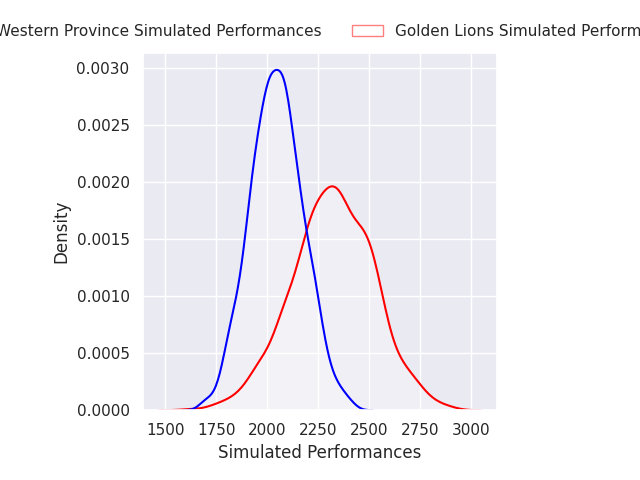
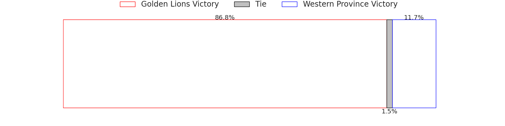
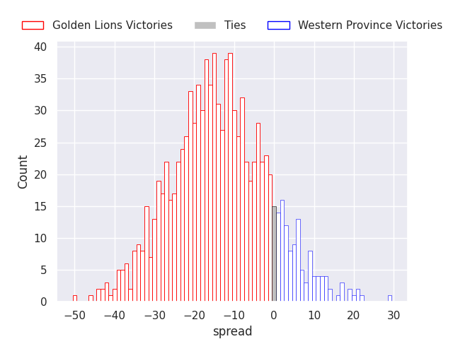

### Natal Sharks V Blue Bulls on 2026/08/28

Average Margin: Natal Sharks by 8.4

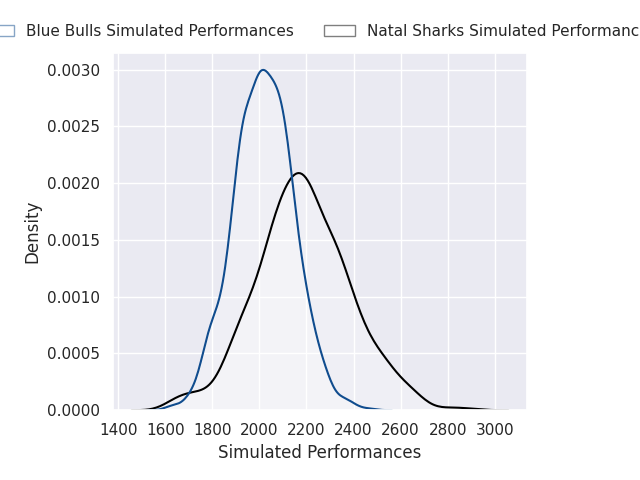
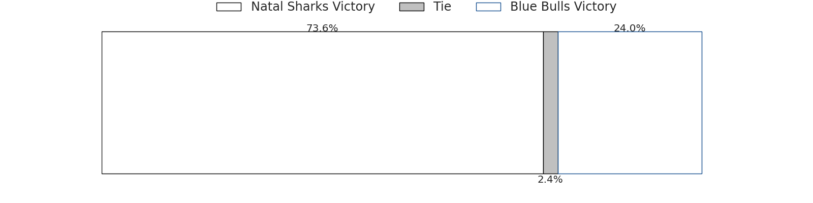
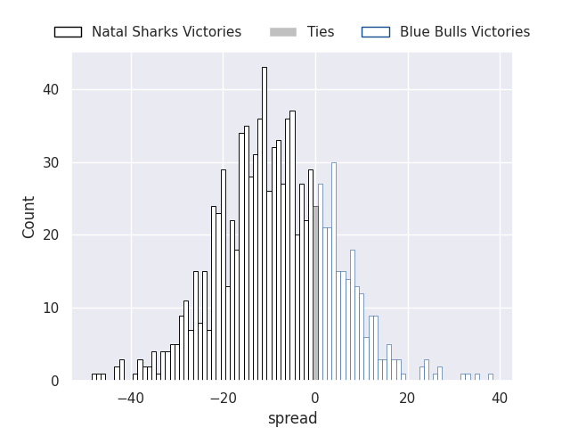

### Pumas V Cheetahs on 2026/08/29

Average Margin: Pumas by 4.9

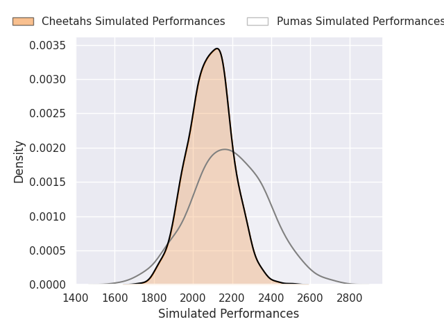
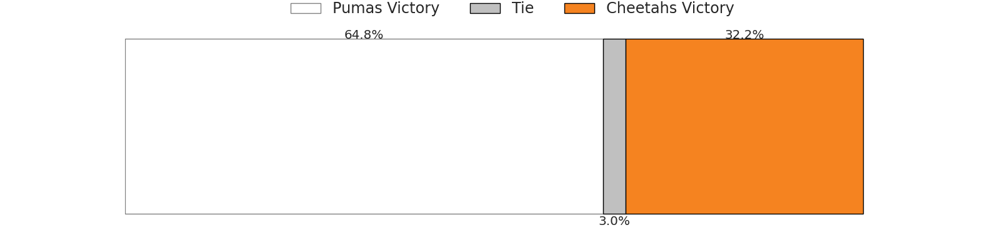
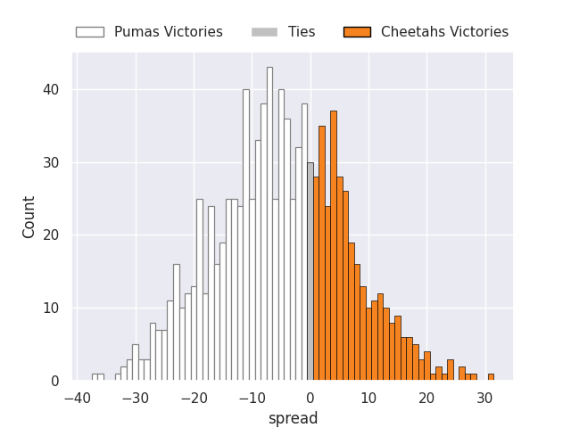

### Boland Cavaliers V Griquas on 2026/08/30

Average Margin: Boland Cavaliers by 1.7

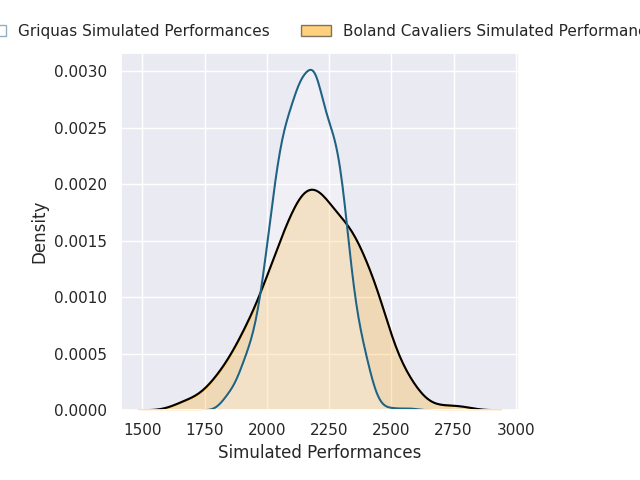

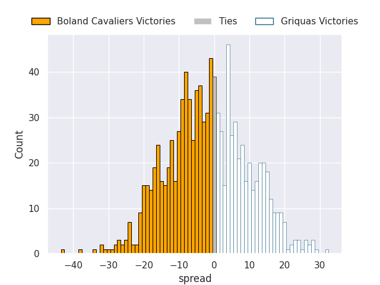

