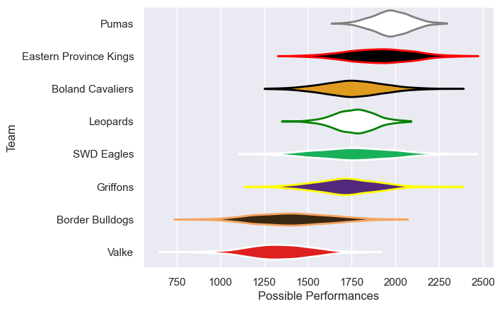

---  
title: "Currie Cup First Division 2012"  
date: 2025-07-29 6:00:00 -0500  
categories: model review projection  
layout: article  
aside:  
    toc: true  
---
# Current Team Rankings

# Standings

## Current Standings

| Club                   |   Played |   Wins |   Point Differential |   Losing Bonus Points |   Try Bonus Points |   Competition Points |
|:-----------------------|---------:|-------:|---------------------:|----------------------:|-------------------:|---------------------:|
| Eastern Province Kings |       16 |     14 |                  293 |                     0 |                    |                   60 |
| Pumas                  |       15 |     10 |                  176 |                     2 |                  1 |                   47 |
| SWD Eagles             |       14 |      8 |                   28 |                     1 |                    |                   35 |
| Griffons               |       14 |      8 |                  -32 |                     3 |                    |                   35 |
| Leopards               |       15 |      8 |                   39 |                     2 |                    |                   34 |
| Boland Cavaliers       |       14 |      3 |                  -21 |                     6 |                    |                   22 |
| Valke                  |       14 |      3 |                 -205 |                     2 |                    |                   16 |
| Border Bulldogs        |       14 |      0 |                 -278 |                     5 |                    |                    5 |

# Completed Match Review

| Model | Percent Correct Predictions | Spread Error |
| ------ | ------ | ------ |
| Club Level | 70.7% | 20.7 |
| Player Level: Lineup | nan% | nan |
| Player Level: Minutes | nan% | nan |

