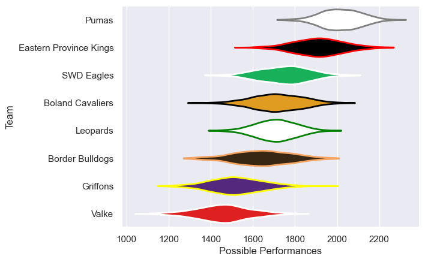

---  
title: "Currie Cup First Division 2013 Status"  
date: 2025-07-28 6:00:00 -0500  
categories: model review projection  
layout: article  
aside:  
    toc: true  
---
# Current Team Rankings

# Standings

## Current Standings

| Club                   |   Played |   Wins |   Point Differential |   Losing Bonus Points |   Try Bonus Points |   Competition Points |
|:-----------------------|---------:|-------:|---------------------:|----------------------:|-------------------:|---------------------:|
| Pumas                  |       16 |     16 |                  386 |                     0 |                  1 |                   65 |
| Eastern Province Kings |       16 |     11 |                  124 |                     3 |                    |                   47 |
| Leopards               |       15 |      8 |                   52 |                     5 |                    |                   37 |
| SWD Eagles             |       15 |      7 |                  -11 |                     5 |                    |                   33 |
| Boland Cavaliers       |       14 |      6 |                  -66 |                     3 |                    |                   29 |
| Border Bulldogs        |       14 |      4 |                  -88 |                     6 |                    |                   22 |
| Griffons               |       14 |      3 |                 -167 |                     3 |                    |                   19 |
| Valke                  |       14 |      2 |                 -230 |                     2 |                    |                   12 |

# Completed Match Review

| Model | Percent Correct Predictions | Spread Error |
| ------ | ------ | ------ |
| Club Level | 71.2% | 13.5 |
| Player Level: Lineup | nan% | nan |
| Player Level: Minutes | nan% | nan |

