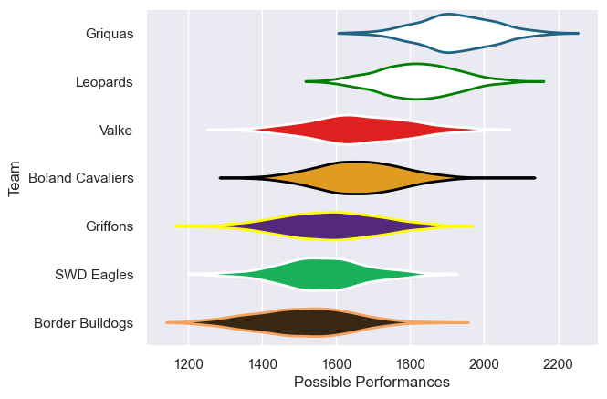

---  
title: "Currie Cup First Division 2014"  
date: 2025-07-29 6:00:00 -0500  
categories: model review projection  
layout: article  
aside:  
    toc: true  
---
# Current Team Rankings

# Standings

## Current Standings

| Club             |   Played |   Wins |   Point Differential |   Losing Bonus Points | Try Bonus Points   |   Competition Points |
|:-----------------|---------:|-------:|---------------------:|----------------------:|:-------------------|---------------------:|
| Griquas          |        6 |      6 |                  145 |                     0 |                    |                   24 |
| Leopards         |        6 |      5 |                  215 |                     1 |                    |                   21 |
| Griffons         |        6 |      3 |                  -30 |                     1 |                    |                   13 |
| SWD Eagles       |        6 |      3 |                  -82 |                     0 |                    |                   12 |
| Boland Cavaliers |        6 |      2 |                  -16 |                     2 |                    |                   10 |
| Valke            |        6 |      2 |                  -30 |                     0 |                    |                    8 |
| Border Bulldogs  |        6 |      0 |                 -202 |                     1 |                    |                    1 |

# Completed Match Review

| Model | Percent Correct Predictions | Spread Error |
| ------ | ------ | ------ |
| Club Level | 81.0% | 19.2 |
| Player Level: Lineup | nan% | nan |
| Player Level: Minutes | nan% | nan |

