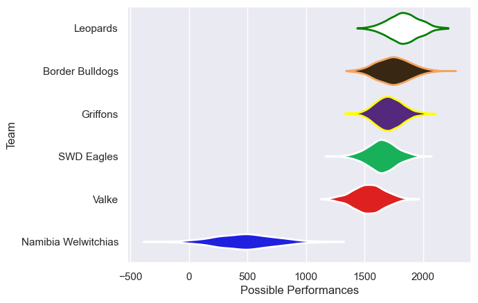

---  
title: "Currie Cup First Division 2016"  
date: 2025-07-29 6:00:00 -0500  
categories: model review projection  
layout: article  
aside:  
    toc: true  
---
# Current Team Rankings

# Standings

## Current Standings

| Club                |   Played |   Wins |   Point Differential |   Losing Bonus Points |   Try Bonus Points |   Competition Points |
|:--------------------|---------:|-------:|---------------------:|----------------------:|-------------------:|---------------------:|
| Leopards            |        7 |      6 |                   56 |                     0 |                    |                   24 |
| Griffons            |        7 |      5 |                   89 |                     0 |                  1 |                   21 |
| Border Bulldogs     |        6 |      4 |                   92 |                     1 |                    |                   17 |
| Valke               |        6 |      2 |                  -49 |                     0 |                    |                    8 |
| SWD Eagles          |        5 |      1 |                   -2 |                     3 |                    |                    7 |
| Namibia Welwitchias |        5 |      0 |                 -186 |                     0 |                    |                    0 |

# Completed Match Review

| Model | Percent Correct Predictions | Spread Error |
| ------ | ------ | ------ |
| Club Level | 66.7% | 19.7 |
| Player Level: Lineup | nan% | nan |
| Player Level: Minutes | nan% | nan |

