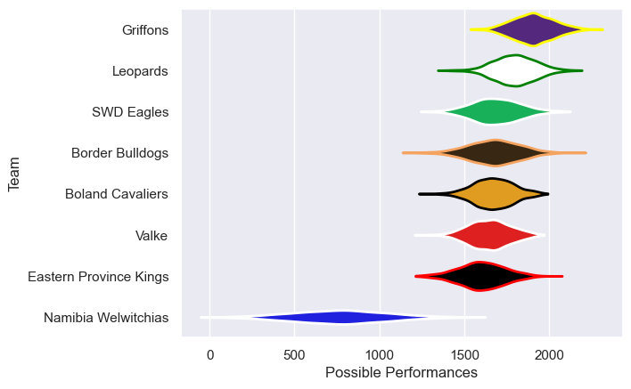

---  
title: "Currie Cup First Division 2017"  
date: 2025-07-29 6:00:00 -0500  
categories: model review projection  
layout: article  
aside:  
    toc: true  
---
# Current Team Rankings

# Standings

## Current Standings

| Club                   |   Played |   Wins |   Point Differential |   Losing Bonus Points |   Try Bonus Points |   Competition Points |
|:-----------------------|---------:|-------:|---------------------:|----------------------:|-------------------:|---------------------:|
| Griffons               |        8 |      8 |                  145 |                     0 |                  1 |                   33 |
| Leopards               |        8 |      5 |                   84 |                     1 |                  1 |                   24 |
| Valke                  |        7 |      4 |                   10 |                     2 |                    |                   18 |
| SWD Eagles             |        6 |      3 |                  -34 |                     0 |                    |                   14 |
| Boland Cavaliers       |        7 |      3 |                   29 |                     1 |                    |                   13 |
| Border Bulldogs        |        6 |      2 |                  -54 |                     2 |                    |                   10 |
| Namibia Welwitchias    |        6 |      1 |                  -44 |                     3 |                    |                    7 |
| Eastern Province Kings |        6 |      0 |                 -136 |                     0 |                    |                    0 |

# Completed Match Review

| Model | Percent Correct Predictions | Spread Error |
| ------ | ------ | ------ |
| Club Level | 66.7% | 21.7 |
| Player Level: Lineup | nan% | nan |
| Player Level: Minutes | nan% | nan |

