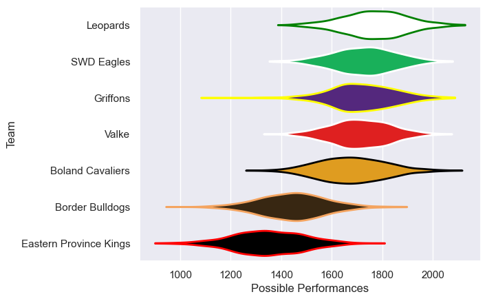

---  
title: "Currie Cup First Division 2018 Status"  
date: 2025-07-28 6:00:00 -0500  
categories: model review projection  
layout: article  
aside:  
    toc: true  
---
# Current Team Rankings

# Standings

## Current Standings

| Club                   |   Played |   Wins |   Point Differential |   Losing Bonus Points | Try Bonus Points   |   Competition Points |
|:-----------------------|---------:|-------:|---------------------:|----------------------:|:-------------------|---------------------:|
| SWD Eagles             |        6 |      5 |                   66 |                     1 |                    |                   21 |
| Valke                  |        7 |      4 |                  131 |                     1 |                    |                   17 |
| Leopards               |        5 |      4 |                   17 |                     0 |                    |                   16 |
| Boland Cavaliers       |        6 |      3 |                   18 |                     1 |                    |                   13 |
| Border Bulldogs        |        5 |      2 |                  -59 |                     0 |                    |                    8 |
| Griffons               |        4 |      1 |                  -10 |                     2 |                    |                    6 |
| Eastern Province Kings |        5 |      0 |                 -163 |                     1 |                    |                    1 |

# Completed Match Review

| Model | Percent Correct Predictions | Spread Error |
| ------ | ------ | ------ |
| Club Level | 78.9% | 17.6 |
| Player Level: Lineup | nan% | nan |
| Player Level: Minutes | nan% | nan |

