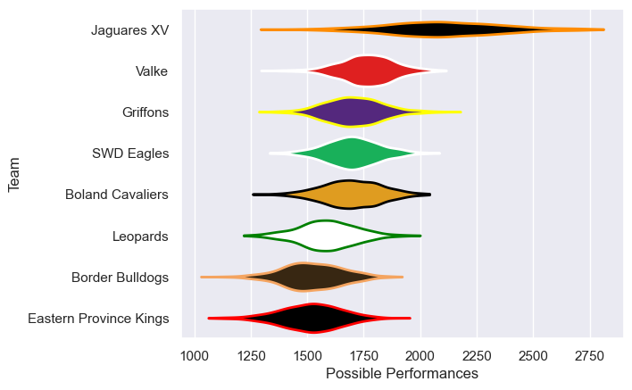

---  
title: "Currie Cup First Division 2019 Status"  
date: 2025-07-28 6:00:00 -0500  
categories: model review projection  
layout: article  
aside:  
    toc: true  
---
# Current Team Rankings

# Standings

## Current Standings

| Club                   |   Played |   Wins |   Point Differential |   Losing Bonus Points | Try Bonus Points   |   Competition Points |
|:-----------------------|---------:|-------:|---------------------:|----------------------:|:-------------------|---------------------:|
| Jaguares XV            |        9 |      9 |                  386 |                     0 |                    |                   36 |
| Griffons               |        9 |      4 |                   63 |                     1 |                    |                   23 |
| Eastern Province Kings |        8 |      4 |                  -37 |                     2 |                    |                   18 |
| Valke                  |        8 |      3 |                  -83 |                     0 |                    |                   16 |
| Leopards               |        7 |      3 |                  -55 |                     1 |                    |                   13 |
| Boland Cavaliers       |        7 |      2 |                  -21 |                     1 |                    |                   11 |
| SWD Eagles             |        7 |      1 |                 -100 |                     2 |                    |                   10 |
| Border Bulldogs        |        7 |      1 |                 -153 |                     0 |                    |                    4 |

# Completed Match Review

| Model | Percent Correct Predictions | Spread Error |
| ------ | ------ | ------ |
| Club Level | 61.3% | 16.0 |
| Player Level: Lineup | nan% | nan |
| Player Level: Minutes | nan% | nan |

