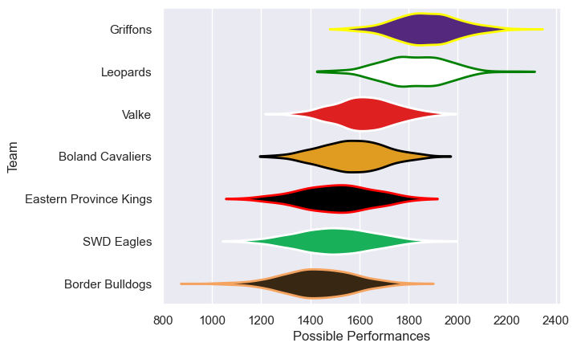

---  
title: "Currie Cup First Division 2021 Status"  
date: 2025-07-28 6:00:00 -0500  
categories: model review projection  
layout: article  
aside:  
    toc: true  
---
# Current Team Rankings

# Standings

## Current Standings

| Club                   |   Played |   Wins |   Point Differential |   Losing Bonus Points | Try Bonus Points   |   Competition Points |
|:-----------------------|---------:|-------:|---------------------:|----------------------:|:-------------------|---------------------:|
| Leopards               |        7 |      6 |                  102 |                     1 |                    |                   25 |
| Griffons               |        7 |      5 |                  110 |                     1 |                    |                   21 |
| Valke                  |        7 |      3 |                    7 |                     3 |                    |                   15 |
| Boland Cavaliers       |        7 |      3 |                  -39 |                     1 |                    |                   13 |
| Eastern Province Kings |        6 |      2 |                  -72 |                     0 |                    |                    8 |
| Border Bulldogs        |        6 |      2 |                  -80 |                     0 |                    |                    8 |
| SWD Eagles             |        4 |      1 |                  -28 |                     1 |                    |                    5 |

# Completed Match Review

| Model | Percent Correct Predictions | Spread Error |
| ------ | ------ | ------ |
| Club Level | 68.2% | 14.4 |
| Player Level: Lineup | nan% | nan |
| Player Level: Minutes | nan% | nan |

