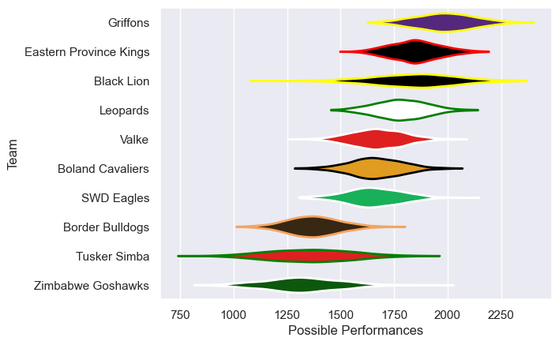

---  
title: "Currie Cup First Division 2022 Status"  
date: 2025-07-28 6:00:00 -0500  
categories: model review projection  
layout: article  
aside:  
    toc: true  
---
# Current Team Rankings

# Standings

## Current Standings

| Club                   |   Played |   Wins |   Point Differential |   Losing Bonus Points | Try Bonus Points   |   Competition Points |
|:-----------------------|---------:|-------:|---------------------:|----------------------:|:-------------------|---------------------:|
| Griffons               |       10 |     10 |                  264 |                     0 |                    |                   40 |
| Eastern Province Kings |       11 |      7 |                  121 |                     1 |                    |                   29 |
| SWD Eagles             |       10 |      6 |                   37 |                     0 |                    |                   24 |
| Black Lion             |        7 |      5 |                   69 |                     1 |                    |                   21 |
| Boland Cavaliers       |        9 |      4 |                   19 |                     4 |                    |                   20 |
| Valke                  |        8 |      4 |                   48 |                     1 |                    |                   17 |
| Leopards               |        9 |      3 |                    5 |                     2 |                    |                   14 |
| Tusker Simba           |        8 |      3 |                  -44 |                     1 |                    |                   13 |
| Zimbabwe Goshawks      |        9 |      3 |                 -179 |                     0 |                    |                   12 |
| Border Bulldogs        |        9 |      0 |                 -340 |                     0 |                    |                    0 |

# Completed Match Review

| Model | Percent Correct Predictions | Spread Error |
| ------ | ------ | ------ |
| Club Level | 68.9% | 20.8 |
| Player Level: Lineup | nan% | nan |
| Player Level: Minutes | nan% | nan |

