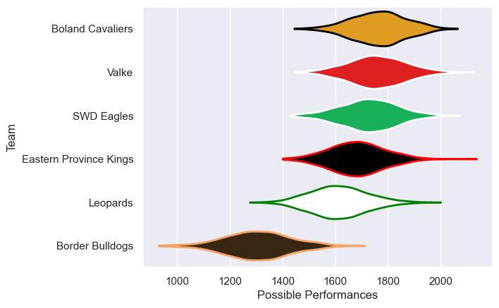

---  
title: "Currie Cup First Division 2023"  
date: 2025-07-29 6:00:00 -0500  
categories: model review projection  
layout: article  
aside:  
    toc: true  
---
# Current Team Rankings

# Standings

## Current Standings

| Club                   |   Played |   Wins |   Point Differential |   Losing Bonus Points | Try Bonus Points   |   Competition Points |
|:-----------------------|---------:|-------:|---------------------:|----------------------:|:-------------------|---------------------:|
| Boland Cavaliers       |       11 |      8 |                  180 |                     2 |                    |                   34 |
| Valke                  |       11 |      7 |                   68 |                     1 |                    |                   29 |
| Eastern Province Kings |       10 |      7 |                   13 |                     0 |                    |                   28 |
| SWD Eagles             |       10 |      6 |                   76 |                     1 |                    |                   25 |
| Leopards               |       10 |      3 |                  -33 |                     1 |                    |                   13 |
| Border Bulldogs        |       10 |      0 |                 -304 |                     1 |                    |                    1 |

# Completed Match Review

| Model | Percent Correct Predictions | Spread Error |
| ------ | ------ | ------ |
| Club Level | 83.9% | 12.4 |
| Player Level: Lineup | nan% | nan |
| Player Level: Minutes | nan% | nan |

