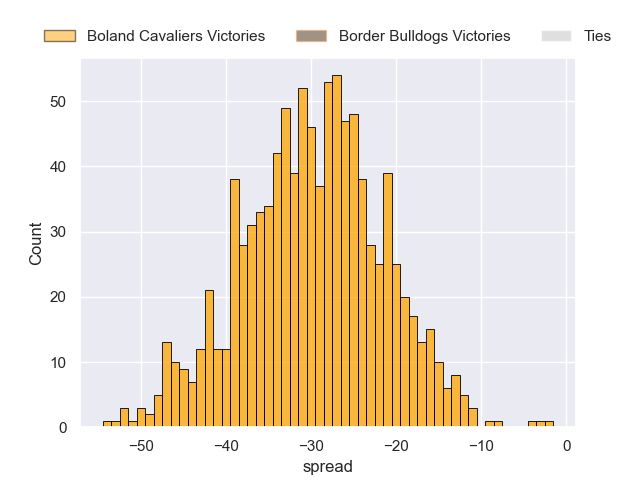
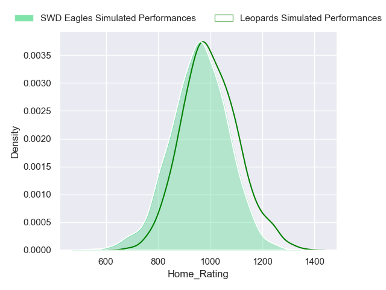
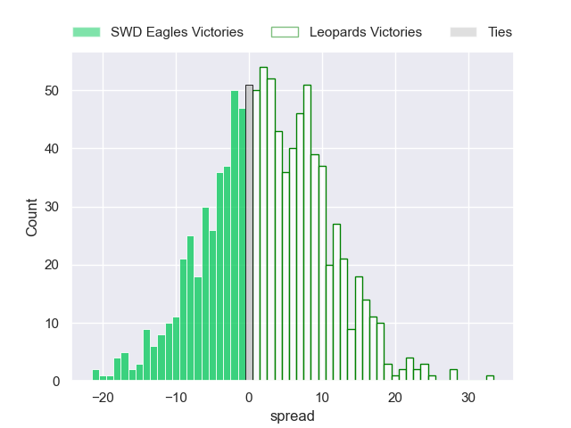
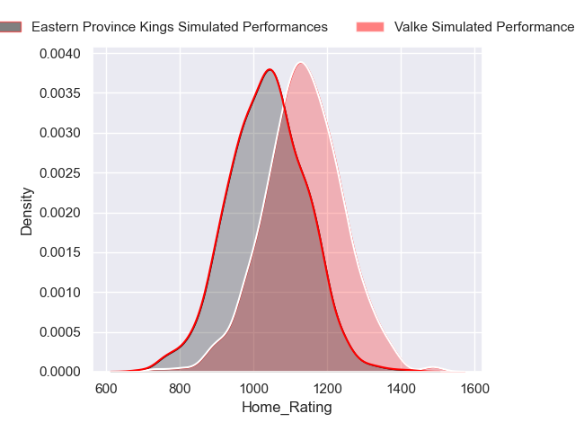
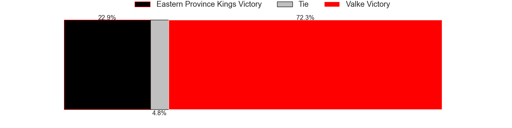
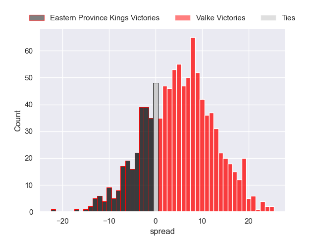

---  
title: "Currie Cup First Division 2023 Status"  
date: 2024-07-12 6:00:00 -0500  
categories: model review projection  
layout: article  
aside:  
    toc: true  
---
# Current Team Rankings

# Standings

## Current Standings

| Club                   |   Played |   Wins |   Point Differential |   Losing Bonus Points |   Try Bonus Points |   Competition Points |
|:-----------------------|---------:|-------:|---------------------:|----------------------:|-------------------:|---------------------:|
| Boland Cavaliers       |        9 |      8 |                  233 |                     1 |                nan |                   33 |
| Valke                  |        9 |      6 |                   52 |                     1 |                nan |                   25 |
| Eastern Province Kings |       10 |      6 |                   49 |                     1 |                nan |                   25 |
| SWD Eagles             |       10 |      4 |                   18 |                     2 |                nan |                   18 |
| Leopards               |        9 |      4 |                  -98 |                     0 |                nan |                   16 |
| Border Bulldogs        |        9 |      0 |                 -254 |                     2 |                nan |                    2 |

## Projected Remaining Table

| Club                   |   Matches Remaining |   Wins |   Point Differential |   Losing Bonus Points |   Try Bonus Points |   Competition Points |
|:-----------------------|--------------------:|-------:|---------------------:|----------------------:|-------------------:|---------------------:|
| Boland Cavaliers       |                   1 |    1   |             29.8724  |                   0   |                0.9 |                  4.9 |
| Valke                  |                   1 |    0.7 |              5.00494 |                   0.2 |                0.5 |                  3.7 |
| Leopards               |                   1 |    0.6 |              2.14566 |                   0.3 |                0.4 |                  3.1 |
| SWD Eagles             |                   1 |    0.4 |             -2.14566 |                   0.3 |                0.5 |                  2.4 |
| Eastern Province Kings |                   1 |    0.3 |             -5.00494 |                   0.3 |                0.5 |                  1.9 |
| Border Bulldogs        |                   1 |    0   |            -29.8724  |                   0   |                0.3 |                  0.3 |

## Projected Total Table

| Club                   |   Total Matches |   Wins |   Point Differential |   Losing Bonus Points |   Try Bonus Points |   Competition Points |
|:-----------------------|----------------:|-------:|---------------------:|----------------------:|-------------------:|---------------------:|
| Boland Cavaliers       |              10 |    9   |             262.872  |                   1   |                0.9 |                 37.9 |
| Valke                  |              10 |    6.7 |              57.0049 |                   1.2 |                0.5 |                 28.7 |
| Eastern Province Kings |              11 |    6.3 |              43.9951 |                   1.3 |                0.5 |                 26.9 |
| SWD Eagles             |              11 |    4.4 |              15.8543 |                   2.3 |                0.5 |                 20.4 |
| Leopards               |              10 |    4.6 |             -95.8543 |                   0.3 |                0.4 |                 19.1 |
| Border Bulldogs        |              10 |    0   |            -283.872  |                   2   |                0.3 |                  2.3 |

# Completed Match Review

| Model | Percent Correct Predictions | Spread Error |
| ------ | ------ | ------ |
| Club Level | 75.0% | 15.2 |
| Player Level: Lineup | 75.0% | 16.1 |
| Player Level: Minutes | 75.0% | 16.5 |

# Future Predictions

## Week 11

### Border Bulldogs V Boland Cavaliers on 2024/07/12

Average Margin: Boland Cavaliers by 29.9

Average Scoreline: 42-12

### Leopards V SWD Eagles on 2024/07/13

Average Margin: Leopards by 2.1

Average Scoreline: 24-22

### Valke V Eastern Province Kings on 2024/07/13

Average Margin: Valke by 5.0

Average Scoreline: 37-32

