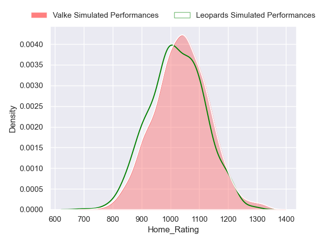
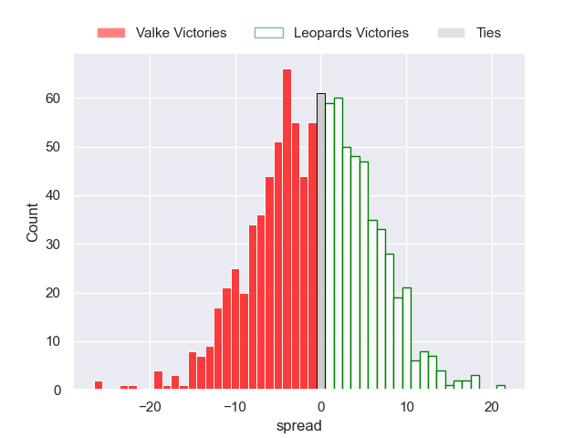

---  
title: "Currie Cup First Division 2023 Status"  
date: 2023-05-19 6:00:00 -0500  
categories: model review projection  
layout: article  
aside:  
    toc: true  
---
# Current Team Rankings

# Standings

## Current Standings

| Club                   |   Played |   Wins |   Point Differential |   Losing Bonus Points |   Try Bonus Points |   Competition Points |
|:-----------------------|---------:|-------:|---------------------:|----------------------:|-------------------:|---------------------:|
| Boland Cavaliers       |        5 |      4 |                  102 |                     1 |                  0 |                   17 |
| Eastern Province Kings |        6 |      4 |                   13 |                     0 |                  0 |                   16 |
| SWD Eagles             |        6 |      3 |                   51 |                     1 |                  0 |                   13 |
| Valke                  |        5 |      3 |                    8 |                     1 |                  0 |                   13 |
| Leopards               |        5 |      2 |                  -31 |                     0 |                  0 |                    8 |
| Border Bulldogs        |        5 |      0 |                 -143 |                     1 |                  0 |                    1 |

## Projected Remaining Table

| Club                   |   Matches Remaining |   Wins |   Point Differential |   Losing Bonus Points |   Try Bonus Points |   Competition Points |
|:-----------------------|--------------------:|-------:|---------------------:|----------------------:|-------------------:|---------------------:|
| Valke                  |                   2 |    1.2 |                  3.2 |                   0.6 |                1.1 |                  6.5 |
| Boland Cavaliers       |                   1 |    0.7 |                  4   |                   0.2 |                0.7 |                  3.9 |
| Leopards               |                   1 |    0.5 |                 -0.8 |                   0.4 |                0.4 |                  2.7 |
| Eastern Province Kings |                   1 |    0.3 |                 -2.4 |                   0.4 |                0.3 |                  2.1 |
| SWD Eagles             |                   1 |    0.3 |                 -4   |                   0.4 |                0.2 |                  1.7 |

## Projected Total Table

| Club                   |   Total Matches |   Wins |   Point Differential |   Losing Bonus Points |   Try Bonus Points |   Competition Points |
|:-----------------------|----------------:|-------:|---------------------:|----------------------:|-------------------:|---------------------:|
| Boland Cavaliers       |               6 |    4.7 |                106   |                   1.2 |                0.7 |                 20.9 |
| Valke                  |               7 |    4.2 |                 11.2 |                   1.6 |                1.1 |                 19.5 |
| Eastern Province Kings |               7 |    4.3 |                 10.6 |                   0.4 |                0.3 |                 18.1 |
| SWD Eagles             |               7 |    3.3 |                 47   |                   1.4 |                0.2 |                 14.7 |
| Leopards               |               6 |    2.5 |                -31.8 |                   0.4 |                0.4 |                 10.7 |
| Border Bulldogs        |               5 |    0   |               -143   |                   1   |                0   |                  1   |

# Completed Match Review

| Model | Percent Correct Predictions | Spread Error |
| ------ | ------ | ------ |
| Club Level | 75.0% | 13.2 |
| Player Level: Lineup | 68.8% | 15.2 |
| Player Level: Minutes | 68.8% | 16.0 |

# Future Predictions

## Week 7

### Boland Cavaliers V SWD Eagles on 2023/05/20

Average Margin: Boland Cavaliers by 4.3

### Valke V Eastern Province Kings on 2023/05/20

Average Margin: Valke by 2.6

## Week 8

### Leopards V Valke on 2023/06/03

Average Margin: Valke by 0.8

