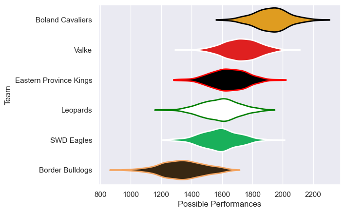

---  
title: "Currie Cup First Division 2024 Status"  
date: 2025-07-28 6:00:00 -0500  
categories: model review projection  
layout: article  
aside:  
    toc: true  
---
# Current Team Rankings

# Standings

## Current Standings

| Club                   |   Played |   Wins |   Point Differential |   Losing Bonus Points | Try Bonus Points   |   Competition Points |
|:-----------------------|---------:|-------:|---------------------:|----------------------:|:-------------------|---------------------:|
| Boland Cavaliers       |        5 |      5 |                  176 |                     0 |                    |                   20 |
| Eastern Province Kings |        5 |      3 |                   46 |                     1 |                    |                   13 |
| Valke                  |        5 |      3 |                   34 |                     0 |                    |                   12 |
| Leopards               |        4 |      2 |                  -67 |                     0 |                    |                    8 |
| SWD Eagles             |        4 |      1 |                  -33 |                     1 |                    |                    5 |
| Border Bulldogs        |        5 |      0 |                 -156 |                     1 |                    |                    1 |

## Projected Remaining Table

| Club       |   To Play |   Projected Wins |   Projected Differential |   Projected Losing Bonus Points | Projected Try Bonus Points   |   Projected Competition Points |
|:-----------|----------:|-----------------:|-------------------------:|--------------------------------:|:-----------------------------|-------------------------------:|
| Leopards   |         1 |             0.61 |                     2.92 |                            0.18 |                              |                           2.68 |
| SWD Eagles |         1 |             0.36 |                    -2.92 |                            0.26 |                              |                           1.76 |

## Projected Total Table

| Club                   |   Played |   Wins |   Point Differential |   Losing Bonus Points | Try Bonus Points   |   Competition Points |
|:-----------------------|---------:|-------:|---------------------:|----------------------:|:-------------------|---------------------:|
| Boland Cavaliers       |        5 |   5    |               176    |                  0    |                    |                20    |
| Eastern Province Kings |        5 |   3    |                46    |                  1    |                    |                13    |
| Valke                  |        5 |   3    |                34    |                  0    |                    |                12    |
| Leopards               |        5 |   2.61 |               -64.08 |                  0.18 |                    |                10.68 |
| SWD Eagles             |        5 |   1.36 |               -35.92 |                  1.26 |                    |                 6.76 |
| Border Bulldogs        |        5 |   0    |              -156    |                  1    |                    |                 1    |

# Completed Match Review

| Model | Percent Correct Predictions | Spread Error |
| ------ | ------ | ------ |
| Club Level | 73.3% | 16.8 |
| Player Level: Lineup | nan% | nan |
| Player Level: Minutes | nan% | nan |

# Future Predictions

## Week 6

### Leopards V SWD Eagles on 2024/07/13

Average Margin: Leopards by 2.1

